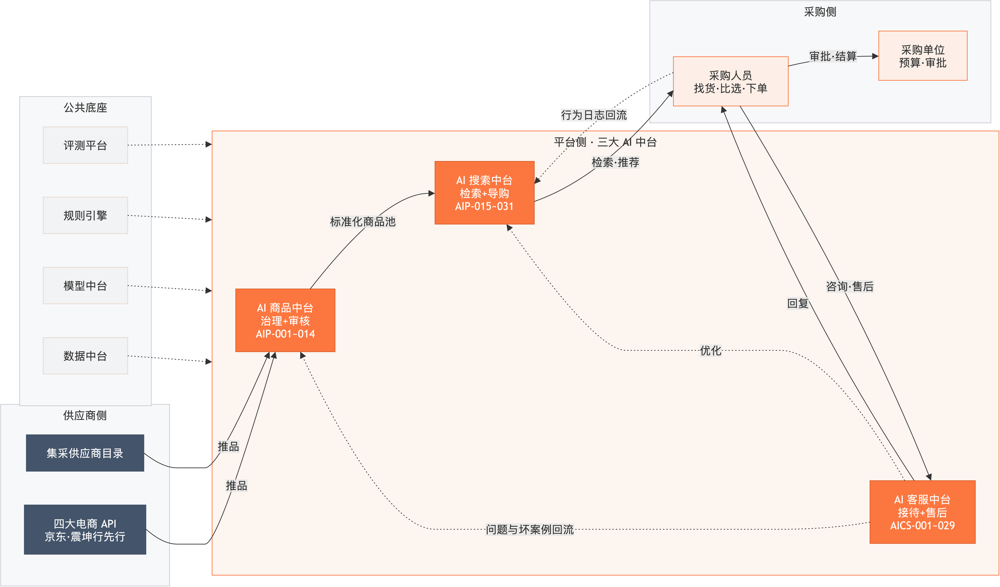
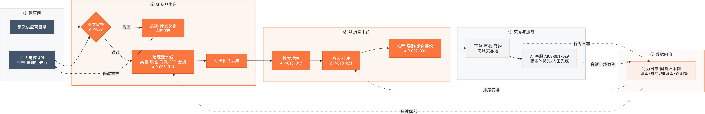
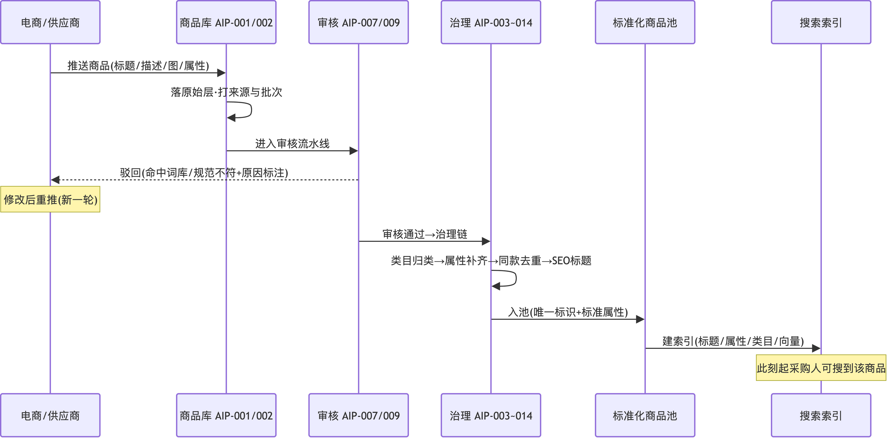
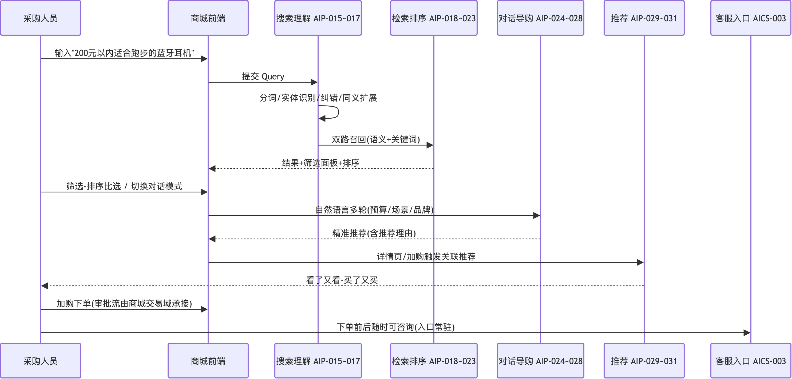
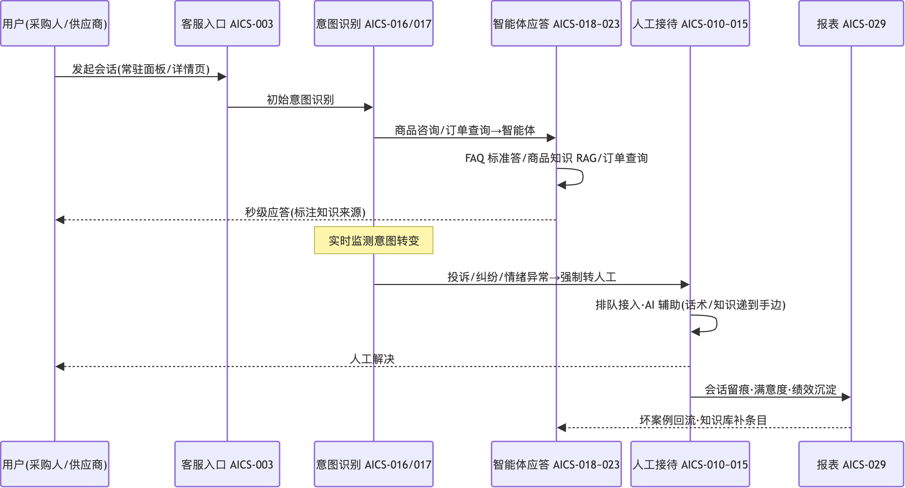
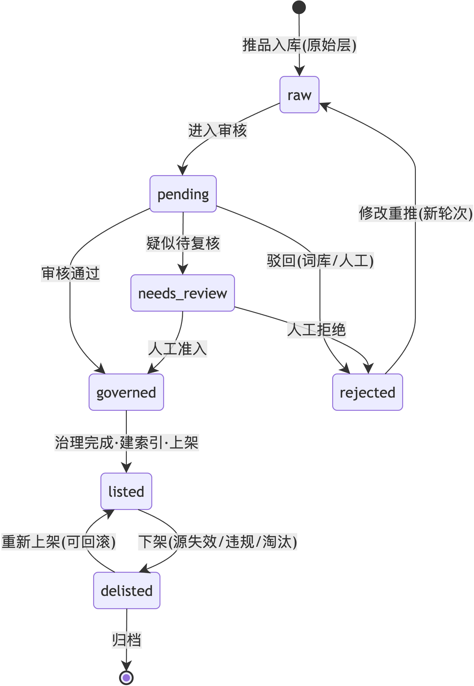
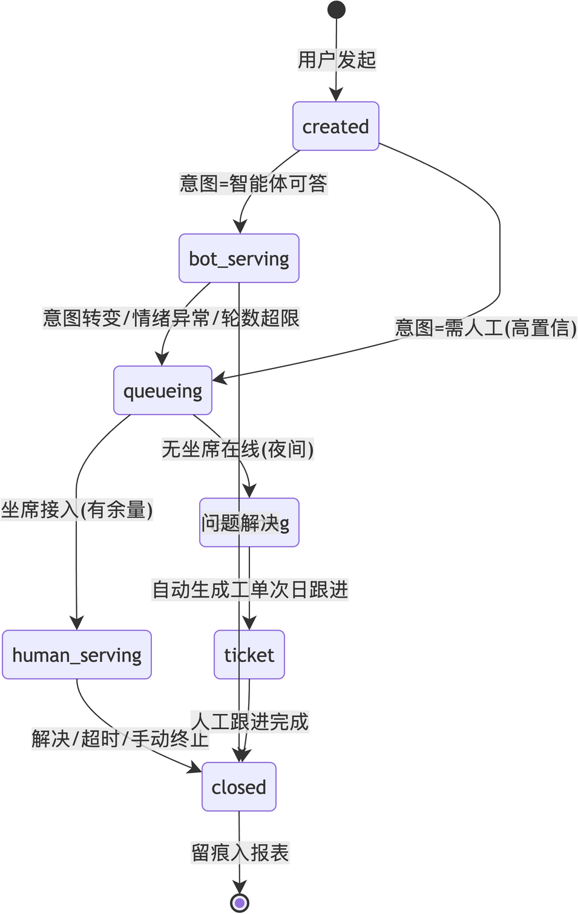
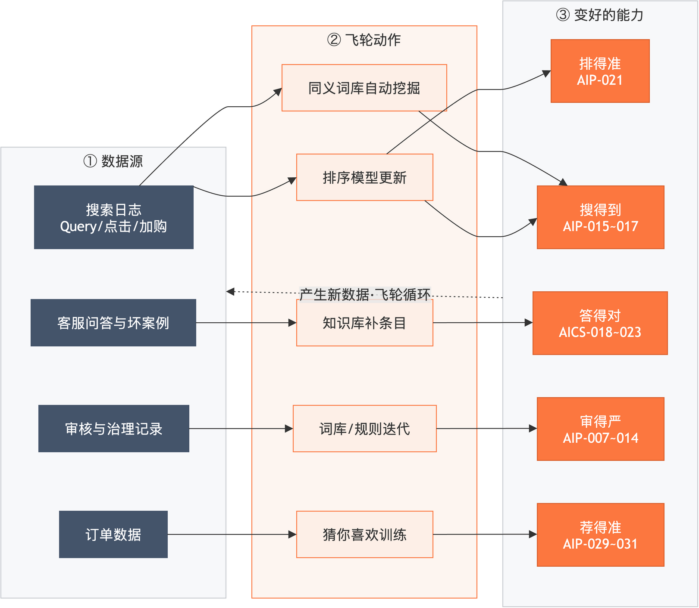
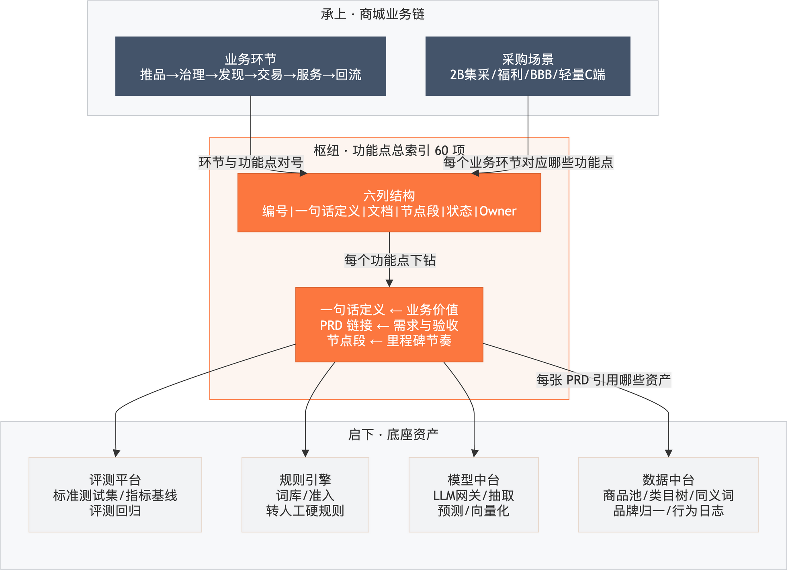

# 供应链采购商城 · AI 能力全景逻辑（精图版）

> **定位**：对外汇报 / 评审 / PPT 配图用的 drawio 精图版——9 张图全部为保利橙视觉体系的 drawio 渲染图（可编辑源与矢量在 `assets/panorama/`）。
> **事实源声明**：语义与结构的事实源是 [00-全景逻辑关系.md](00-全景逻辑关系.md)（Mermaid 版，随 PR 更新）；本文为其渲染视图，语义一致，仅增强配色与布局。图更新流水线：Mermaid 源 → drawio 转换 → 校验目检 → 终版导出（工具：drawio desktop + drawio-skill）。
> 读者：保利领导 / 甲方评审 / 新成员。30 秒版看 §〇，3 分钟版读到 §三。

---

## 〇、三十秒版：一句话 + 主链图

**一句话**：供应商把货推进来（商品中台治理成标准商品池），采购人把货找出去（搜索中台让人说得清找得到选得准），客服守全程（智能体优先人工兜底），所有行为数据回流让三家越用越强——底座四件套（数据/模型/规则/评测）在下面托住一切。

读图要点：横着看是**业务链**（推品→治理→检索→下单→服务），竖着看是**技术分层**（中台层+底座层）；两条虚线是回流——飞轮的来源。
可编辑源：[main-chain.drawio](assets/panorama/main-chain.drawio) ｜ 矢量：[main-chain.drawio.svg](assets/panorama/main-chain.drawio.svg)

---

## 一、端到端业务流程：一件商品走完全程（五泳道）

六阶段业务（推品接入→审核关→治理成池→前台发现→交易服务→数据回流）按五个泳道横向展开；治理与交易环节在总图压缩为节点，逐项功能点见总索引。

读图要点：实线是主流程（左→右贯通）；三条虚线是反馈回路——驳回修改重推（审核关内循环）、行为日志与坏案例回流（最右泳道跨回中台泳道）、持续优化（回流泳道→治理与排序）。治理流水线节点展开后就是 AIP-003~014 的十项功能，客服节点展开后就是 AICS 的四个模块。
可编辑源：[e2e-lane.drawio](assets/panorama/e2e-lane.drawio)

---

## 二、核心时序：三条主链路的参与方协作

### 时序 1：供应商推品 → 审核治理 → 可被检索

要点：词库拦截发生在供应商往返的第一环（最便宜的拦截放最前）；"待复核"是人机交接点，裁决附理由落审计日志；入池建索引的那一刻起，采购人才搜得到这件商品。

### 时序 2：采购人找货 → 比选 → 下单

要点：理解层（分词/实体/纠错/扩展）先于检索；筛选排序与对话导购是并列的两条收敛路径；推荐在详情页与加购时被动触发；客服入口全程常驻。

### 时序 3：一次咨询 → 智能体 → 转人工 → 闭环

要点：转人工是硬规则触发（投诉/纠纷/情绪异常），不是模型决策；坐席处理时 AI 话术与知识"递到手边"；坏案例回流知识库是客服飞轮的入口。

---

## 三、核心对象生命周期

### 状态 1：商品生命周期（从推品到下架）

要点：审核三态（rejected / needs_review / governed）是两条安全阀——**AI 拿不准的必须落到确定性的人或规则上**；"修改重推"开启新轮次，历史轮次全部保留可回放。

### 状态 2：客服会话生命周期

要点：夜间无人值守走"留言→自动工单→次日人工跟进"支线，一件不丢；所有终态都汇入报表留痕。

---

## 四、数据回流飞轮：三家越用越强的机制

要点：飞轮不是口号——左列数据源、中列飞轮动作、右列变好的能力，三层一一对应；回边总线（③→①）代表"变好的能力产生新数据"。每一环都有可观测指标：零结果率↓、首位点击率↑、问题解决率↑、审核召回↑、推荐转化↑。

---

## 五、承上启下：业务链 → 总索引 → 底座的三层导航

**总索引（00-功能点总索引.md）是枢纽**：它的"一句话定义"列向上承接业务价值，"PRD 链接"列向下挂接底座资产（每张 PRD 卡的技术说明引用 DATA_ASSET_MAP 的真实表/端点），节点段列对齐里程碑节奏——一张表把"业务在说什么"和"系统有什么"钉在同一个编号上。

| 你是谁 | 你的问题 | 查法 |
|---|---|---|
| 新成员 / 领导 / 甲方 | 商城的 AI 都干什么？ | 本文 §〇→§一 看全貌 → 总索引浏览"一句话定义" |
| 产品 / 开发 / 测试 | 某功能怎么定义怎么验收？ | 总索引定位编号 → PRD 卡（流程图/FR/验收用例） |
| 项目管理 / 交付 | 各节点交付什么？ | 总索引按"节点段"过滤 → 发布说明 |

**一句话记忆**：**业务链定环节，总索引定功能，PRD 定细节，底座资产定靠什么**——四层各管一段，编号全程贯通。

---

## 六、图资产清单（维护用）

| 图 | 文件（assets/panorama/） | 目检评分 | 事实源 |
|---|---|---|---|
| 主链图 | main-chain.drawio(.png/.svg) | 8.5/10 | 00-全景逻辑关系.md §〇 |
| 端到端五泳道 | e2e-lane.drawio(.png/.svg) | 7.5/10 | §一（泳道化重构，语义一致） |
| 时序×3 | seq-listing / seq-search / seq-service | 8~8.5/10 | §二 |
| 状态机×2 | state-product / state-session | 9/10 | §三 |
| 飞轮图 | flywheel.drawio(.png/.svg) | 9.5/10 | §四（LR 三列重构） |
| 承上启下 | three-layer.drawio(.png/.svg) | 9.5/10 | §五 |

维护规则：功能增删或编号变化 → 先改 Mermaid 事实源（与总索引同一 PR）→ 按需重跑渲染流水线更新本版图。所有 .drawio 文件可双击打开继续精修（布局/配色/文案），改完重导出即可。
