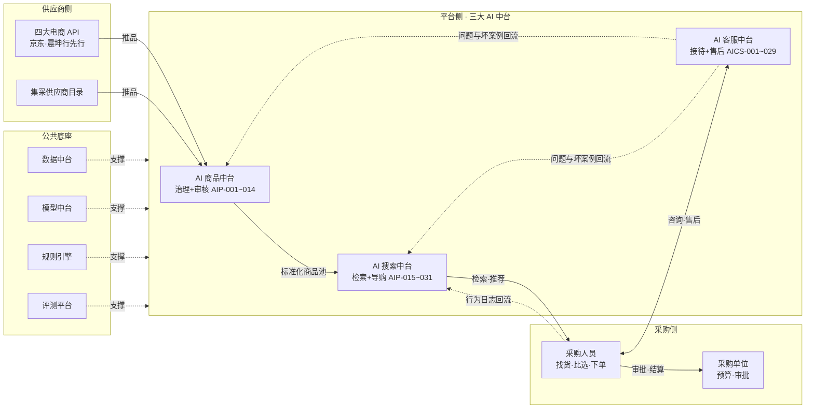
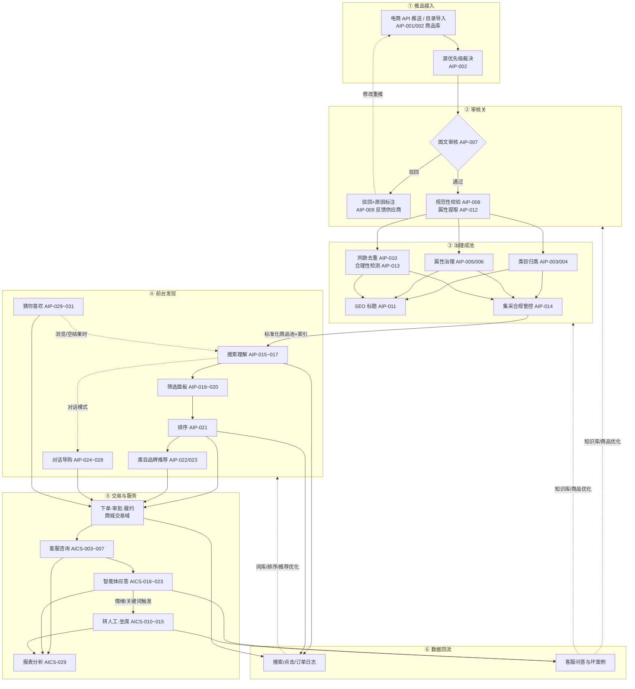
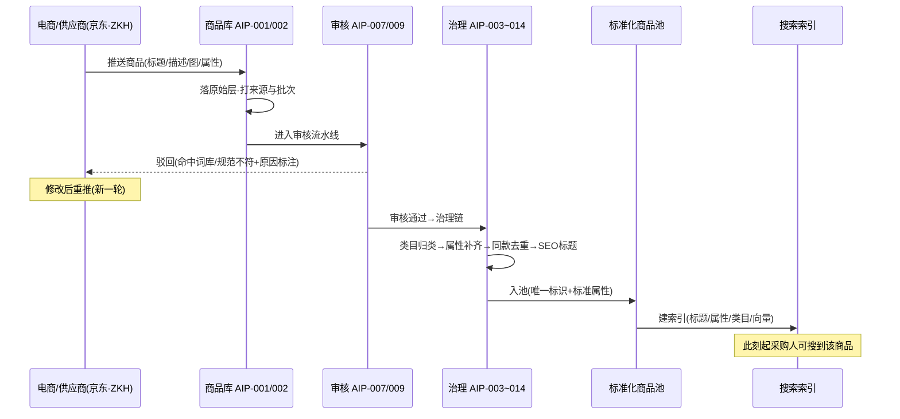
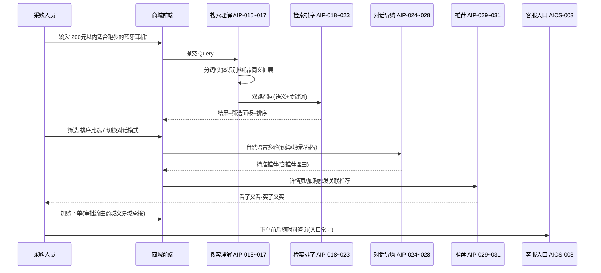
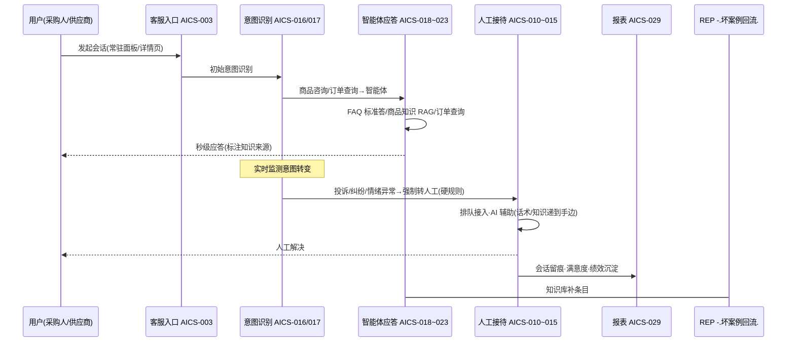
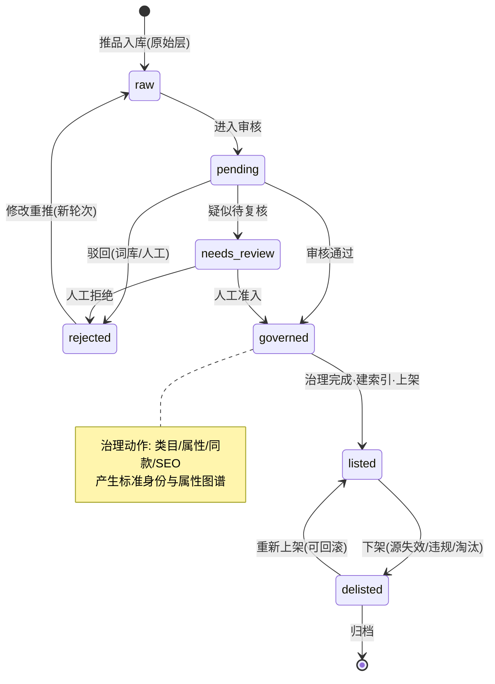
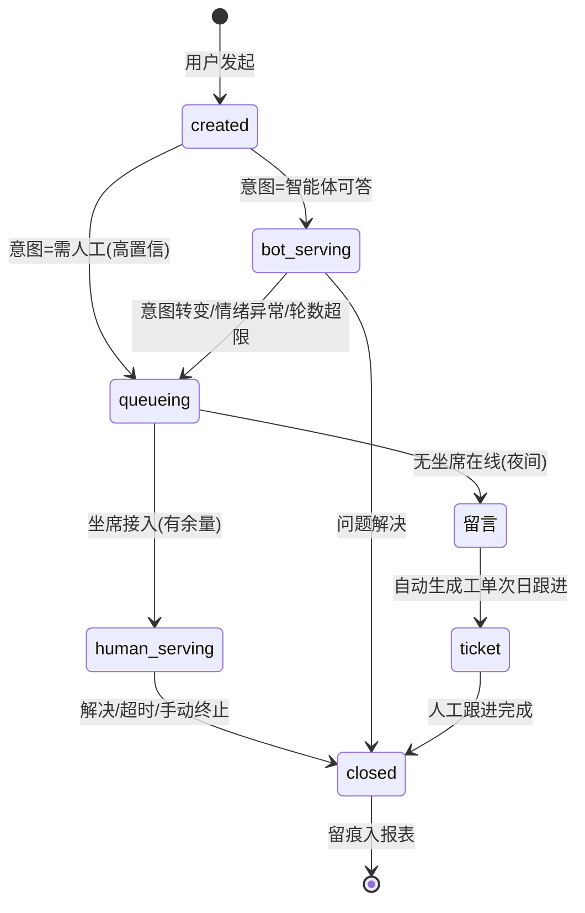
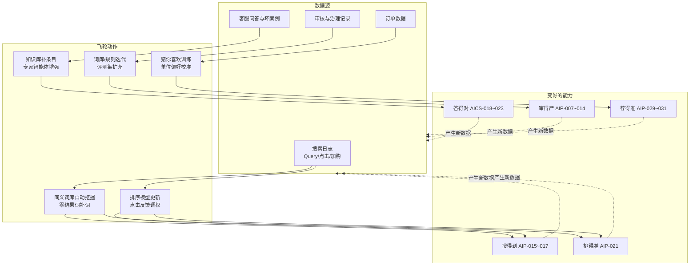

# 供应链采购商城 · AI 能力全景逻辑关系

> 定位：产品文档体系的第二个入口——**先看本文学会"业务怎么看"，再用 [00-功能点总索引](00-功能点总索引.md) 下钻"功能怎么查"**。
> 覆盖：三大中台 60 项功能点（商品 AIP-001–014 / 搜索 AIP-015–031 / 客服 AICS-001–029）在保利供应链采购商城业务中的完整逻辑关系：主链 1 张、端到端流程图 1 张、核心时序 3 张、生命周期状态图 2 张、数据回流飞轮 1 张、承上启下三层 1 张，共 9 张图。
> 维护：功能增删或编号变化时，本图与总索引同步更新（同一 PR）。

---

## 〇、三十秒版：一句话 + 一张主链图

**一句话**：供应商把货推进来（商品中台治理成标准商品池），采购人把货找出去（搜索中台让人说得清找得到选得准），客服守全程（智能体优先人工兜底），所有行为数据回流让三家越用越强——底座四件套（数据/模型/规则/评测）在下面托住一切。



读图要点：横着看是**业务链**（推品→治理→检索→下单→服务），竖着看是**技术分层**（中台层+底座层）；两条虚线是回流——飞轮的来源。

> 🖼 **PPT/正式文档精修版**：[assets/panorama/main-chain.drawio.png](assets/panorama/main-chain.drawio.png)（保利橙主题，2000px 可编辑 PNG；可编辑源 main-chain.drawio / 矢量 main-chain.drawio.svg 同目录）。Mermaid 块仍是唯一事实源，精修版随语义变更同步重生成。

---

## 一、端到端业务流程图：一件商品走完全程

从供应商推品到采购人复购，六个阶段、每一步标注由哪些功能点支撑（编号与总索引一致）：



读图要点：②③ 是商品中台（把货变标准），④ 是搜索中台（让人找到货），⑤ 是客服中台（让成交无后顾之忧），⑥ 是三家共用的飞轮；"修改重推"虚线与"数据回流"虚线是两条最重要的反馈回路。

---

## 二、核心时序图（三条主链路的参与方协作）

### 时序 1：供应商推品 → 审核治理 → 可被检索



### 时序 2：采购人找货 → 比选 → 下单



### 时序 3：一次咨询 → 智能体 → 转人工 → 闭环



---

## 三、核心对象生命周期（状态图）

### 状态 1：商品生命周期（从推品到下架）



### 状态 2：客服会话生命周期



读图要点：两个状态机都遵循同一设计哲学——**AI 能处理的自动处理，拿不准的必须落到确定性的人或规则上**（needs_review / queueing 是两条安全阀）。

---

## 四、数据回流飞轮：三家越用越强的机制



读图要点：飞轮不是口号，每一环都有明确的数据源、动作与可观测指标（零结果率↓、首位点击率↑、问题解决率↑、审核召回↑、推荐转化↑）。

> 🖼 **PPT/正式文档精修版**：[assets/panorama/flywheel.drawio.png](assets/panorama/flywheel.drawio.png)（LR 三列布局+回边总线，保利橙主题；可编辑源 flywheel.drawio / 矢量 flywheel.drawio.svg 同目录）。Mermaid 块仍是唯一事实源。

---

## 五、承上启下：业务链 → 总索引 → 底座的三层导航

**总索引（00-功能点总索引.md）为什么是枢纽**：它向上承接商城业务（每行功能点的"一句话定义"讲业务价值），向下挂接底座资产（每张 PRD 卡的技术说明节引用 DATA_ASSET_MAP 与真实表/端点）——一张表把"业务在说什么"和"系统有什么"钉在同一个编号上。

```mermaid
graph TD
    subgraph L_TOP[承上 · 商城业务链]
      T1[采购场景<br/>2B集采/福利/BBB/轻量C端]
      T2[业务环节<br/>推品→治理→发现→交易→服务→回流]
    end
    subgraph L_MID[枢纽 · 功能点总索引 60 项]
      I1[六列结构:<br/>编号|一句话定义|文档|节点段|状态|Owner]
      I2[一句话定义 ← 业务价值<br/>PRD 链接 ← 需求与验收<br/>节点段 ← 里程碑节奏]
    end
    subgraph L_BOT[启下 · 底座资产]
      B1[数据中台<br/>商品池/类目树/同义词/品牌归一/行为日志]
      B2[模型中台<br/>LLM网关/抽取/预测/向量化]
      B3[规则引擎<br/>词库/准入/转人工硬规则]
      B4[评测平台<br/>标准测试集/指标基线/评测回归]
    end
    T1 & T2 -->|每个业务环节对应哪些功能点| I1
    I1 -->|每个功能点下钻| I2
    I2 -->|每张 PRD 引用哪些资产| B1 & B2 & B3 & B4
```

**三种使用姿势**（谁在什么时候查总索引）：

| 你是谁 | 你的问题 | 查法 |
|---|---|---|
| 新成员 / 领导 / 甲方 | 这个商城的 AI 都干什么？ | 本文 §〇→§一 先看业务全貌 → 总索引按中台浏览"一句话定义"列 |
| 产品 / 开发 / 测试 | 某功能点到底怎么定义怎么验收？ | 总索引定位编号 → 点开 PRD 卡（流程图/FR/验收用例） |
| 项目管理 / 交付 | 11/15、12/20 各交付什么？ | 总索引按"节点段"列过滤 → 对照发布说明模板 |

**一句话记忆**：**业务链定环节（§一），总索引定功能（00 表），PRD 卡定细节（01-prd/），底座资产定靠什么（DATA_ASSET_MAP）**——四层各管一段，编号全程贯通。

---

## 六、图与文档的对照表（维护索引用）

| 图 | 讲什么 | 涉及功能点 | 关联文档 |
|---|---|---|---|
| §〇 主链图 | 三十秒全貌 | 全部 | README |
| §一 端到端流程 | 一件商品走完全程（六阶段） | 全部 | 各中台 PRD |
| §二 时序 1/2/3 | 推品上架 / 找货下单 / 咨询闭环 | 分台核心链 | AIP-007、015、AICS-016 卡 |
| §三 状态 1/2 | 商品 / 会话生命周期 | AIP-001~014、AICS-003~015 | 对应 PRD §5.3 |
| §四 飞轮 | 数据回流机制 | 跨台 | EVALUATION.md |
| §五 承上启下 | 三层导航逻辑 | 全部 | 00-功能点总索引 |
