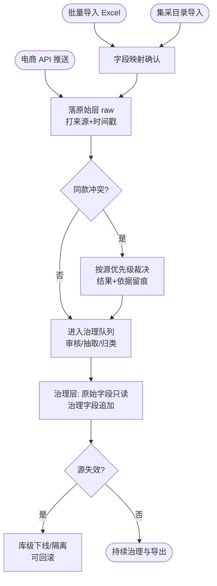
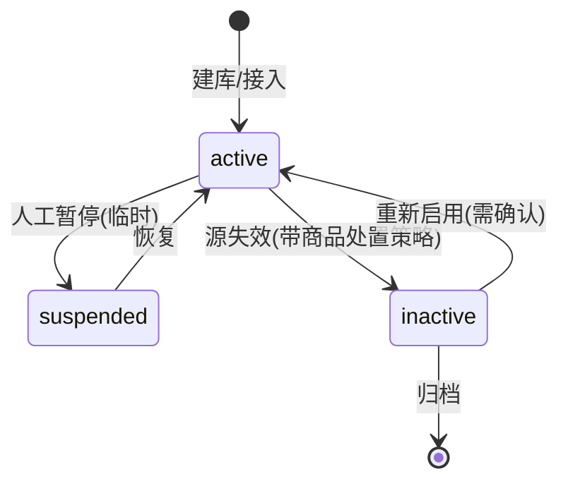

# 商品库管理（AIP-001/002）

> 节点段：★11/15 MVP ｜ Owner：AI 产品负责人 ｜ 评审：商品业务对接人
> 状态：v0.3（2026-09-26，完整版）

## 1 概述（TL;DR）

把不同系统、来源、批次的商品统一纳进可管理的商品库：原始商品与治理后商品分库管理，支持导入、API 接入、导出、查询，并可配置商品源优先级与有效性。它是商品中台所有智能处理（审核、抽取、归类、去重）的原料入口——库管得清，治理才有边界。

## 2 背景与问题（Problem）

- **现状**：商品来源多元——第三方电商 API 推送（前期以震坤行、京东为主）、集采供应商目录导入、自有商品登记——各来源字段口径、批次节奏互不相同。
- **痛点**：原始数据与治理成果混在一起时无法追溯"这条商品的属性是哪个批次补的"；同一商品多来源并存时没有裁决规则；来源失效后商品滞留无下线机制。
- **机会**：治理体系（标准化、审核、挂载）已具备处理能力，纳管层成为其放大量产的前提。

## 3 目标与非目标（Goals / Non-Goals）

**目标**
- G1：任意商品可按"库 × 来源 × 批次 × 治理状态"四维定位与导出
- G2：原始数据与治理结果物理分离，原始字段永不覆盖（血缘可追溯）
- G3：多来源同款冲突时按源优先级确定性裁决，规则可配置可审计
- G4：库级有效性管理——源失效可整库下线且动作可回滚

**非目标**
- N1：不做商品编辑 CRUD 完整后台（属平台运营端商品管理）
- N2：不治理库存与价格字段（属商品中心与价格体系）
- N3：不做供应商资质审核（属供应商管理）

## 4 用户与场景（Personas & Use Cases）

**用户角色**

| 角色 | 描述 | 核心诉求 | 频率 |
|---|---|---|---|
| 商品运营 | 日常商品治理与核对 | 快速定位、导出、核对进度 | 每日 |
| 数据治理工程师 | 存量清洗与批量导入 | 批次可管理、可重跑、可对账 | 每批次 |
| 系统/接口 | 电商 API 推送 | 自动入库、幂等、无人工 | 实时 |

**用户故事**
- US-1：作为商品运营，我希望按来源和治理状态组合查询商品，以便每天核对治理进度。
- US-2：作为数据治理工程师，我希望导入任务以批次为单位可重跑可对账，以便出错时精确定位回滚。
- US-3：作为商品运营，我希望配置"京东 > 震坤行 > 导入"的源优先级，以便同款冲突时自动取更可信的值。
- US-4：作为商品运营，我希望某电商停止合作时能一键失效其库并可选择商品处置方式，以便目录干净可控。

**触发场景**：API 推送实时/定时自动入库；批量导入人工发起；查询导出随时；库失效人工发起。

## 5 业务流程（Diagrams）

### 5.1 端到端流程图



读图要点：三条入库通道汇入同一原始层（FR-2 分级存储）；裁决发生在入库时点而非查询时点（快照式，避免源变更连带漂移）；治理层只追加不改写。

### 5.2 对象状态机：商品库（product_source）



读图要点：inactive 是可逆终态（重启用需二次确认）；suspended 与 inactive 的区别是前者不停新入库、后者停止且触发商品处置（隔离或下线，Q1 裁决）。

## 6 功能需求（Functional Requirements）

### 6.1 需求详述

**FR-1 多库组织**：系统应支持创建多个商品库，按系统、来源、批次三维度组织；库为治理与权限的基本单元。
**FR-2 分级存储**：导入与 API 接入写入原始层（raw）；治理动作只写治理层字段，原始字段只读不可覆盖；两层通过商品主键关联。
**FR-3 批量导入**：用户可上传 Excel 发起导入；流程为 建库→上传→字段映射确认→执行→对账报告；对账报告含成功/失败/跳过计数与行级错误定位；任务可整批重跑。
- 边界：单批上限（建议 5 万行，超出自动分片）；重复行按源幂等键去重并计入跳过。
**FR-4 API 接入**：系统提供接入通道，电商推送自动入库，打来源与时间戳；重复推送幂等（同 sku+来源+内容哈希不变则跳过）。
**FR-5 查询导出**：按库/来源/批次/治理状态/关键词组合查询；导出 Excel 字段完整，大导出走异步任务（进度可见、文件可下载）。
**FR-6 源优先级**：用户可配置来源优先级序列；同款字段冲突按优先级取值，裁决记录（冲突字段、各方值、胜出方、依据）留痕可查。
**FR-7 有效性管理**：库可置 suspended/inactive；inactive 时停止新入库并按策略处置商品（隔离/下线，策略配置项）；处置与恢复均可回滚。
**FR-8 操作审计**：建库、优先级变更、失效/恢复等库级操作记录操作人、时间、变更内容（前后值）。

### 6.2 页面与原型（Wireframes）

**高保真原型**：
（AI 功能位置：橙色标注框标出多库管理/四维查询/原始-治理分层/冲突裁决留痕/对账报告五个区域；可编辑源 [mockup-productlib.drawio](../../assets/prd/mockup-productlib.drawio)）

**完美输出样例**（实测口径，与 `docs/STATUS.md` 一致）：在管商品 189,211 行；治理三态 clean 167,213 / needs_review 21,758 / quarantined 240；标题标准化 176,074 全量完成——商品库不是空壳，入库即入治理链路。

**页面 1：商品库管理（运营后台 → 商品中台 → 商品库）**（ASCII 快速版）

```
┌───────────────────────────────────────────────────────────────────────┐
│ 商品库管理    [+新建库]  [批量导入]  [导出]                            │
├───────────────────────────────────────────────────────────────────────┤
│ 库列表                                                                  │
│ ┌ 库 ZKH集采Q4  来源:震坤行 状态:●active 批次:3 商品:12,408  [⋯操作] │
│ ├ 库 京东主站   来源:京东   状态:●active 批次:1 商品:38,102  [⋯操作] │
│ └ 库 历史导入   来源:excel  状态:○inactive 批次:7 商品:5,930  [⋯操作]│
├──────────────┬────────────────────────────────────────────────────────┤
│ 查询:        │ SK-8821 打印纸 A4 70g  [clean]  来源:京东  批次:Q4-01 │
│ 库:京东主站▾ │ ├ 原始层(只读): 标题"得力牌A4打印纸70g/包" 属性:--    │
│ 状态:clean▾  │ ├ 治理层: std_title"A4打印纸 70g" 属性:{规格:70g...} │
│ 关键词:[___] │ └ 冲突裁决: 规格取[京东] 胜出于 震坤行(优先级) 11-02 │
│ [导出当前]   │                                                        │
└──────────────┴────────────────────────────────────────────────────────┘
```

| 区域 | 元素 | 交互与状态 |
|---|---|---|
| 工具栏 | 新建/导入/导出 | 导入向导按 5.1 主流程分步 |
| 库列表 | 库卡片（状态灯/计数） | 操作菜单：暂停/失效/恢复/优先级/归档；危险操作二次确认 |
| 查询区 | 四维+关键词 | 组合过滤，条件可保存 |
| 详情区 | 原始层/治理层/裁决三层展开 | 原始层标注"只读"；裁决行展示胜出依据 |

### 6.3 字段与数据（Field Schema）

**商品库（product_source）**

| 字段 | 类型 | 必填 | 校验/默认 | 说明 |
|---|---|---|---|---|
| source_id | bigint | ✓ | 自增 | 库标识 |
| name | varchar(64) | ✓ | 唯一 | 库名 |
| src_type | enum | ✓ | api / import / manual | 来源类型 |
| status | enum | ✓ | active / suspended / inactive / archived | 状态机一致 |
| priority | int | ✓ | 数值越小优先级越高 | 裁决依据 |
| dispose_policy | enum | ✗ | quarantine / offline（inactive 时） | 商品处置策略 |
| created_by / updated_at | | ✓ | | 审计 |

**批次（import_batch）**：batch_id、source_id FK、file_name、total/success/failed/skipped（对账四计数）、status（running/done/failed）、operator。

**裁决记录（source_conflict_log）**：conflict_id、sku、field、各源值 jsonb、winner_source_id、rule（priority）、created_at。

### 6.4 异常与错误处理

| 场景 | 触发 | 系统行为 | 用户感知 |
|---|---|---|---|
| 导入字段缺失 | 映射后必填列为空 | 任务继续，行级失败并定位行号 | 对账报告红色行 |
| API 重复推送 | 幂等键命中 | 跳过入库，计数 +1 | 无感（推送方收到 skipped 状态） |
| 大导出超时 | 行数超阈值 | 转异步任务 | 通知中心收下载链接 |
| 库失效回滚 | inactive→active | 恢复入库；已处置商品按策略逆操作 | 二次确认弹窗展示影响面 |
| 优先级冲突循环 | 两库同 priority | 保存被拒 | 表单校验提示 |

## 7 成功指标（Success Metrics）

| 指标 | 定义 | 口径来源 |
|---|---|---|
| 入库完整率 | 导入/API 零丢失（对账不一致率=0） | 00-索引 §参考层 |
| 优先级裁决正确率 | 冲突抽样验证正确占比 | 00-索引 §参考层 |
| 治理覆盖率 | 原始层商品进入治理队列比例 | 00-索引 §参考层 |

## 8 里程碑（Milestones）

| 里程碑 | 交付内容 |
|---|---|
| ★11/15 MVP | 多库/导入/API/查询导出/优先级/有效性 + 对账报告 |
| 12/20 UAT | 全量回归 + 批量时效评测 + 库运营 SOP |

## 9 验收用例（Acceptance Cases）

| 用例 | Given | When | Then |
|---|---|---|---|
| AC-1 导入对账 | 准备 500 行文件（含 10 行缺必填） | 执行导入 | 成功 490/失败 10；报告定位失败行；任务可重跑 |
| AC-2 幂等 | 京东已推送 SK-1 | 同内容重复推送 | 跳过计数 +1；库内无重复 |
| AC-3 优先级裁决 | 库A(优先级1)与库B(优先级2)同款规格冲突 | 商品入库 | 取 A 值；裁决记录含双方值与依据 |
| AC-4 原始层只读 | 任意已治理商品 | 查看原始层 | 原始字段与入库时点一致，无治理覆盖 |
| AC-5 库失效回滚 | 库 inactive 且商品已隔离 | 恢复 active | 隔离逆操作；影响面确认弹窗先行 |
| AC-E1 API 断流 | 推送通道中断 | 恢复后重推 | 断点续传不丢不重 |
| AC-P1 权限 | 无工程师角色账号 | 尝试建库/改优先级 | 拒绝并落审计 |

## 10 开放问题（Open Questions）

- Q1：库失效的商品处置默认策略（隔离 or 下线）——商品业务对接人 / 10-15 前
- Q2：优先级裁决粒度（字段级 or 商品级）——评审裁决

## 11 相关文档（Appendix）

- 上游：`../00-功能点总索引.md` ｜ 关联：`AIP-007-商品图文审核.md`（治理队列入口）
- 参考：`../../ARCHITECTURE.md`、`../../DATA_ASSET_MAP.md`

## 变更记录

| 日期 | 版本 | 变更 | 说明 |
|---|---|---|---|
| 2026-09-26 | v0.1/v0.2 | 初稿→社区结构 | 立卡 |
| 2026-09-26 | v0.3 | 完整版 | +流程图/库状态机/线框/字段表×3/错误表/用例 7 条 |
