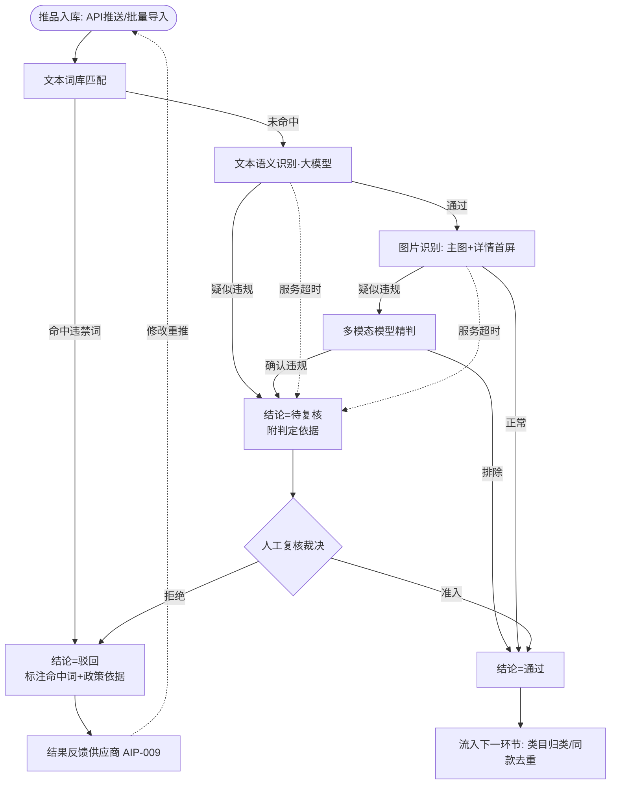
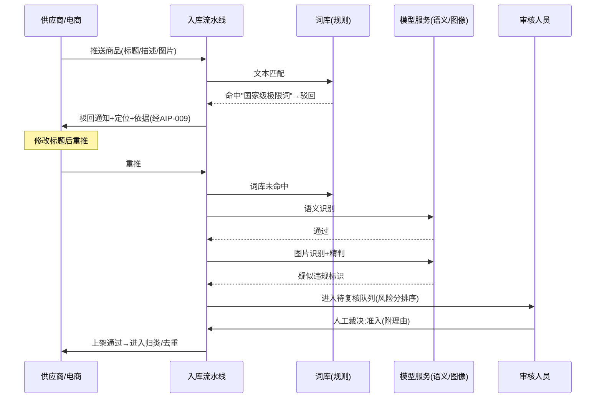
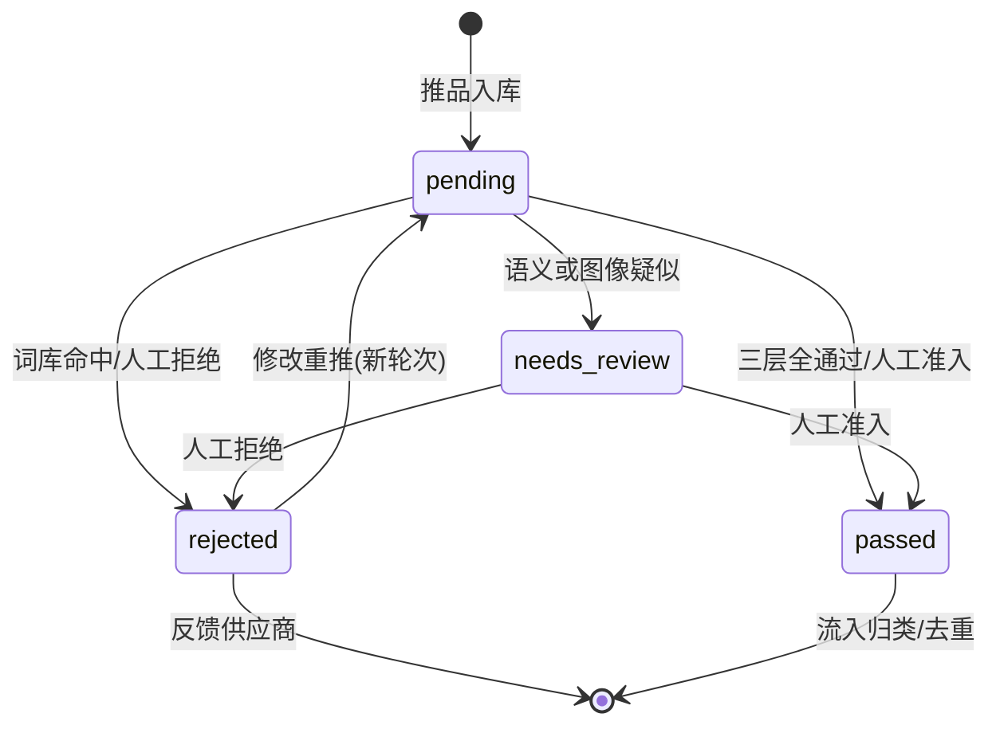

# 商品图文审核（AIP-007）

> 节点段：★11/15 MVP ｜ Owner：AI 产品负责人 ｜ 评审：商品业务对接人（词库口径共审）
> 范围：SOW 合同能力（COMP-04）｜ 文档状态：**Frozen v1.0**（2026-10-09 冻结；签署记录见 ../../PRD-REVIEW-CHECKLIST.md）
> 实现进度见 `docs/STATUS.md`；本文只维护需求定义与验收契约，数字口径以标注为准

## 1 概述（TL;DR）

商品入库时自动触发的合规审查：文本走违禁词库规则 + 大模型语义识别，图片走图像识别，违规信息可溯源、可标注、可解释。把"推送即上架"的合规风险敞口变成"每一件商品都过同一道闸"；人工只处理机器拿不准的边缘 case。

**职责边界（与 AIP-009 分工，P1-7 定则）**：本卡是审核**检测、判定与证据输出的权威源**——审核任务、三态结论与 append-only 审核日志由本卡拥有并唯一写入；人工裁决（无论从本卡工作台还是 AIP-009 队列界面发起）一律经本卡 resolve 接口以 resolution 追加写回。AIP-009 只消费本卡结论，负责展示、批量反馈、供应商可见性与运营看板，不另存竞争状态。

## 2 背景与问题（Problem）

- **现状**：第三方电商推送商品直接上架，无审核环节；人工逐条审核在批量推品量下不可持续。
- **痛点**：法规与集团采购政策禁止的内容（违禁品标识、违法宣传、低俗虚假图文）一旦上架，风险由平台承担；供应商不知道红线在哪，被拒也不知道怎么改。
- **机会**：混合技术路线（规则 + 大模型 + 图像识别）可在批量时效内做到三层递进审查，且每层结论可解释、可审计。

## 3 目标与非目标（Goals / Non-Goals）

**目标**
- G1：推品入库 100% 经过自动审核，批量时效满足日常推品节奏（阈值见 Q2）
- G2：文本三层递进——词库命中即拦（确定性）→ 语义识别变体规避 → 边缘转人工复核
- G3：每条结论可解释：命中哪条规则、哪段文本、哪个图片区域
- G4：驳回原因可传达供应商，驱动"可改进的重推"
- G5：审核链路 fail-safe——任何模型服务不可用时商品进待复核，永不静默放行

**非目标**
- N1：不审价格合理性（属价格巡检体系）
- N2：不判同款（AIP-010）、不判类目对错（AIP-013）
- N3：不做供应商申诉工单流（走待复核人工裁决，二期再议）
- N4：MVP 不做详情图全量翻页扫描（主图 + 详情首屏，全量随 UAT）

## 4 用户与场景（Personas & Use Cases）

**用户角色**

| 角色 | 描述 | 核心诉求 | 使用频率 |
|---|---|---|---|
| 平台运营审核人员 | 审核队列日常处理 | 只复核边缘 case，不看全量 | 每日 |
| 供应商 / 电商 | 推品与被驳回后修改 | 明确被拒原因、一次改过 | 每批次 |
| 合规/质检 | 抽查与审计追溯 | 任意商品可回放审核链路 | 每周/专项 |

**用户故事**
- US-1：作为审核人员，我希望机器先过一遍并把拿不准的标"待复核"，以便时间只花在边缘 case 上。
- US-2：作为供应商，我希望驳回通知写清命中了哪条政策词、在哪个位置，以便改完一次过。
- US-3：作为质检人员，我希望输入任意 SKU 就能回放完整审核链路（何时、哪层、什么依据），以便审计抽查。
- US-4：作为合规管理员，我希望词库能版本化管理并经评审后生效，以便政策红线变更可控可回滚。

**触发场景**：①API 推送/批量导入入库时自动进入审核流水线；②供应商修改重推自动重审（新审核轮次）；③抽检人工发起重审。

## 5 业务流程（Diagrams）

### 5.1 端到端流程图



读图要点：三层递进（词库→语义→图像）顺序固定，前一层未通过不再进入下一层；两个虚线分支是 fail-safe——任何模型服务异常一律转待复核，不存在静默放行路径；驳回后的修改重推是新一轮完整审核（不复用旧结论）。

### 5.2 关键时序：一次供应商推品的审核往返



读图要点：词库层发生在供应商往返的第一环（最便宜的拦截放最前）；"待复核"是人与系统的交接点，裁决必须附理由且落审计日志。

### 5.3 对象状态机：商品审核状态



读图要点：状态枚举 `passed / rejected / needs_review / pending` 与 6.3 字段定义一致；"rejected → pending"的转移代表新审核轮次（round_no +1），历史轮次全部保留可回放。

## 6 功能需求（Functional Requirements）

### 6.1 需求详述

**FR-1 自动触发**
- 规则：商品经 API 推送或批量导入进入入库流程时，系统自动创建审核任务并执行，全程无人工发起。
- 边界：同一批次内重复推送幂等（不重复审核）；审核任务积压时按批次 FIFO 消化并显示队列深度。

**FR-2 词库层（确定性拦截）**
- 规则：系统维护违规违禁词库（法规类 + 集团采购政策类），对标题与描述做全量匹配；命中即判驳回。
- 字段：命中输出 = 命中词、词库分类（法规/政策）、政策依据说明、文本定位（起始位置）。
- 边界：一词多义不做语义豁免（词库层保持确定性，语义豁免交给人工复核路径）；词库变更对变更后新任务即时生效，不追溯已结论任务。

**FR-3 语义层（变体识别）**
- 规则：对词库未命中的文本调用大模型识别隐晦表述、变体规避（谐音/拆字/夹杂符号）、上下文违规；命中判"待复核"并附判定依据摘要。
- 字段：输出 = 风险类型、原文片段、模型判定理由、模型版本。
- 边界：模型服务超时/失败 → 该商品整体转待复核（fail-safe），并触发告警；判定理由必须包含原文引用，禁止无依据结论。

**FR-4 图像层**
- 规则：对主图与详情首屏执行图像识别（违禁物料、违规标识、低俗内容、虚假宣传图像）；疑似违规调多模态模型精判，标注违规区域与类型。
- 边界：图片无法解析/缺失 → 标记"图片待补检"转待复核（缺失不放行）；同一图片在同轮次内只精判一次。

**FR-5 溯源标注**
- 规则：任何拦截结论必须定位到最小信息单元——文本到片段（含位置），图片到区域框；商品级"整体驳回"必须由至少一条单元级证据支撑。
- 边界：语义层无法定位（整体语气违规）时以"整段"为最小单元并在依据中注明。

**FR-6 结论与日志**
- 规则：结论为三态（passed/rejected/needs_review），写入 append-only 审核日志，含：轮次、各层结论与依据、词库版本、模型版本、耗时；日志不删除不改写（人工裁决以 resolution 记录追加）。
- 边界：日志保留期 ≥2 年（审计要求）；重推后旧轮次完整保留。

**FR-7 批量时效**
- 规则：批量任务在约定时效内完成（阈值 Q2 定稿，建议 500 条/10 分钟）；处理进度（已审/总数/驳回/待复核）实时可见。
- 边界：超出时效的批次自动告警并支持并行加速。

**FR-8 词库管理**
- 规则：词库支持增删改、分类（法规/政策）、启停、版本化；变更提交后经评审（合规归口 + 业务对接人）确认生效，生效时间留痕，支持回滚到任意历史版本。
- 边界：词库编辑不中断进行中的审核（新任务用新版本）。

**FR-9 fail-safe 降级**
- 规则：审核链路任一外部服务（语义/图像/精判）不可用时，商品进入待复核而非放行；系统连续失败触发熔断（暂停该层并全量转待复核）+ 告警。
- 边界：熔断期间词库层照常工作（本地规则不受云端服务影响）。

### 6.2 页面与原型（Wireframes）

**高保真原型**：
（AI 功能位置：证据区展示文本命中标注与图片违规区域框、判定依据含模型与词库版本、轮次信息、A/R/N 快捷裁决键；驳回反馈池与供应商通知卡对应 FR-4/5；可编辑源 [mockup-audit.drawio](../../assets/prd/mockup-audit.drawio)；**真实页面入口**：portal :8000 →「商品审核台」页签，容器已跑通实测）

**完美输出样例**（审核 Agent 实测，STATUS 口径）：单条 12 秒四工具全调用——自动发现自身 cluster 疑似重复 → 结论 manual_review（保守转人审）→ `product_review_log` 落库可回放；批量 2 条 20 秒全落库；commit 端点违禁词命中实测返回 409 拒绝入库。

**页面 1：审核队列（运营后台 → 商品中台 → 审核队列）**（ASCII 快速版）

```
┌────────────────────────────────────────────────────────────────────┐
│ 商品图文审核      [通过 320] [驳回 45] [待复核 12*]   队列深度: 8    │
├──────────────┬─────────────────────────────────────────────────────┤
│ 筛选          │ ① SK-1042 得力5502订书机    [待复核] 风险分 0.91   │
│ 来源: 京东▾   │ ├───────────────┬──────────────────────────────┐   │
│ 批次: Q4-11▾  │ │ 主图 [区域框]  │ 文本: "全网最xx耐用"          │   │
│ 时间: 近7天▾  │ │ 图像:疑似虚假  │  ── 命中: 极限词(语义变体)    │   │
│ 风险分>0.8 □  │ │ 宣传(右侧角标) │ 依据: 谐音规避"最强" →待人工  │   │
│ ────────────  │ └───────────────┴──────────────────────────────┘   │
│ 词库: 管理    │   轮次:2  上一轮:驳回(词库:极限词)  已审:1,286      │
│ 日志: 导出    │        [准入]  [拒绝]  [跳过下一个]                 │
└──────────────┴─────────────────────────────────────────────────────┘
```

| 区域 | 元素 | 交互与状态 |
|---|---|---|
| 顶栏 | 三态计数 Tab | 点击切换队列；待复核默认高亮；`*` 表示超阈值提醒 |
| 左栏 | 筛选器 | 来源/批次/时间/风险分组合过滤，记忆上次条件 |
| 主区-商品头 | SKU、名称、状态、风险分 | 风险分降序排列；点击 SKU 开新页看商品详情 |
| 主区-证据 | 图片区域框 + 文本命中标注 | 悬停区域框高亮原图对应位置；文本命中词下划线 |
| 主区-操作 | 准入/拒绝/跳过 | 裁决弹理由必填框；快捷键 A/R/N；操作后自动载下一条 |
| 底部 | 轮次与历史 | 显示当前轮次与上一轮结论；"上一轮"链接打开历史回放 |

**页面 2：供应商驳回通知（供应商端消息中心）**

```
┌──────────────────────────────────────────────────┐
│ 审核结果通知                        [批量导出]    │
├──────────────────────────────────────────────────┤
│ ❌ SK-1042 订书机   2026-11-03  轮次:1           │
│    命中: 政策词「国家级」(标题 第4-6字)           │
│    依据: 《广告法》极限用语禁用 → 集团政策词库 v3 │
│    [查看完整标注]  [修改后重新提报]              │
└──────────────────────────────────────────────────┘
```

### 6.3 字段与数据（Field Schema）

**审核任务/结论（audit_task）**

| 字段 | 类型 | 必填 | 校验/默认 | 说明 |
|---|---|---|---|---|
| task_id | bigint | ✓ | 自增主键 | 审核任务 |
| sku / source_id | varchar | ✓ | 外部商品标识 | 与商品库关联 |
| round_no | int | ✓ | 默认 1 | 重推 +1 |
| status | enum | ✓ | passed / rejected / needs_review / pending | 与状态机一致 |
| risk_score | numeric | ✗ | 语义/图像层输出 0–1 | 待复核排序依据 |
| rule_hits | jsonb | ✗ | 数组：[{词,分类,依据,位置}] | 词库层证据 |
| semantic_evidence | jsonb | ✗ | {片段,类型,理由,模型版本} | 语义层证据 |
| image_evidence | jsonb | ✗ | [{图URL,区域框,类型,判定}] | 图像层证据 |
| lexicon_version | varchar | ✓ | 词库版本号 | 结论时点快照 |
| model_version | varchar | ✗ | 语义/图像模型版本 | 可复现 |
| decided_by | enum | ✓ | auto / operator:{id} | 结论来源 |
| created_at / decided_at | timestamp | ✓ | | 全链路耗时可算 |

**词库条目（lexicon_term）**

| 字段 | 类型 | 必填 | 说明 |
|---|---|---|---|
| term_id / term | varchar | ✓ | 词条 |
| category | enum | ✓ | legal(法规) / policy(集团政策) |
| basis | text | ✓ | 政策依据说明（反馈供应商可见） |
| status | enum | ✓ | draft / active / disabled |
| version | varchar | ✓ | 生效版本号；变更走评审 |

### 6.4 异常与错误处理

| 场景 | 触发条件 | 系统行为 | 用户感知 |
|---|---|---|---|
| 模型超时 | 语义/图像服务 >阈值 | 转 needs_review + 告警 | 运营看到"模型超时待复核"标签 |
| 服务熔断 | 连续 N 次失败 | 该层暂停，全量转待复核；词库层照常 | 批量进度条标注"语义层熔断" |
| 图片缺失/损坏 | URL 拉取失败 | 标记"图片待补检"转待复核 | 供应商被要求补图 |
| 词库层误拦申诉 | 供应商认为误拦 | 供应商端提交复核申请 → 进入待复核队列（人工裁决） | 不需要线下渠道 |
| 批量超时效 | 超过 FR-7 阈值 | 告警 + 自动提升并行度 | 无感（进度正常推进） |
| 审核日志写入失败 | 存储异常 | 审核流程暂停（宁可慢不可无审计） | 队列暂停横幅 |

## 7 成功指标（Success Metrics）

| 指标 | 定义 | 口径来源 |
|---|---|---|
| 文本违规检测召回率 | 实际违规文本中被识别出的比例 | 00-索引 §参考层 |
| 图片违规检测召回率 | 实际违规图片中被识别出的比例 | 00-索引 §参考层 |
| 待复核占比健康度 | needs_review 比例（过高=模型弱，过低=阈值松） | 00-索引 §参考层 |
| 批量审核时效 | 约定批量规模端到端耗时 | Q2 定稿后入参考层 |
| 驳回后一次改过率 | 供应商重推即通过比例（反馈有效性） | 00-索引 §参考层 |

## 8 里程碑（Milestones）

| 里程碑 | 交付内容 |
|---|---|
| ★11/15 MVP | 文本三层链路 + 图片双通道 + 词库管理 + 审核队列页 + 驳回反馈（联调 AIP-009） |
| 12/20 UAT | 召回率指标评测报告（标准测试集）+ 词库月度评审机制 + 详情图全量扫描 |

## 9 验收用例（Acceptance Cases）

| 用例 | 覆盖 FR | Given | When | Then |
|---|---|---|---|---|
| AC-1 词库拦截 | FR-2、FR-5 | 词库含政策词"国家级"，词库 v3 生效 | 推送标题含"国家级"的商品 | 状态=驳回；rule_hits 含该词、分类 policy、位置正确；供应商通知含依据 |
| AC-2 语义变体 | FR-3 | 词库无"最强"，商品标题用谐音变体表达"最强" | 推送该商品 | 状态=needs_review；semantic_evidence 含原文片段与理由 |
| AC-3 图片违规 | FR-4、FR-5 | 主图右下角含违规标识 | 推送该商品 | image_evidence 含区域框与类型；转 needs_review |
| AC-4 人工准入 | FR-6 | 一条 needs_review 记录 | 审核员点"准入"并填理由 | 状态→passed；日志追加 resolution（操作人+理由） |
| AC-5 修改重推 | FR-1、FR-6 | 一条 rejected 记录（轮次 1） | 供应商改标题重推 | 新任务轮次=2；轮次 1 完整保留可回放 |
| AC-6 批量时效 | FR-7 | 批量导入 500 条 | 等待处理完成 | 全部出结论；耗时 ≤ 阈值（Q2 口径）；进度实时可见 |
| AC-7 词库回滚 | FR-8 | 词库 v4 生效后 | 回滚到 v3 | 新任务按 v3 匹配；v4 期间结论不变更 |
| AC-E1 模型熔断 | FR-9 | 语义服务连续失败达熔断阈值 | 推送新商品 | 商品转 needs_review；队列出现"语义层熔断"横幅；词库层拦截照常 |
| AC-E2 无图商品 | FR-4 | 商品无主图 | 推送 | 转待复核并标"图片待补检"；不判 passed |
| AC-P1 权限-供应商隔离 | FR-6 | 供应商 A 的驳回记录 | 供应商 B 登录查看通知 | 不可见 A 的任何记录（行级隔离） |
| AC-P2 权限-词库管理 | FR-8 | 无合规角色的账号 | 尝试编辑词库 | 拒绝；操作日志记录尝试 |

## 10 开放问题（Open Questions）

| Q ID | 未决问题 | 影响 FR/AC | 选项与推荐项 | 决策 Owner | 截止日期 | 当前状态 | 未决时默认行为 |
|---|---|---|---|---|---|---|---|
| Q1 | 违禁词库初版来源（甲方政策词表 / 乙方整理甲方确认）——**阻塞项** | FR-2、FR-8、AC-1 | 推荐：甲方出政策词表，乙方补法规类 | 合规归口 | 2026-10-15 | 待裁决 | 法规类先行（广告法极限词等公开口径），政策类空缺时语义层兜底转人工 |
| Q2 | 批量时效量化口径（建议 500 条/10 分钟） | FR-7、AC-6 | 推荐：500 条/10 分钟 | 商品业务对接人 | 2026-11-15 | 待裁决 | 按建议值执行并监控告警 |
| Q3 | 语义层豁免申诉与词库层申诉是否合并入口 | FR-2 | 推荐：合并（同一待复核队列） | 商品业务对接人（评审） | 2026-11-15 | 待裁决 | 两类申诉同入待复核队列，标签区分 |

## 11 相关文档（Appendix）

- 上游地图：`../00-功能点总索引.md` ｜ 关联卡：`AIP-009-审核结果分类展示.md`（结论出口）、`AIP-001-002-商品库管理.md`（入库通道）
- 参考：`../../ARCHITECTURE.md`（模型网关与熔断）、`../../EVALUATION.md`（评测口径）

## 变更记录

| 日期 | 版本 | 变更 | 说明 |
|---|---|---|---|
| 2026-09-26 | v0.1 | 初稿 | 立卡 |
| 2026-09-26 | v0.2 | 社区结构重排 | FR 化 |
| 2026-09-26 | v0.3 | 完整版 | +流程图/时序/状态机/线框×2/字段表×2/错误表/验收用例 11 条 |
| 2026-10-09 | v1.0 | Frozen（规范化修复） | §1 与 AIP-009 职责边界（本卡=判定与证据权威源，resolve 唯一写入点）；§9 加「覆盖 FR」列；§10 表格化（Owner/截止/默认行为） |
