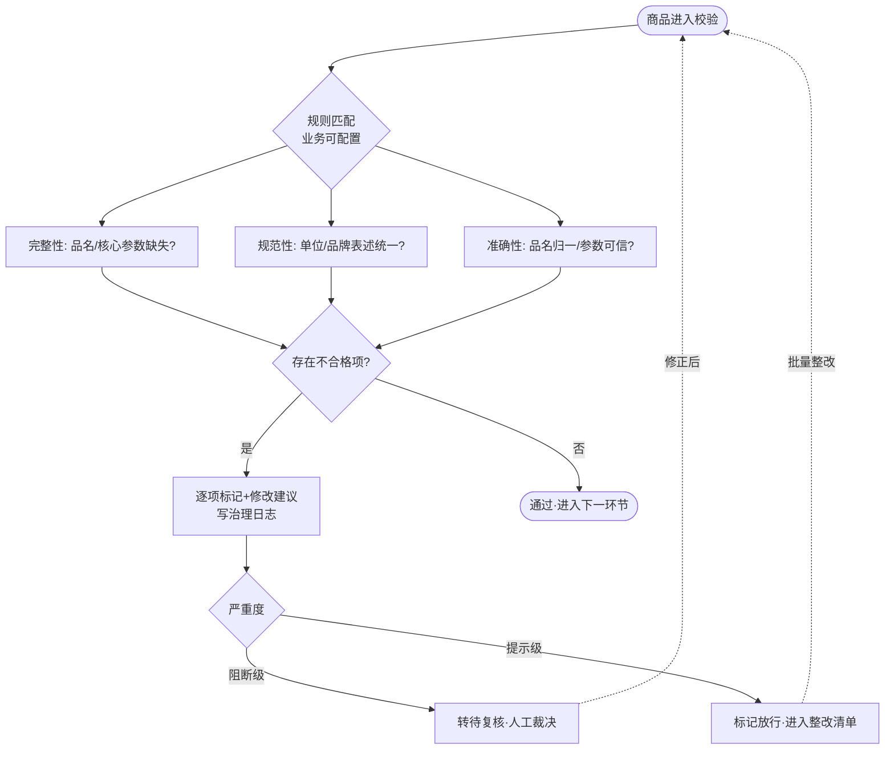

# 描述规范性校验（AIP-008）

> 节点段：12/20 UAT（功能完善段 11/15–12/5）｜ Owner：AI 产品负责人 ｜ 评审：商品业务对接人
> 范围：SOW 合同能力（COMP-05）｜ 文档状态：**Frozen v1.0**（2026-10-09 冻结；签署记录见 ../../PRD-REVIEW-CHECKLIST.md）
> 实现进度见 `docs/STATUS.md`；本文只维护需求定义与验收契约

## 1 概述（TL;DR）

对商品描述做完整性 / 规范性 / 准确性三项体检：缺什么参数、单位品牌写法不统一、品名不合归一标准，逐项精准标记并给出可操作的修改建议——规则可由业务自定义，让"描述合不合格"从人工经验变成可配置的标准。

**职责边界（与 AIP-013 分工，P1-7 定则）**：本卡管**文本形态**（描述字段完整性、命名/单位/品牌写法规范、品名符合归一标准——判断"写得对不对"），结果写 `norm_check_result`，只标记与建议、不修复；AIP-013 管**值与语义**（属性值范围/单位数值合理性、属性-类目一致性、修正建议与人工复核——判断"值可不可信、挂得对不对"），`quality_flag` 的最终写入权在 AIP-013。同一字段两卡都可能看到时按"写法 vs 数值"划界，同一异常不产生两条冲突工单（AIP-013 AC-7 对账）。

## 2 背景与问题（Problem）

- **现状**：同一商品不同供应商的描述五花八门——"得力牌 5502 型订书机"与"得力5502订书机"；核心参数（规格/型号/单位）时有缺失。
- **痛点**：描述不规范直接传导到下游——搜索筛不到（属性字段空）、比价拉不出单（规格不可比）、客服答不准（参数来源混乱）；人工逐条检查不可持续。
- **机会**：集团商品标准化规则（《商品描述规范》制度文件）已成文，规则引擎 + 大模型可以把制度变成自动体检。

## 3 目标与非目标（Goals / Non-Goals）

**目标**
- G1：三项体检全量自动执行——完整性（品名/核心参数缺失）、规范性（计量单位/品牌表述统一）、准确性（品名符合归一标准/参数真实可信）
- G2：每个不合格项精准标记到字段级 + 给出可操作修改建议（不是"不合格"三个字）
- G3：校验规则业务可自定义（集团标准调整不需要改代码）

**非目标**
- N1：不判违规违法（AIP-007 图文审核域）
- N2：不判类目挂错（AIP-013 合理性检测域）
- N3：不自动改写描述（只标记与建议，改不改由运营/供应商决定）

## 4 用户与场景（Personas & Use Cases）

**用户角色**

| 角色 | 描述 | 核心诉求 |
|---|---|---|
| 平台运营 | 治理执行者 | 批量体检 + 按建议快速修正 |
| 供应商 | 描述撰写者 | 明确知道哪里不规范、怎么改 |
| 商品标准化负责人 | 规则制定者 | 制度变更能自助配置生效 |

**用户故事**
- US-1：作为运营，我希望导入一批商品后自动得到体检报告（缺参数/单位不统一/品名不归一逐项列出），以便批量治理。
- US-2：作为供应商，我希望修改建议具体到"单位应为'包'而非'包/500张'"这种程度，以便一次改对。
- US-3：作为标准化负责人，我希望新增一条校验规则（如"生鲜类必须含保质期"）在管理界面配置即可生效。

**触发场景**：商品入库审核通过后自动执行（流水线一环）；存量商品批量体检定时/人工发起；规则变更后可对指定范围重跑。

## 5 业务流程（Diagrams）



读图要点：三项体检并行执行互不阻断；严重度分级是关键设计——阻断级（如缺核心参数）转人工，提示级（如品牌表述）标记放行进整改清单，避免一刀切卡死上架效率。

## 6 功能需求（Functional Requirements）

### 6.1 需求详述

**FR-1 自动执行**：商品通过图文审核（AIP-007）后自动进入规范性校验；无需人工发起。
**FR-2 完整性校验**：按类目属性 Schema 检查必填项——品名、核心参数（型号/规格/计量单位）缺失即标记，缺什么标什么。
**FR-3 规范性校验**：计量单位对照标准单位表、品牌表述对照品牌归一表（13,128 品牌），不统一即标记并给出标准写法。
**FR-4 准确性校验**：品名对照归一标准（std_title 规则）；描述文本中"参数表述缺失/不可信"的提示归本卡；**数值范围/单位合理性的判定与 quality_flag 写入归 AIP-013**（本卡联动提示但不重复标记，见 §1 职责边界）。
**FR-5 修改建议**：每个不合格项给出具体可操作的建议值（来自标准表/归一规则/大模型建议但标注来源），禁止只给"不合格"结论。
**FR-6 规则自定义**：校验规则在管理界面配置（规则类型/适用类目/严重度/提示文案），变更经评审生效并留痕，支持启用停用。
**FR-7 严重度分级**：阻断级转待复核（人工裁决），提示级标记放行进整改清单；分级由规则配置决定。
**FR-8 结果输出**：校验结果写入治理日志（append-only），支持按批次导出体检报告（Excel，列：SKU/不合格项/标记位置/建议值/严重度）。

### 6.2 页面与原型（Wireframes）

**接口契约形态**（纯后台能力，界面挂运营台审核详情页签）：
- 输入：`{sku, title, description, attributes, std_path_id}`
- 输出示例（完美输出样例设计）：
```json
{"sku": "SK-8821", "verdict": "warn",
 "issues": [
   {"type": "完整性", "field": "计量单位", "mark": "缺失", "suggest": "包（该类目标准单位）", "severity": "block"},
   {"type": "规范性", "field": "品牌", "mark": "得力牌", "suggest": "得力（品牌归一）", "severity": "warn"},
   {"type": "准确性", "field": "品名", "mark": "不符合归一标准", "suggest": "A4打印纸 70g（std_title 规则）", "severity": "warn"}]}
```
真实页面入口：portal :8000 → 商品审核台 → 商品详情（校验结果与审核证据同页展示，UAT 段扩展页签）。

### 6.3 字段与数据（Field Schema）

| 对象 | 字段 | 类型 | 必填 | 校验/默认 | 说明 |
|---|---|---|---|---|---|
| 校验规则（norm_rule） | rule_id | BIGINT | 是 | 自增主键 | 规则标识 |
| 校验规则（norm_rule） | rule_type | ENUM | 是 | completeness / norm / accuracy（全枚举） | 三项体检 |
| 校验规则（norm_rule） | scope | VARCHAR | 是 | 类目 path_id；空=全类目通用 | 适用范围 |
| 校验规则（norm_rule） | severity | ENUM | 是 | block / warn | 分级（FR-7） |
| 校验规则（norm_rule） | template | TEXT | 是 | 提示文案模板 | 建议话术 |
| 校验规则（norm_rule） | status | ENUM | 是 | draft / active / disabled | 版本化、变更评审留痕 |
| 校验结果（norm_check_result） | sku / rule_id / field / mark / suggest / severity / checked_at | — | 是 | rule_id FK→norm_rule；append-only | 只标记不修复；保留期对齐治理审计 ≥2 年 |
| 标准表引用 | 单位标准表 / 品牌归一（13,128）/ std_title 规则 | — | — | 只读引用治理资产（正源见 DATA_ASSET_MAP） | 复用不复制 |

### 6.4 异常与错误处理

| 场景 | 触发 | 系统行为 | 用户感知 |
|---|---|---|---|
| 类目无 Schema | 新类目未配属性模板 | 仅执行通用规则，标记"该类目专项规则建设中" | 报告注明覆盖范围 |
| 大模型建议超时 | 建议值生成失败 | 降级为标准表建议或"待人工补建议" | 不阻断体检流程 |
| 规则冲突 | 同字段两条规则结论相反 | 按严重度高者执行并记录冲突供规则评审 | 规则管理页提示 |

## 7 成功指标（Success Metrics）

| 指标 | 定义 | 口径来源 |
|---|---|---|
| 校验覆盖率 | 被校验商品占比（应 100%） | 00-索引 §参考层 |
| 整改采纳率 | 按建议修改后复检通过比例 | 00-索引 §参考层 |
| 提示级占比健康度 | warn 比例（衡量规则松紧） | 00-索引 §参考层 |

## 8 里程碑（Milestones）

| 里程碑 | 交付内容 |
|---|---|
| 12/5 | 功能完成：三项校验 + 规则管理界面 + 体检报告导出 |
| 12/20 UAT | 全量回归 + 与《商品描述规范》制度文件对齐评审（A 类） |

## 9 验收用例（Acceptance Cases）

| 用例 | 覆盖 FR | Given | When | Then |
|---|---|---|---|---|
| AC-1 完整性 | FR-2、FR-5、FR-7 | 商品缺"计量单位"且该类目 Schema 必填 | 入库校验 | 标记缺失+建议标准单位；severity=block 转待复核 |
| AC-2 规范性 | FR-3、FR-7 | 品牌写"得力牌"，归一表标准为"得力" | 入库校验 | 标记+建议"得力"；warn 放行进整改清单 |
| AC-3 准确性 | FR-4 | 品名不含归一标准词 | 入库校验 | 标记+建议 std_title 写法 |
| AC-4 规则自定义 | FR-6 | 管理界面新增"生鲜必须含保质期"规则并启用 | 新生鲜商品入库 | 命中该规则；规则变更留痕 |
| AC-5 批量报告 | FR-8 | 存量 500 条执行体检 | 导出报告 | Excel 含五列完整、逐项定位 |
| AC-6 入库自动执行 | FR-1 | 商品通过图文审核（AIP-007） | 入库流转 | 自动进入规范性校验，无需人工发起 |
| AC-E1 无 Schema | FR-2 | 新类目未配模板 | 校验 | 仅通用规则+覆盖范围注明，不报错 |
| AC-P1 规则权限 | FR-6 | 无标准化角色账号 | 尝试改规则 | 拒绝并留痕 |

## 10 开放问题（Open Questions）

| Q ID | 未决问题 | 影响 FR/AC | 选项与推荐项 | 决策 Owner | 截止日期 | 当前状态 | 未决时默认行为 |
|---|---|---|---|---|---|---|---|
| Q1 | 《商品描述规范》制度文件与规则模板的首版对齐（依赖 11/30 制度文件交付） | FR-6、AC-4 | 依赖合同节点 | 商品业务对接人 | 2026-11-30 | 待交付 | 先按集团既有标准配通用规则，制度到位后对齐评审 |
| Q2 | 阻断级规则的初始清单（哪些缺失项卡上架） | FR-7、AC-1 | 推荐：核心参数缺失=block，表述类=warn | 商品业务对接人（评审） | 2026-12-05 | 待裁决 | 仅"品名/计量单位/型号"缺失为 block，其余 warn |

## 11 相关文档（Appendix）

- 上游：`../00-功能点总索引.md` ｜ 关联：`AIP-007-商品图文审核.md`（前置环节）、`AIP-013`（合理性联动）
- 参考：`../../属性抽取产品文档.md`（v4，属性体系事实源；旧 `ATTRIBUTE_EXTRACTION_PRD.md` v1.0 已留档）、SMART_LISTING_PLAN（流水线位置）

## 变更记录

| 日期 | 版本 | 变更 | 说明 |
|---|---|---|---|
| 2026-09-26 | v0.3 | 完整版立卡 | 补齐 UAT 段文档缺口 |
| 2026-10-09 | v1.0 | Frozen（规范化修复） | §1 与 AIP-013 职责边界（写法 vs 数值）；FR-4 划清 quality_flag 写入权；§6.3 升全字段契约；§9 加「覆盖 FR」列并补 AC-6；§10 表格化 |
