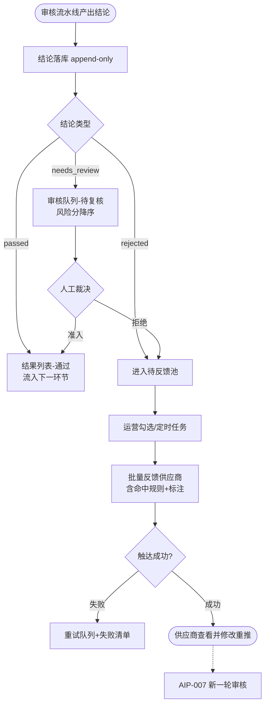
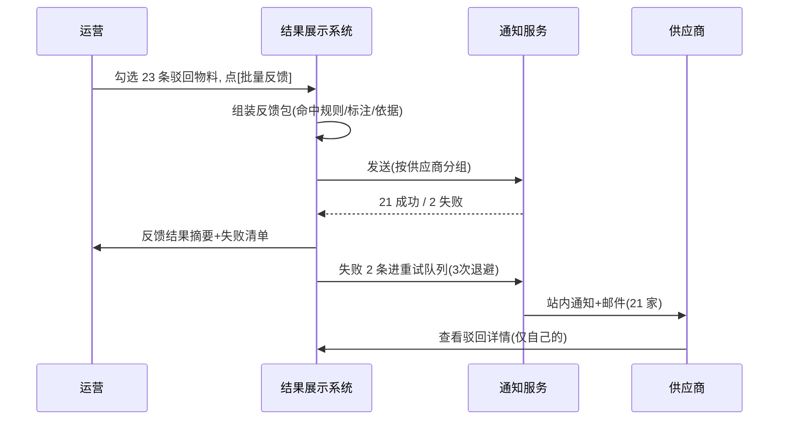

# 审核结果分类展示（AIP-009）

> 节点段：★11/15 MVP ｜ Owner：AI 产品负责人 ｜ 评审：商品业务对接人
> 状态：v0.3（2026-09-26，完整版）

## 1 概述（TL;DR）

审核结论的统一出口：通过 / 驳回 / 待复核三态分类展示，驳回物料带原因标注并批量反馈供应商。让审核结论从"系统内部状态"变成"运营可度量、供应商可行动"的信息——审核链路的收银台。

## 2 背景与问题（Problem）

- **现状**：审核结论散落在流水线内部状态里，只有开发能查。
- **痛点**：供应商不知道为何被驳回、如何修改，推品通过率上不去；运营看不到三态分布，审核质量（通过率、人工工作量）无法度量；管理者不知道待复核积压。
- **机会**：审核流水线已产出结构化结论（AIP-007 的证据字段），只缺展示与分发层。

## 3 目标与非目标（Goals / Non-Goals）

**目标**
- G1：三态全量可查，按状态、来源、批次、时间过滤
- G2：驳回原因（命中规则 + 溯源标注）批量反馈供应商，触达可确认
- G3：三态分布、推品通过率趋势、积压量可视化
- G4：人工裁决全留痕，可覆盖机器结论

**非目标**
- N1：不做审核规则/词库配置（归 AIP-007）
- N2：不做供应商绩效分析（属运营报表体系）

## 4 用户与场景（Personas & Use Cases）

**用户角色**

| 角色 | 描述 | 核心诉求 | 频率 |
|---|---|---|---|
| 平台运营审核人员 | 审核队列日常处理 | 高效复核、一键裁决 | 每日 |
| 供应商 | 被驳回后修改重推 | 明确原因、可行动 | 每批次 |
| 管理者 | 审核质量 oversight | 分布/趋势/积压预警 | 每周 |

**用户故事**
- US-1：作为审核人员，我希望队列按风险排序，点开即见违规标注与依据，以便快速裁决。
- US-2：作为供应商，我希望收到驳回通知并附原因标注，以便修改后一次通过。
- US-3：作为管理者，我希望看到推品通过率趋势与待复核积压，以便调配人力、优化规则。
- US-4：作为运营，我希望勾选一批驳回物料一键批量反馈，以便不必逐条转发。

**触发场景**：流水线结论落库即刷新（自动）；驳回反馈定时批量或人工点发；看板随时。

## 5 业务流程（Diagrams）

### 5.1 端到端流程图



读图要点：本功能从 B 开始（判定归 AIP-007）；"待反馈池"是驳回与反馈之间的缓冲，支持批量与失败重试；供应商修改重推回到 AIP-007，形成闭环。

### 5.2 关键时序：批量反馈



## 6 功能需求（Functional Requirements）

### 6.1 需求详述

**FR-1 三态视图**：系统提供通过/驳回/待复核三态分类视图，支持按状态、来源、批次、时间组合过滤；计数实时。
**FR-2 待复核队列**：按风险分降序排列；逐条展示违规标注（文本片段/图片区域框）与判定依据；支持键盘快捷裁决。
**FR-3 人工裁决**：对待复核项可"准入/拒绝"；理由必填；裁决以 resolution 追加写入审核日志（可覆盖机器结论，历史保留）；裁决后自动载入下一条。
**FR-4 批量反馈**：支持勾选驳回物料批量反馈对应供应商；反馈内容含命中规则、标注与修改指引；按供应商自动分组发送。
**FR-5 供应商可见性**：供应商端可查看自己被驳回的物料、原因与发送状态；行级隔离（仅自己的数据）。
**FR-6 审核看板**：当日三态分布、推品通过率趋势（近 30 天）、待复核积压量；支持下钻到明细。
**FR-7 积压提醒**：待复核积压超阈值（可配置，建议 48h 未处理标红）向审核角色推送提醒。
**FR-8 反馈重试**：发送失败自动重试（3 次退避）；失败清单运营可见可手动重发。

### 6.2 页面与原型（Wireframes）

**高保真原型**：（本卡重点看下半部：**待反馈池**（勾选批量反馈/失败清单红标）与**供应商驳回通知卡**（命中词+定位+政策依据+修改指引）；可编辑源 [mockup-audit.drawio](../../assets/prd/mockup-audit.drawio)；**真实页面入口**：portal :8000 →「商品审核台」，队列/结论/一键准入拒绝已实测）

**完美输出样例**（STATUS 实测口径）：`GET /api/v1/products/review-queue?limit=2` 返回待复核队列（anomaly_score 降序）；人工裁决 `POST .../{id}/resolve` 实测落库生效（裁决 #3 resolution 覆盖可查）；审核日志 append-only 不回写业务表。

**页面 1：审核看板（管理者视角，运营后台 → 商品中台 → 审核看板）**（ASCII 快速版）

```
┌──────────────────────────────────────────────────────────────────┐
│ 审核看板   今日: 推品 486 │ 通过 320 │ 驳回 45 │ 待复核 12 ⚠     │
├─────────────────────┬────────────────────────────────────────────┤
│ 推品通过率趋势       │ 三态分布(近30天)                           │
│  92% ────╮          │  ████████████ 通过 78%                     │
│  88% ────╰─╮ 90%    │  ████ 驳回 14%                             │
│  84% ╭─────╯        │  ██ 待复核 8%↓                             │
│      11-01  11-15   │  [下钻明细]  积压>48h: 3 条 [立即处理]     │
└─────────────────────┴────────────────────────────────────────────┘
```

**页面 2：待反馈池（运营视角）**

```
┌──────────────────────────────────────────────────────────────────┐
│ 驳回待反馈  共 45 条   [全选本页] [批量反馈(23)]   发送失败: 2   │
├──────────────────────────────────────────────────────────────────┤
│ ☑ SK-1042 订书机   供应商:得力   命中:政策词×1  11-03  未反馈   │
│ ☑ SK-2211 绝缘手套 供应商:震坤行 命中:法规词×2  11-03  未反馈   │
│ ☐ SK-3301 台灯     供应商:XX    命中:图片违规   11-02  ✓已反馈  │
└──────────────────────────────────────────────────────────────────┘
```

| 区域 | 元素 | 交互与状态 |
|---|---|---|
| 看板顶栏 | 四计数 | 待复核超阈值变 ⚠ 红 |
| 趋势图 | 折线 | 悬停看日明细；下钻到当日列表 |
| 反馈池列表 | 复选行 | 已反馈置灰；失败行红标 + [重发] |

### 6.3 字段与数据（Field Schema）

**反馈记录（reject_feedback）**

| 字段 | 类型 | 必填 | 校验/默认 | 说明 |
|---|---|---|---|---|
| feedback_id | bigint | ✓ | 自增 | |
| sku / supplier_id | varchar | ✓ | | 分组发送键 |
| task_id | bigint | ✓ | FK→审核任务 | 溯源 |
| content | jsonb | ✓ | {命中规则,标注,指引} | 快照（不依赖词库后续变更） |
| channel | enum | ✓ | inapp / email | |
| status | enum | ✓ | pending / sent / failed | |
| retry_count | int | ✓ | 默认 0 | 上限 3 |
| sent_at | timestamp | ✗ | | 触达确认 |

**看板聚合**：按日物化（date、source、三态计数、通过率），下钻查明细。

### 6.4 异常与错误处理

| 场景 | 触发 | 系统行为 | 用户感知 |
|---|---|---|---|
| 反馈发送失败 | 通知服务异常 | 重试 3 次退避 → failed | 失败清单红标可手动重发 |
| 高峰积压 | 待复核超阈值 | FR-7 提醒 | 看板 ⚠ + 消息推送 |
| 供应商误删通知 | 端内消息删除 | 驳回列表长期保留可查 | 不依赖一次性通知 |
| 裁决冲突 | 双人同时裁决同条 | 乐观锁，后提交者提示已被处理 | 刷新看最新结论 |

## 7 成功指标（Success Metrics）

| 指标 | 定义 | 口径来源 |
|---|---|---|
| 人工审核通过率 | 经 AI 处理后人工通过比例（AI 质量度量） | 00-索引 §参考层 |
| 供应商推品通过率 | 首次通过比例（体验） | 00-索引 §参考层 |
| 人工审核工作量下降率 | 上线前后人工单量对比 | 00-索引 §参考层 |
| 反馈触达率 | sent 占应反馈比例 | 00-索引 §参考层 |

## 8 里程碑（Milestones）

| 里程碑 | 交付内容 |
|---|---|
| ★11/15 MVP | 三态视图 + 裁决 + 批量反馈 + 看板 + 积压提醒 |
| 12/20 UAT | 看板完善 + 审核运营月报模板（随报表体系） |

## 9 验收用例（Acceptance Cases）

| 用例 | Given | When | Then |
|---|---|---|---|
| AC-1 队列排序 | 存在 5 条 needs_review（风险分各异） | 打开待复核队列 | 风险分降序；首条展开即见标注与依据 |
| AC-2 快捷裁决 | 焦点在队列 | 按 A 键并填理由 | 状态→passed；resolution 落日志；自动载下一条 |
| AC-3 批量反馈 | 勾选 23 条驳回（3 家供应商） | 点批量反馈 | 按供应商分 3 组发送；摘要显示 23/23 |
| AC-4 触达失败重试 | 通知服务抖动致 2 条失败 | 查看失败清单 | 红标 + 自动重试 3 次；手动重发可用 |
| AC-5 看板下钻 | 通过率趋势某日异常低点 | 点击该日 | 打开当日明细列表 |
| AC-6 积压提醒 | 3 条待复核超 48h | 到达检查时点 | 审核角色收到提醒；看板 ⚠ |
| AC-E1 并发裁决 | 甲乙同时开同条 | 乙后提交 | 乙收到"已被处理"提示并刷新 |
| AC-P1 供应商隔离 | 供应商 A 的驳回 | 供应商 B 查询 | 不可见（行级隔离验证） |

## 10 开放问题（Open Questions）

- Q1：反馈触达渠道（站内 / 站内+邮件双通道）——商品业务对接人
- Q2：积压提醒阈值默认（建议 48h 标红）——评审确认

## 11 相关文档（Appendix）

- 上游：`../00-功能点总索引.md` ｜ 关联：`AIP-007-商品图文审核.md`（结论来源）
- 参考：`../../DATA_ASSET_MAP.md`

## 变更记录

| 日期 | 版本 | 变更 | 说明 |
|---|---|---|---|
| 2026-09-26 | v0.1/v0.2 | 初稿→社区结构 | 立卡 |
| 2026-09-26 | v0.3 | 完整版 | +流程图/反馈时序/线框×2/字段表/错误表/用例 8 条 |
