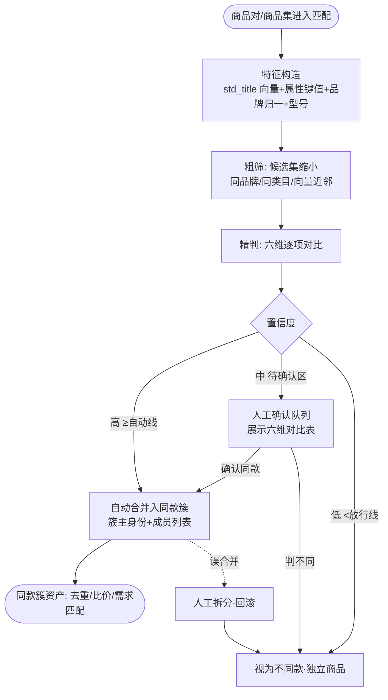

# 同款精确匹配（AIP-010）

> 节点段：12/20 UAT（功能完善段 11/15–12/5）｜ Owner：AI 产品负责人 ｜ 评审：商品业务对接人
> 状态：v0.3（2026-09-26，完整版立卡）

## 1 概述（TL;DR）

在品牌、规格、型号、数量、版本、款式六个维度上全方位对比，判断两条商品是不是同一款——同款合并去重（一个商品一个身份），并支撑后续的需求匹配与价格对比用途。行业公认难题（Amazon ASIN 聚合、跨平台实体对齐同源问题），多信号融合是正解。

## 2 背景与问题（Problem）

- **现状**：同一把"得力 5502 订书机"从京东、震坤行、供应商目录三路进来，标题写法各异，成为三条"不同"商品。
- **痛点**：重复商品让比价无从比起（同款找不到一起）、库存销量被分流、搜索结果重复刷屏；商品池膨胀浪费治理与存储成本。
- **机会**：标题标准化（std_title 176,074 全量）+ 属性抽取（AIP-012）+ 品牌归一已产出高质量匹配特征；ES 同款簇与保守门禁已在 commit 链路实测。

## 3 目标与非目标（Goals / Non-Goals）

**目标**
- G1：六维对比（品牌/规格/型号/数量/版本/款式）输出同款判定，带置信度
- G2：批量执行——存量商品聚类去重 + 增量入库实时判重
- G3：保守策略兜底——高置信自动合并、中置信人工确认、低置信放行（三档分流）
- G4：同款簇成为下游资产（比价视图/需求匹配的比对基础，后续用途）

**非目标**
- N1：不做价格合理性判断（价格巡检域）
- N2：不做图片以图搜同款（二期多模态增强，本期文本+属性信号）
- N3：合并动作不自动改库存/价格（只建同款关系，交易字段取源优先级另行裁决）

## 4 用户与场景（Personas & Use Cases）

**用户角色**

| 角色 | 描述 | 核心诉求 |
|---|---|---|
| 商品运营 | 池的守门人 | 重复商品少、簇关系可查可拆 |
| 集采经办 | 比价使用者 | 同款多供应商能聚到一起比 |
| 系统 | 增量入库 | 新品实时判重不重复上架 |

**用户故事**
- US-1：作为运营，我希望存量商品批量跑一遍同款聚类，高置信自动合并、中置信给我确认，以便池子一次清干净。
- US-2：作为集采经办，我希望同款商品的多个供应商报价聚在一起，以便直接比选（后续用途）。
- US-3：作为运营，我希望合并错了可以拆开，以便误合并可回滚。

**触发场景**：增量——新品入库治理链末端自动判重；存量——批量聚类任务人工发起；拆分——人工随时。

## 5 业务流程（Diagrams）

读图要点：两阶段（粗筛缩候选 + 精判六维）控制成本；三档分流与治理三态同构（auto/review/passthrough）；同款簇是资产不是终点——比价与需求匹配是后续用途。

## 6 功能需求（Functional Requirements）

### 6.1 需求详述

**FR-1 六维对比**：对候选商品对在品牌（归一后）、规格、型号、数量、版本、款式六维逐项对比，输出维度级一致/不一致/缺失与总置信度。
**FR-2 两阶段执行**：粗筛（同品牌+同类目+向量近邻 topN 缩小候选）→ 精判（六维细比）；批量任务按"品牌×类目"分片并行。
**FR-3 三档分流**：置信 ≥ 自动线自动合并；区间内进人工确认队列；低于放行线判不同款。两条阈值可配置。
**FR-4 同款簇管理**：合并生成同款簇（簇主=源优先级最高的成员）；簇可查看成员列表与合并依据；人工可拆分（拆分记录留痕可回滚）。
**FR-5 增量实时判重**：新品入库时对候选簇执行同判定，命中高置信即入簇不重复上架。
**FR-6 簇资产输出**：同款簇关系对外提供查询（簇成员、多供应商来源），作为比价视图与需求匹配的数据基础。
**FR-7 保守默认**：工程默认口径——无品牌或无型号信息的商品不自动合并（进人工确认），业务可推翻。

### 6.2 页面与原型（Wireframes）

**界面形态**：运营后台 → 商品中台 → 同款匹配（人工确认队列为主界面）。
AI 功能位置：确认队列卡片——左右两条商品对照 + 六维对比表（✓/✗/—逐维）+ 置信度分 + [确认合并][判不同][跳过]；簇详情页——簇主/成员/合并历史/拆分按钮。

**完美输出样例**（commit 链路实测口径）：6 个真实商品被保守同款门禁正确拦截转人审（工程默认"brand 缺省恒 review / duplicate 以 cluster 为准"的实测行为）；本卡把该保守行为产品化为三档分流。

### 6.3 字段与数据（Field Schema）

| 对象 | 字段 | 说明 |
|---|---|---|
| 同款簇（dup_cluster） | cluster_id / master_sku / member_skus jsonb / created_by（auto/operator）/ confidence | 簇主=优先级最高源 |
| 匹配记录（dup_match_log） | sku_a / sku_b / 六维结果 jsonb / confidence / verdict（auto_merge/review/pass）/ decided_by | append-only 可回放 |
| 阈值配置 | auto_threshold / review_threshold | 可配置，变更留痕 |

### 6.4 异常与错误处理

| 场景 | 触发 | 系统行为 | 用户感知 |
|---|---|---|---|
| 属性大面积缺失 | 未治理商品 | 不自动合并，全进人工确认 | 队列量增大（治理前置依赖的体现） |
| 向量服务超时 | 语义粗筛失败 | 降级为品牌+类目精确粗筛（召回变窄） | 任务标注"语义粗筛降级" |
| 合并冲突 | 两簇被同一新品同时高置信命中 | 转人工确认（不自动链式合并） | 确认队列出现"簇-簇"对比卡 |
| 拆分回滚 | 人工拆分 | 成员恢复独立身份，历史留痕 | 即时生效 |

## 7 成功指标（Success Metrics）

| 指标 | 定义 | 口径来源 |
|---|---|---|
| 同款匹配 Precision / Recall | 合同基线 P≥85% R≥80% | 00-索引 §参考层（SOW 表 13） |
| 自动合并占比 | auto_merge 占总合并比例（健康度） | 00-索引 §参考层 |
| 误合并率 | 拆分次数/合并次数 | 00-索引 §参考层 |

## 8 里程碑（Milestones）

| 里程碑 | 交付内容 |
|---|---|
| 12/5 | 六维匹配 + 三档分流 + 簇管理界面 |
| 12/20 UAT | 存量批量聚类首轮 + P/R 指标评测报告（标准测试集 5000+ 商品对） |

## 9 验收用例（Acceptance Cases）

| 用例 | Given | When | Then |
|---|---|---|---|
| AC-1 高置信合并 | 同品牌同型号两条仅标题写法不同 | 批量匹配 | auto_merge 入簇；簇主取优先级高源；六维表全 ✓ |
| AC-2 规格不一致 | 型号同但规格 70g vs 80g | 匹配 | 规格维 ✗ → 不自动合并（进确认或放行） |
| AC-3 人工确认 | 中置信对 | 确认队列操作 | [确认合并]入簇且 decided_by=operator |
| AC-4 拆分回滚 | 已合并簇 | 点拆分 | 成员恢复独立；记录留痕 |
| AC-5 增量判重 | 新品与既有簇高置信同款 | 入库 | 直接入簇不重复上架 |
| AC-6 无品牌保护 | 商品无品牌信息 | 匹配 | 不自动合并，进人工确认 |
| AC-E1 语义降级 | 向量服务超时 | 批量任务 | 降级粗筛继续跑，任务标注降级 |
| AC-P1 阈值配置权限 | 无角色账号改阈值 | 拒绝 | 留痕 |

## 10 开放问题（Open Questions）

- Q1：合并后交易字段（价格/库存）取值规则——沿用 AIP-002 源优先级？——评审确认
- Q2：图像向量加入精判的时点（二期，DEV_PLAN 批次二已立项）——排期

## 11 相关文档（Appendix）

- 上游：`../00-功能点总索引.md` ｜ 关联：`AIP-012`（属性特征来源）、`AIP-002`（源优先级）
- 参考：SMART_LISTING_PLAN（同款簇与置信分流设计）、../../DATA_ASSET_MAP.md

## 变更记录

| 日期 | 版本 | 变更 | 说明 |
|---|---|---|---|
| 2026-09-26 | v0.3 | 完整版立卡 | 补齐 UAT 段文档缺口 |
