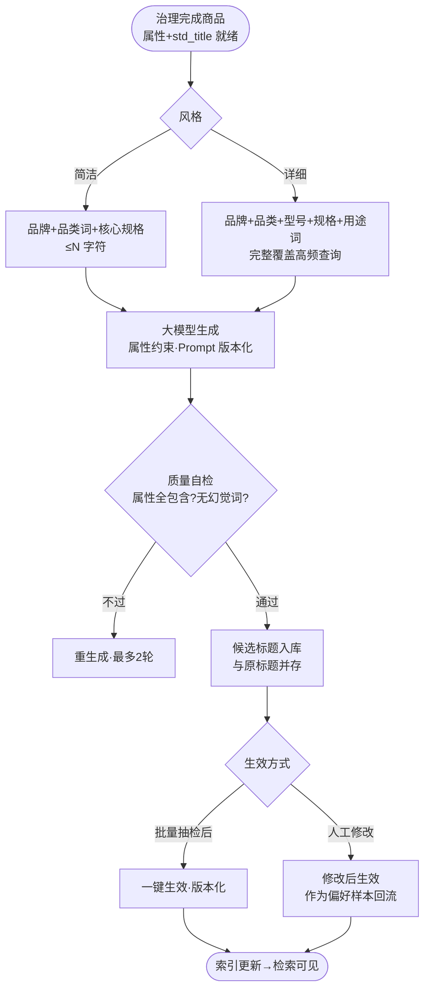

# SEO 标题自动生成（AIP-011）

> 节点段：12/20 UAT（功能完善段 11/15–12/5）｜ Owner：AI 产品负责人 ｜ 评审：采购业务对接人（搜索侧联审）
> 状态：v0.3（2026-09-26，完整版立卡）

## 1 概述（TL;DR）

基于商品属性（品牌/型号/规格等治理产出）自动生成符合搜索优化的商品标题，简洁/详细两种风格可自定义——让每件商品的标准名同时是"搜得到的名"，属性治理的价值直接变现为检索流量。

## 2 背景与问题（Problem）

- **现状**：供应商原始标题口语化、关键属性堆砌无序或缺失（"超好用的订书机办公室必备"）。
- **痛点**：原始标题搜不到（关键词与采购人查询不匹配）也筛不到（属性未进标题无法被泛查询命中）；人工逐条改标题在数万 SKU 规模下不可行。
- **机会**：std_title 标准化（176,074 全量）与属性抽取（AIP-012）已产出结构化原料，标题生成是"治理→检索"价值链的最后一公里。

## 3 目标与非目标（Goals / Non-Goals）

**目标**
- G1：按类目生成搜索友好标题——核心属性（品牌/品类词/型号/规格）按该类目的高频查询模式排序
- G2：简洁/详细两种风格，用户级可选可配默认
- G3：生成结果可审可改——人工修改后作为偏好样本回流
- G4：生成标题与原标题并存（原始层只读原则），生效标题版本化

**非目标**
- N1：不做营销文案生成（卖点/详情页文案是另一个域）
- N2：不替代 std_title（标准化名是身份，SEO 标题是展示名，两个字段并存）
- N3：不做跨语言/多语言标题（二期）

## 4 用户与场景（Personas & Use Cases）

**用户角色**

| 角色 | 描述 | 核心诉求 |
|---|---|---|
| 商品运营 | 标题生效者 | 批量生成、抽检、一键生效 |
| 采购人 | 搜索使用者 | 搜什么都命中想要的（间接受益） |
| 搜索中台 | 消费方 | 索引字段直接取生效标题 |

**用户故事**
- US-1：作为运营，我希望按类目圈选商品批量生成标题、抽检后一键生效，以便检索质量整体提升。
- US-2：作为运营，我希望统一设"简洁风"为默认、详情类目用"详细风"，以便不同类目各有最优形态。
- US-3：作为采购人，我希望搜"18W 灯管"能命中"三雄极光 T8 LED灯管 18W 6500K"这样的标题，以便一眼确认是对的商品。

**触发场景**：治理入库链末端批量生成（默认简洁风）；运营按需批量重生成（风格切换）；人工修改触发单条重生成建议。

## 5 业务流程（Diagrams）

读图要点：生成不是终点——质量自检（属性全包含/无幻觉词）与人工修改回流是标题越生成越准的机制；生效版本化保证可回滚。

## 6 功能需求（Functional Requirements）

### 6.1 需求详述

**FR-1 属性驱动生成**：标题必须由治理产出字段（品牌归一/品类词/型号/规格）构成，模型只做排序与组织，禁止编造属性值（防幻觉硬约束）。
**FR-2 风格两档**：简洁（品牌+品类+核心规格，字符上限可配）与详细（全属性+用途词）；默认风格可按类目配置。
**FR-3 质量自检**：生成后自动校验——核心属性是否全包含、是否出现属性表以外的词（幻觉词）、字符限制；不过则重生成，最多 2 轮后转人工。
**FR-4 批量执行**：按类目/批次圈选批量生成；进度与失败清单可见。
**FR-5 生效与版本**：候选标题默认不生效；批量抽检或人工修改后一键生效；生效标题版本化（历史可查可回滚）；原始标题永不覆盖。
**FR-6 修改回流**：人工修改记录（原候选 vs 人工稿）作为偏好样本沉淀，供 Prompt 迭代。
**FR-7 索引联动**：生效标题变更触发检索索引更新（与 AIP-015 同步链路）。

### 6.2 页面与原型（Wireframes）

**界面形态**：运营后台 → 商品中台 → SEO 标题（列表：原标题/候选/生效中三列对照 + 批量工具栏）。
AI 功能位置：候选列即生成结果；行内"采纳/编辑/重生成"三键；顶部风格切换与按类目默认配置。

**完美输出样例**（设计样例，属性来自治理层）：
- 原：`得力牌5502型订书机 大号耐用办公室文具`
- 简洁：`得力 5502 订书机 中号`
- 详细：`得力 5502 订书机 中号 24钉/次 办公文具`
（详细版属性全部来自 attributes 字段——"24钉/次"若无属性支撑则自检拦截，不允许出现。）

### 6.3 字段与数据（Field Schema）

| 对象 | 字段 | 说明 |
|---|---|---|
| 标题版本（seo_title） | sku / style（brief/detail）/ content / status（candidate/active/retired）/ prompt_version / created_by | 版本化 |
| 偏好样本（seo_edit_sample） | sku / candidate / human_edited / diff_note | Prompt 迭代语料 |
| 风格配置（seo_style_conf） | scope（类目）/ default_style / char_limit | 按类目可配 |

### 6.4 异常与错误处理

| 场景 | 触发 | 系统行为 | 用户感知 |
|---|---|---|---|
| 属性缺失 | 核心属性空 | 不生成，列入"待属性补齐"清单 | 与 AIP-012 联动补齐后自动重跑 |
| 幻觉词检出 | 自检发现属性外词 | 重生成；2 轮不过转人工 | 候选标记"需人工" |
| 生成服务超时 | 模型超时 | 该条跳过进失败清单可重跑 | 批量进度不受阻 |
| 生效回滚 | 切回历史版本 | 索引同步回滚 | 检索即时恢复旧标题 |

## 7 成功指标（Success Metrics）

| 指标 | 定义 | 口径来源 |
|---|---|---|
| 属性覆盖率 | 生效标题含全部核心属性比例 | 00-索引 §参考层 |
| 检索命中提升 | 生效前后 Top-K 命中对比（A/B） | 00-索引 §参考层 |
| 人工修改率 | 修改/总生效（越低越好） | 00-索引 §参考层 |

## 8 里程碑（Milestones）

| 里程碑 | 交付内容 |
|---|---|
| 12/5 | 生成+自检+版本化+批量工具 |
| 12/20 UAT | 高动销存量首轮生效 + 生效前后检索命中对比报告 |

## 9 验收用例（Acceptance Cases）

| 用例 | Given | When | Then |
|---|---|---|---|
| AC-1 简洁风 | 商品属性齐（品牌/型号/规格） | 生成 | 候选含三要素、≤字符上限 |
| AC-2 幻觉拦截 | 属性表无"24钉/次" | 生成含该词 | 自检拦截重生成；2 轮不过转人工 |
| AC-3 版本回滚 | 已生效标题 | 切回上一版 | 生效与索引同步回滚 |
| AC-4 修改回流 | 人工改写候选 | 保存 | 修改生效；样本入库（candidate vs human） |
| AC-5 属性缺失 | 核心属性空 | 批量生成 | 跳过并进待补齐清单，不产出错误标题 |
| AC-E1 服务超时 | 模型超时 | 批量 | 该条进失败清单，任务继续 |
| AC-P1 类目配置 | 无角色改默认风格 | 拒绝 | 留痕 |

## 10 开放问题（Open Questions）

- Q1：各类目字符上限与核心属性排序模板——商品+采购业务对接人共定（11-30 前）
- Q2：生效是否需要采购侧联审（标题影响检索面）——评审确认

## 11 相关文档（Appendix）

- 上游：`../00-功能点总索引.md` ｜ 关联：`AIP-012`（属性原料）、`AIP-015`（索引联动）
- 参考：../../属性抽取产品文档.md（v4 事实源；旧 ATTRIBUTE_EXTRACTION_PRD.md v1.0 已留档）

## 变更记录

| 日期 | 版本 | 变更 | 说明 |
|---|---|---|---|
| 2026-09-26 | v0.3 | 完整版立卡 | 补齐 UAT 段文档缺口 |
