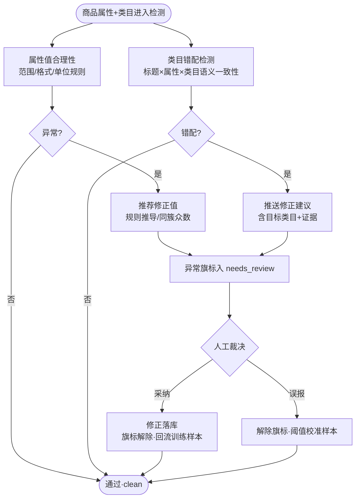

# 属性合理性检测（AIP-013）

> 节点段：12/20 UAT（功能完善段 11/15–12/5）｜ Owner：AI 产品负责人 ｜ 评审：商品业务对接人
> 状态：v0.3（2026-09-26，完整版立卡）

## 1 概述（TL;DR）

两双眼睛看商品数据：属性值合理性（重量为负、尺寸格式错、单位超出常理范围）与类目错配（“手机”挂在“电脑”类目）——异常自动检出并推荐修正值/修正类目，推送运营确认。让脏数据在进入检索与交易之前被拦下。

## 2 背景与问题（Problem）

- **现状**：属性抽取与供应商自报的属性值无质量闸门——"重量: -0.5kg"、"尺寸: 大约一米"；类目错挂实测约 18% 商品明确挂错、5.0% 疑似（TCCC 审计口径），四年 ¥1.22 亿订单因类目缺失无法分析。
- **痛点**：错误属性直接污染筛选面板（价格区间桶失真）与比价（规格不可比）；错挂类目让商品"在错误的货架上"永远等不到对的人。
- **机会**：TCCC 审计（176,140 条全量扫描 + LLM 二审 8,867 条裁决）已验证"规则粗筛 + 模型精判 + 人工兜底"的三层路线与阈值校准方法。

## 3 目标与非目标（Goals / Non-Goals）

**目标**
- G1：属性值合理性——范围/格式/单位三类规则全量检测，异常推荐修正值
- G2：类目错配——标题/属性与类目语义一致性检测，错配推送修正建议（含目标类目）
- G3：与治理三态联动——异常旗标进 needs_review，人工确认后回流
- G4：存量增量双轨——存量批量体检（复用 TCCC 链路）+ 入库实时检测

**非目标**
- N1：不判描述文字规范（AIP-008 域）
- N2：不自动改挂类目（只建议，改挂经人工确认——沿用 TCCC 判例纪律）
- N3：不检测图片内容（AIP-007 域）

## 4 用户与场景（Personas & Use Cases）

**用户角色**

| 角色 | 描述 | 核心诉求 |
|---|---|---|
| 商品运营 | 数据质检员 | 异常清单可批量处理、建议可直接采纳 |
| 治理工程师 | 体检任务执行者 | 存量批量跑、阈值可校准 |
| 数据消费方 | 搜索/报表 | 拿到的属性与类目可信 |

**用户故事**
- US-1：作为运营，我希望"重量为负"这类异常自动进清单并给出推荐值，以便一键采纳批量修。
- US-2：作为运营，我希望"手机挂电脑类目"的错配给出目标类目建议，以便确认后一键改挂。
- US-3：作为治理工程师，我希望错配检出阈值可校准（误报/漏报平衡），以便不同类目各有最优阈值。

**触发场景**：入库治理链实时检测；存量批量体检定时/人工；TCCC 纠正回流（corrected 8,311 条待业务确认后批量改挂）。

## 5 业务流程（Diagrams）

读图要点：两条检测线共用"检出→建议→人工→回流"闭环；误报与采纳都是样本（校准阈值与迭代模型）——这是 TCCC 已验证的校准飞轮。

## 6 功能需求（Functional Requirements）

### 6.1 需求详述

**FR-1 属性值规则检测**：三类规则——范围（数值上下限/非负）、格式（尺寸/日期/编码格式）、单位（与类目标准单位表一致）；规则按类目属性 Schema 配置。
**FR-2 修正值推荐**：异常值给出推荐修正——同款簇属性众数、同类目统计众数或规则推导（如负号误录取绝对值），推荐值标注来源。
**FR-3 类目错配检测**：标题与属性向量和候选类目语义比对，错配输出目标类目建议 + 证据摘要（标题中的类目指示词）。
**FR-4 三态联动**：检出即打异常旗标（quality_flags），商品转 needs_review；修正/误报解除旗标恢复 clean——与治理三态体系一致。
**FR-5 人工裁决界面**：异常清单按严重度排序；行内 [采纳建议][标记误报][跳过]；采纳即落库。
**FR-6 阈值可校准**：错配判定阈值按类目可调；校准依据（误报率/检出率）看板化。
**FR-7 双轨执行**：入库实时（治理链一环）+ 存量批量（复用 TCCC 全量扫描链路，支持断点续跑）。

### 6.2 页面与原型（Wireframes）

**界面形态**：运营后台 → 商品中台 → 数据体检（异常清单）。
AI 功能位置：清单行 = 商品+异常项+推荐修正+证据；行内三键裁决；顶部按异常类型 Tab（值异常/类目错配）与阈值校准入口。

**完美输出样例**（TCCC 实测口径）：全量扫描 176,140 条——ok 60,710 / low_conf 106,265 / suspicious 8,838（5.0%，与抽样 5.2% 一致）；LLM 二审 8,867 条裁决：corrected 8,311（93.7%，100% 反查到 path_id，仅 3% 落兜底叶）——本卡即该能力的功能化与常态化。

### 6.3 字段与数据（Field Schema）

| 对象 | 字段 | 说明 |
|---|---|---|
| 异常记录（quality_flag） | sku / flag_type（value_range/format/unit/cat_mismatch）/ detail jsonb / suggest / severity / status（open/fixed/false_positive） | 复用 gov_product.quality_flags 数组 |
| 修正动作（quality_fix_log） | sku / flag / action（adopt/reject）/ old / new / operator | append-only 回流样本 |
| 阈值配置（qa_threshold） | scope（类目）/ mismatch_threshold / calibrated_at | 校准留痕 |

### 6.4 异常与错误处理

| 场景 | 触发 | 系统行为 | 用户感知 |
|---|---|---|---|
| 无同簇众数 | 新品孤立无参照 | 推荐值降级为规则推导或"待人工" | 建议列标注来源 |
| 语义服务超时 | 错配检测模型超时 | 该条挂起转批量补跑 | 不阻断入库主链 |
| 误报集中 | 某规则误报率超阈值 | 自动提示校准该类目阈值 | 看板红色提示 |
| 批量中断 | 存量扫描中断 | 断点续跑 | 进度不回零 |

## 7 成功指标（Success Metrics）

| 指标 | 定义 | 口径来源 |
|---|---|---|
| 检出率 / 误报率 | 错配检出两率平衡（TCCC 校准基线 FP=5.0%/TP=25.9%） | 00-索引 §参考层 |
| 采纳率 | 建议被采纳比例 | 00-索引 §参考层 |
| 异常存量下降 | open 旗标商品数趋势 ↓ | 00-索引 §参考层 |

## 8 里程碑（Milestones）

| 里程碑 | 交付内容 |
|---|---|
| 12/5 | 规则检测 + 错配检测 + 裁决界面 |
| 12/20 UAT | TCCC corrected 8,311 条回流执行 + 存量体检报告（A 类质量报告一部分） |

## 9 验收用例（Acceptance Cases）

| 用例 | Given | When | Then |
|---|---|---|---|
| AC-1 负值检出 | 重量=-0.5 | 入库检测 | flag value_range + 推荐值（同簇众数或 abs）+ 转 review |
| AC-2 格式检出 | 尺寸="大约一米" | 检测 | flag format + 标准格式提示 |
| AC-3 类目错配 | 手机挂电脑类目 | 检测 | flag cat_mismatch + 目标类目建议+证据 |
| AC-4 采纳回流 | 异常行点采纳 | 落库 | 值修正/类目改挂；旗标解除；样本留痕 |
| AC-5 误报校准 | 标记误报超阈值 | 看板 | 该类目阈值校准提示 |
| AC-6 断点续跑 | 批量扫描中断恢复 | 重启 | 从断点继续不重扫 |
| AC-E1 语义超时 | 模型超时 | 入库 | 挂起批量补跑，主链不阻 |
| AC-P1 裁决权限 | 无角色账号采纳修正 | 拒绝 | 留痕 |

## 10 开放问题（Open Questions）

- Q1：TCCC 8,311 corrected 回流的业务确认流程（人审簿 tccc_adjudication_review.xlsx）——商品业务对接人
- Q2：自动改挂高置信（≥99%）是否放行（OPEN-006 关联决策）——评审

## 11 相关文档（Appendix）

- 上游：`../00-功能点总索引.md` ｜ 关联：`AIP-008`（规范域分界）、`AIP-003/004`（类目资产）
- 参考：STATUS TCCC 两行（审计+二审）、../../DATA_ASSET_MAP.md

## 变更记录

| 日期 | 版本 | 变更 | 说明 |
|---|---|---|---|
| 2026-09-26 | v0.3 | 完整版立卡 | 补齐 UAT 段文档缺口；锚定 TCCC 实测 |
