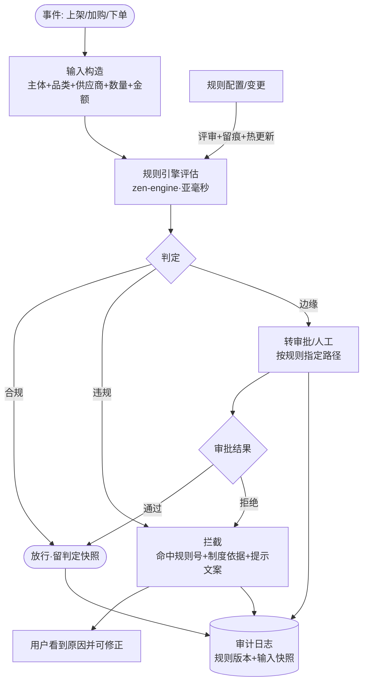

# 集采专区合规管控（AIP-014）

> 节点段：12/20 UAT（功能完善段 11/15–12/5）｜ Owner：AI 产品负责人 ｜ 评审：商品业务对接人 + 合规归口
> 范围：SOW 合同能力（COMP-08）｜ 文档状态：**Frozen v1.0**（2026-10-09 冻结；签署记录见 ../../PRD-REVIEW-CHECKLIST.md）
> 实现进度见 `docs/STATUS.md`；本文只维护需求定义与验收契约
> 术语口径：合同表述"由智能体进行逻辑判断"——技术实现为**规则引擎**（确定性逻辑判断），非自主智能体；对外表述统一用"合规管控引擎（合同名：智能体）"。

## 1 概述（TL;DR）

给集采专区装一道确定性闸门：采买规则（准入品类/供应商范围/数量限额/审批条件）由业务配置，进入集采专区的每一笔行为（商品上架/加购/下单）经规则引擎逐条判定，合规放行、违规拦截、边缘转人工——集采合规不依赖人工事后审计。

## 2 背景与问题（Problem）

- **现状**：集采是内部主场景（内部采购优先策略），采买纪律靠制度文件与人工抽查。
- **痛点**：规则散落制度文件里，执行一致性靠人——超范围采购/超限额/非协议供应商等违规在事后审计才发现，追溯成本高；事后追责不如事前拦截。
- **机会**：规则引擎底座（zen-engine，亚毫秒评估、热更新、可审计）已在项目中就位；集采规则高度结构化（品类/供应商/数量/金额），是规则引擎的标准应用场景。

## 3 目标与非目标（Goals / Non-Goals）

**目标**
- G1：采买规则可配置——准入品类、供应商范围、数量/金额限额、审批触发条件四类规则结构化配置
- G2：三个卡点实时判定——集采商品上架准入、采购人加购校验、下单前终审，违规即拦并给出命中规则
- G3：全程可审计——每次判定留规则版本与输入快照，审计可回放任意一笔
- G4：规则热更新——制度变更配置即生效，不中断服务

**非目标**
- N1：不做价格合理性（价格巡检域）
- N2：不做审批流本身（审批由商城交易域承接，本卡只判定"是否需要审批/是否违规"）
- N3：不做机器学习判定（集采合规是硬约束，确定性规则是设计选择而非能力妥协）

## 4 用户与场景（Personas & Use Cases）

**用户角色**

| 角色 | 描述 | 核心诉求 |
|---|---|---|
| 集采管理 | 规则制定者 | 制度数字化配置、变更可控 |
| 采购人 | 规则遵循者 | 违规即时知道原因（而非事后追责） |
| 合规/审计 | 监督者 | 任意一笔可回放判定依据 |

**用户故事**
- US-1：作为集采管理，我希望"某类目仅限协议供应商 A/B 供货"配置后即时生效，以便制度落地不走样。
- US-2：作为采购人，我加购超限额商品时立即看到"超出单次采购限额 X 件（依据：集采规则 R-12）"，以便当场修正。
- US-3：作为审计，我希望输入订单号就能回放当时的规则版本与判定过程，以便抽查不用翻系统日志。

**触发场景**：集采商品上架时（准入判定）；采购人加购时（数量/范围校验）；下单提交时（终审）；规则变更时（配置生效）。

## 5 业务流程（Diagrams）



读图要点：规则引擎是唯一判定点（无模型参与——确定性红线）；三路出口（放行/拦截/转审批）全部落审计日志；规则变更走评审留痕，与词库管理同一纪律。

## 6 功能需求（Functional Requirements）

### 6.1 需求详述

**FR-1 规则配置**：四类规则结构化配置——品类准入（集采专区允许的类目范围）、供应商范围（协议供应商清单）、限额（单次/周期数量与金额）、审批触发（何种组合需走审批）；支持按采购单位差异化配置。
**FR-2 三卡点判定**：商品上架准入（集采专区商品须过品类+供应商规则）、加购校验（实时反馈，不拦截到提交才发现）、下单终审（最终闸门，绕不过）。
**FR-3 违规可解释**：拦截必须输出命中规则号、制度依据文案、修正指引；禁止无理由拦截。
**FR-4 边缘转审批**：规则可将"边缘场景"（如超限额但低于审批上限）路由到审批流而非直接拦截；路由目标可配。
**FR-5 审计回放**：每次判定记录规则集版本、输入快照、判定路径与结论；按订单/加购单/SKU 可查。
**FR-6 规则热更新**：配置变更经评审确认后生效（秒级），生效时间留痕；进行中的判定用旧版本完成。
**FR-7 性能**：单次判定 P99 < 50ms（同步卡点不拖慢加购/下单体验）。

### 6.2 页面与原型（Wireframes）

**界面形态**：运营后台 → 商品中台 → 集采合规（规则管理 + 判定日志两个页签）；前台拦截提示条。
AI 功能位置：本卡无"AI 视觉元素"（规则引擎是确定性后端）——界面重点是规则配置表单（四类规则向导）与判定日志检索；前台拦截条示例："⚠ 超出单次采购限额 50 件（当前 120 件）｜依据：集采规则 R-12《XX集采专区采买纪律》第3条｜[减少数量] [申请审批]"。

**完美输出样例**（接口契约）：
```json
{"event": "cart_add", "org": "ORG-031", "sku": "SK-1042", "qty": 120,
 "verdict": "block", "rule_id": "R-12",
 "reason": "超出单次采购限额 50 件", "advice": "减少数量或提交审批",
 "rule_version": "poly-purchase-2026.12", "latency_ms": 3}
```

### 6.3 字段与数据（Field Schema）

| 对象 | 字段 | 类型 | 必填 | 校验/默认 | 说明 |
|---|---|---|---|---|---|
| 集采规则（purchase_rule） | rule_id / type / scope | BIGINT / ENUM / VARCHAR | 是 | type ∈ {category, supplier, quota, approval}（全枚举）；scope=单位/专区 | 决策表结构 |
| 集采规则（purchase_rule） | condition / status / version | JSONB / ENUM / VARCHAR | 是 | condition 最小结构 {field, op, value}；status ∈ {draft, active, disabled} | 版本化 |
| 判定日志（rule_eval_log） | event / ref_id / input / verdict / rule_id / rule_version / latency_ms | — | 是 | event ∈ {listing, cart_add, order}；verdict ∈ {pass, block, review}；append-only | 审计可回放；保留期 ≥2 年 |
| 规则版本（rule_release） | version / ruleset_hash / approved_by / effective_at | — | 是 | version 唯一 | 评审留痕 |

### 6.4 异常与错误处理

| 场景 | 触发 | 系统行为 | 用户感知 |
|---|---|---|---|
| 规则引擎异常 | 评估服务故障 | **fail-safe 拦截**（集采事件全部转人工/审批，不放行） | 提示"合规校验暂不可用，已转人工" |
| 规则冲突 | 两规则结论相反 | 按更严格者执行并记录冲突 | 规则管理页告警 |
| 配置错误 | 条件表达式非法 | 保存拒绝+校验提示 | 无法生效 |
| 审批流不可用 | 路由目标故障 | 事件挂起重试，不静默放行 | 告警 |

## 7 成功指标（Success Metrics）

| 指标 | 定义 | 口径来源 |
|---|---|---|
| 判定性能 | P99 < 50ms | 00-索引 §参考层 |
| 违规拦截率 | 应拦尽拦（审计抽验 100%） | 00-索引 §参考层 |
| 规则生效时延 | 评审通过→生效 < 1min | 00-索引 §参考层 |

## 8 里程碑（Milestones）

| 里程碑 | 交付内容 |
|---|---|
| 12/5 | 规则配置 + 三卡点接入 + 审计日志（**优先级已按内部主场景提前**） |
| 12/20 UAT | 首批集采规则与制度对齐评审 + 判定性能报告 |

## 9 验收用例（Acceptance Cases）

| 用例 | 覆盖 FR | Given | When | Then |
|---|---|---|---|---|
| AC-1 准入拦截 | FR-2、FR-3 | 非协议供应商商品申请入集采专区 | 上架判定 | block + 命中供应商范围规则 |
| AC-2 限额实时 | FR-2、FR-3 | 单位限额 50 件，加购 120 | 加购 | 即时 block + R-12 依据 + [申请审批]路径 |
| AC-3 边缘转审批 | FR-4 | 超限但在审批上限内 | 下单 | verdict=review 路由审批流 |
| AC-4 审计回放 | FR-5 | 任意已判订单 | 查日志 | 规则版本+输入快照+路径完整 |
| AC-5 热更新 | FR-6 | 规则限额 50→80 评审生效 | 新事件 | 按 80 判定；进行中事件用旧版完成 |
| AC-6 判定性能 | FR-7 | 同步卡点压测抽样 | 加购/下单 | P99 < 50ms，不拖慢交易主链 |
| AC-7 按单位差异化 | FR-1 | 两单位配置不同品类准入 | 分别判定 | 各按本单位规则集出结论 |
| AC-E1 引擎故障 | FR-2 | 评估服务宕机 | 集采事件 | fail-safe 全转人工，零静默放行 |
| AC-P1 配置权限 | FR-1 | 无集采管理角色改规则 | 尝试修改 | 拒绝；留痕 |

## 10 开放问题（Open Questions）

| Q ID | 未决问题 | 影响 FR/AC | 选项与推荐项 | 决策 Owner | 截止日期 | 当前状态 | 未决时默认行为 |
|---|---|---|---|---|---|---|---|
| Q1 | 首批规则清单与制度文件对齐（哪四类先配） | FR-1、AC-7 | 推荐：品类准入+供应商范围先行 | 集采管理 + 合规归口 | 2026-12-10 | 待清单 | 只配品类准入一类，其余空缺不拦 |
| Q2 | 审批流对接点（商城交易域哪个单据类型） | FR-4、AC-3 | 待交易域确认 | 联调排期（交易域） | 2026-12-10 | 待对接 | review 挂起+人工处理，不静默放行 |

## 11 相关文档（Appendix）

- 上游：`../00-功能点总索引.md` ｜ 关联：`AIP-002`（源优先级同体系规则配置）
- 参考：../../ARCHITECTURE.md（规则引擎横切层）、handoff 规则判例（fail-safe 设计先例）

## 变更记录

| 日期 | 版本 | 变更 | 说明 |
|---|---|---|---|
| 2026-09-26 | v0.3 | 完整版立卡 | 补齐 UAT 段；标注术语口径（规则引擎非自主智能体）；优先级提前说明 |
| 2026-10-09 | v1.0 | Frozen（规范化修复） | §6.3 升全字段契约；§9 加「覆盖 FR」列并补 AC-6/AC-7（FR-7 性能与 FR-1 差异化配置原无验收覆盖）；§10 表格化 |
