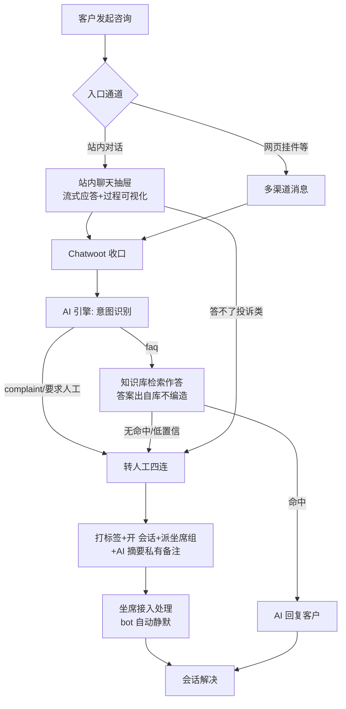
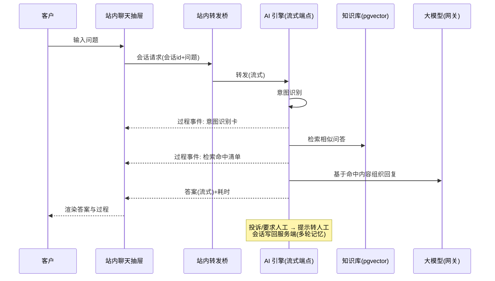
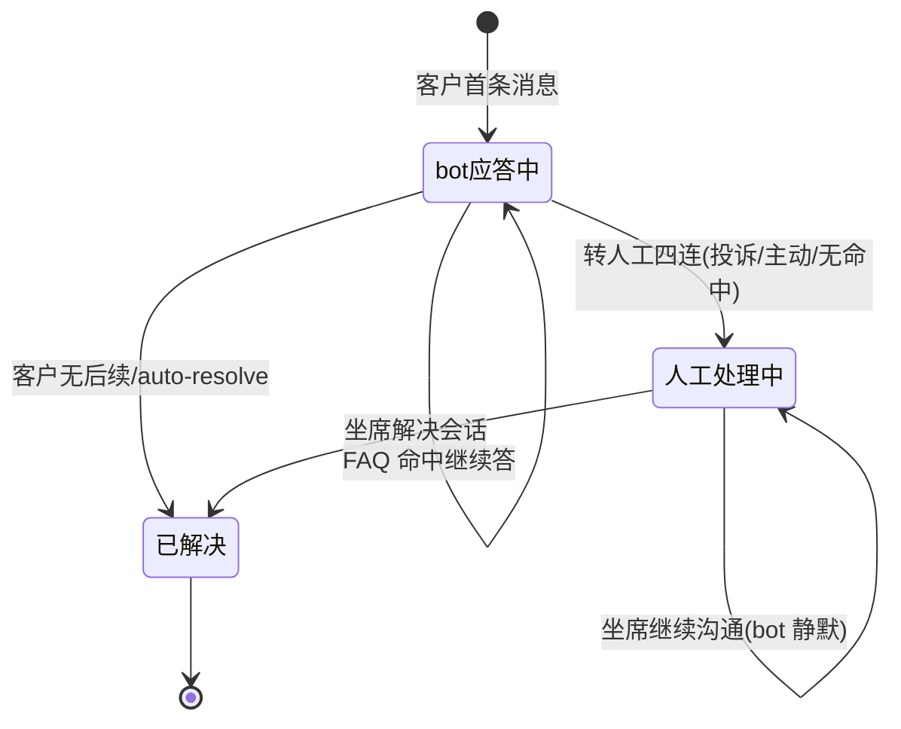

# 双通道在线客服底座（AICS-001–009）

> 节点段：★12/30 MVP ｜ Owner：AI 产品负责人 ｜ 评审：客服业务对接人（转人工口径共审）
> 范围：SOW 合同能力（九项合卡，COMP-16）｜ 文档状态：**Frozen v1.0**（2026-10-09 冻结；签署记录见 ../../PRD-REVIEW-CHECKLIST.md）
> 实现进度见 `docs/STATUS.md`；实测证据见 `docs/CUSTOMER_SERVICE_SCENARIOS.md`；本文只维护需求定义与验收契约
>
> **读者路线**：产品同事读 §1–§3 / §7–§8（定位与价值）；客服运营与业务方读 §4 / §6 / §9（怎么用、边界在哪）；
> 接入方（开放使用）读 §6 FR-10 与 §6.3（嵌入方式与协议契约）。

## 1 概述（TL;DR）

我们为了解决「商城客服人力成本高、响应不及时、投诉必须有人兜底」的问题，建设了
**一条 AI 大脑、两条服务腿**的在线客服底座：客户从**站内对话**（网页/运营台内嵌聊天抽屉，AI 流式秒答）
或**多渠道挂件**（网页聊天挂件等）任一入口进来，都先由同一个 AI 引擎应答（FAQ 检索作答，答案出自知识库不编造）；
答不了或不该答的（投诉、高风险、库外问题）**一步转人工**，坐席在 Chatwoot 工作台接入，
接手瞬间有 AI 摘要和「/」快捷答案辅助。用户只需要说一句话，AI 自动作答或转对的人，
上线后预计高频咨询大部分由机器承接（SOW 口径：标准问题 ≥85% 机器解决），人工只处理真正需要人的部分。

这与市场主流实践一致：国际（Intercom Fin / Zendesk AI Agents）已把「AI 先答 + 人工接管」做成按次解决的
标准商业模式（$0.99–$2.00/次）；国内（七鱼/智齿/Udesk）共识为「机器人优先 + 人工兜底」双轨。
我们的差异点：**开源坐席台（Chatwoot MIT 核心，自部署数据不出域）+ 自研 AI 大脑（统一模型网关）**，
不租用海外 SaaS、不用其企业版 AI，成本按 token 可核算、知识库自主可控。

## 2 背景与问题（Problem）

### 2.1 现状与痛点

- **现状**：商城客服以人工为主（电话+人盯后台），FAQ 类重复咨询（退款/发票/配送/售后规则）占大头；
  知识库此前无统一事实源，同一问题不同客服口径不一。
- **痛点**：
  - 人力：批量推品带来咨询量增长，人工同比例扩张不可持续；
  - 时效：非工作时间（客服 9:00-18:00 之外）无人应答；
  - 合规：投诉类必须有真人兜底，纯 AI 应答投诉有升级风险；
  - 口径：退货政策、账期等强制口径问题答错有业务风险。
- **机会**：AI 客服技术路线已成熟且市场已验证（下表），自部署开源坐席台零 licence 成本，
  自有 LiteLLM 模型网关使单次应答成本远低于国际按次计费。

### 2.2 市场实践经验对照（2026）〔行业参考——定位对照用，不构成本项目验收承诺〕

| 维度 | 国际实践（Intercom Fin / Zendesk） | 国内实践（七鱼/智齿/Udesk） | 本产品取法 |
|---|---|---|---|
| 主流架构 | AI-first：AI 先答，解决不了转人工 | 共识「机器人优先 + 人工兜底」双轨 | 同左：两条入口腿共用一个 AI 引擎，转人工是设计内动作 |
| 计费/成本 | 按次解决计费 $0.99–$2.00/次（Fin 不收转人工的单） | 订阅+调用+人工兜底同表核算 | 自有网关按 token 计费，成本可核算可控（单次成本随用量实测后补录） |
| 量化基准 | Fin 解决率约 50–76%；50% 分流 × 500 单/月 ≈ 省 $20K/月 | 验收基准：机器人直接解决率 ≥80%、转人工率 ≤30%；标杆（三只松鼠）解决 87%/转人工 7% | 采 SOW 口径为纲（标准 ≥85%），行业基准为参照系 |
| 转人工观 | 2026 年评测维度转向「转人工质量」 | **反面教材**：把拦截率当考核 → 用户与机器人纠缠、投诉率反升；2026-09 AI 客服新国标治理此风 | 转人工是安全阀不是成本敌人：不设障、带摘要、坐席秒懂上下文 |
| 人机协同形态 | AI Copilot 按坐席加购（Zendesk $50/坐席/月） | AI 坐席辅助成新形态（王府井等已落地） | 内置：转人工自动写 AI 摘要私有备注 + 「/」快捷答案，不额外付费 |
| 坐席台选型 | 闭源 SaaS | 闭源 SaaS 为主 | **Chatwoot 开源 MIT 核心自部署**：代码可审计、数据不出域；其企业版 AI（Captain）不用，AI 大脑自研——规避「对话数据送第三方模型」的隐私争议 |

> 数据来源见 §11 参考文档。上表数字为行业公开口径，用于定位对照，不构成本项目验收承诺。

## 3 目标与非目标（Goals / Non-Goals）

**目标**
- G1 双通道 MVP 可用：站内对话（流式应答+过程可视化）与网页挂件（多渠道收口到同一坐席台）两条客户入口跑通
- G2 AI 分流：高频标准咨询由机器直接解决，SOW 口径客服标准问题 ≥85%（非标 ≥80%、强制口径 ≥88%）
- G3 转人工不设障：转人工成功率 SOW 一般场景 ≥95%、高风险 100%、库外 ≥99%；转人工带 AI 摘要，坐席零冷启动
- G4 知识库单源：faq_kb 唯一事实源，业务改一条问答，两条腿 + 坐席快捷回复 6 秒内同步生效
- G5 坐席辅助内置：AI 摘要私有备注 + 「/」FAQ 快捷答案（不按坐席加购付费）
- G6 开放接入：对话能力以标准 SSE 协议 + 嵌入式挂件两种方式开放给内外部系统（见 FR-10）

**非目标**
- N1 不追求替代全部人工——市场共识完全替代不现实，投诉/复杂业务始终转人（AICS-010–015 人工接待另卡）
- N2 不做语音/外呼（另立项）
- N3 不使用 Chatwoot 企业版 AI（Captain）——MIT 核心 + 自研大脑是既定红线（数据不出域 + 成本可控）
- N4 MVP 不含 CSAT 满意度评价、多维报表（AICS-029 随试点）
- N5 订单实时问答按渠道分期开放：MVP 阶段订单工具仅在**挂件腿（Chatwoot 渠道）**由智能体接待承接（AICS-016~025 FR-4，含登录身份与订单归属校验）；**站内直连腿一期不接订单实时问答**（enable_tools 默认关闭，场景清单 B10 另立项）——开放节奏与入口范围由 Q6 裁决，未决前按此默认执行（AC-E3 验证边界）

## 4 用户与场景（Personas & Use Cases）

**用户角色**

| 角色 | 描述 | 核心诉求 | 使用频率 |
|---|---|---|---|
| 终端客户（采购员/供应商） | 从商城页面或站内入口咨询 | 说人话就能得到准答案；要真人时能一步找到 | 按需 |
| 人工坐席 | Chatwoot 工作台处理转人工会话 | 接手即懂上下文；高频答案一键填入 | 每日 |
| 客服运营管理员 | 维护 FAQ 知识库、自动化规则 | 改一处、全通道生效；看得见 AI 答了什么 | 每日 |
| 业务负责人 | 关心成本与质量 | 分流率/转人工/口径一致性有数可看 | 每周 |
| 接入方（开放使用） | 内部其他系统/未来外部伙伴 | 用标准协议把对话能力嵌进自己的界面 | 按项目 |

**用户故事**
- US-1：作为采购员，我希望在商城页面直接问「退款多久到账」，AI 秒回标准答案，以便不等人工。
- US-2：作为采购员，我希望说「我要投诉」时立刻被转人工并保留我前面说过的话，以便不用重复描述。
- US-3：作为人工坐席，我希望接手转人工会话时能看到 AI 写的诉求摘要，以便直接处理不问第二遍。
- US-4：作为坐席，我希望输入「/退货」就唤出整段标准答案，以便回复又快又口径统一。
- US-5：作为客服运营，我希望在管理页改一条 FAQ 后两条入口和坐席快捷回复立即生效，以便知识库只维护一处。
- US-6：作为接入方，我希望拿一套标准 SSE 协议把 AI 对话嵌进自己的系统，以便不依赖特定前端。

**触发场景**：①客户在商城页面点挂件/站内入口发起咨询（自动）；②客户消息含投诉关键词或明确要求人工（自动转）；
③AI 检索无命中/置信不足（自动诚实转人工，不编造）；④运营在管理页增删改 FAQ（自动全通道同步）。

## 5 业务流程（Diagrams）

### 5.1 端到端流程图（两条腿共用一个 AI 大脑）



读图要点：两条腿的差异只在「入口与界面」，进入 AI 引擎后完全同源（同一意图识别、同一知识库、同一转人工规则）；
转人工是三类触发的设计内动作（投诉 / 用户主动 / 检索不中），不是失败路径。

### 5.2 关键时序：站内直连腿（流式）



### 5.3 会话状态机（挂件腿，Chatwoot 会话）



状态口径：`bot应答中` = 会话未分配坐席/坐席组；一旦 `assignee/team` 有值即 `人工处理中`，bot 自动静默（防抢话）。
站内直连腿的会话由服务端会话存储维护（会话 id 即多轮记忆键），暂不进 Chatwoot 状态机（见 Q1）。

## 6 功能需求（Functional Requirements）

### 6.1 需求详述

- **FR-1 站内 AI 直连对话（流式）**
  - 规则：系统应在站内聊天抽屉提供流式问答——应答过程（意图识别、知识库检索命中清单）与答案
    逐事件推送到界面，答案未到时显示进行中指示；多轮上下文由服务端会话记忆承接（会话 id 即记忆键）。
  - 字段：见 6.3 对话请求/事件表。
  - 边界：后端不可用时人话提示（不裸抛错误码）；用户中止生成即停（服务端本轮已产生的计算不回滚）。
- **FR-2 多渠道挂件接入**
  - 规则：系统应支持网页聊天挂件嵌入商城任意页面，消息收口到统一坐席台；渠道配置（外观/欢迎语/离线提示）
    为坐席台原生设置项。
  - 边界：bot 对已分配坐席/坐席组的会话静默；同一消息重复投递只处理一次（防重放）。
- **FR-3 AI 先答（零幻觉口径）**
  - 规则：FAQ 意图下系统应先检索知识库（相似度排序 top 命中），答案内容出自知识库条目，大模型只组织语气与
    拼装上下文；检索无命中时不得编造，应诚实告知并转人工。
  - 边界：大模型服务失败时降级为「高分管答原样发出」（相似度 ≥0.6），不做自由生成。
- **FR-4 意图识别与转人工触发**
  - 规则：系统应对每条消息识别意图（常见问题/投诉/要求人工）；关键词版在线（含「退款是常见问题不是投诉」
    口径修正），大模型增强版可配置启用（增加一次调用延迟）。
  - 边界：识别失败按保守路径处理（宁可转人工不误答）。
- **FR-5 转人工四连（不设障）**
  - 规则：触发转人工时系统应自动完成——打标签（诉求分类）、置会话为打开、分配坐席组（如投诉处理组）、
    写入 AI 诉求摘要私有备注并向客户发送安抚话术；坐席接手零冷启动。
  - 边界：四连中单动作失败不阻断其余动作（尽力而为，失败留日志）。
- **FR-6 坐席工作台与辅助**
  - 规则：坐席台应提供中文界面会话处理（回复/私有备注/解决会话）；「/」快捷键唤出 FAQ 标准答案（与知识库
    实时同步）；转人工会话自动带 AI 摘要。
  - 边界：坐席辅助能力（摘要/快捷答案）失败不影响基本回复功能。
- **FR-7 知识库管理（单事实源）**
  - 规则：运营应可在管理页对 FAQ 增删改查（唯一键去重）；保存后自动向量化入检索库并同步坐席快捷回复
    （实测 6 秒内生效）。
  - 边界：向量化服务不可用时保存失败并明确提示（不产生检索不到的半条数据）；删除会提示快捷回复残留口径。
- **FR-8 多轮上下文**
  - 规则：系统应维护服务端会话记忆（最近 N 轮进提示词），追问（"那多久到账"）无需重复背景；
    会话有时效与轮数上限。
  - 边界：记忆存储不可用时降级单轮作答（不影响当次回答）。
- **FR-9 降级与 fail-safe 矩阵**
  - 规则：各依赖失败路径明确——大模型失败→高分管答原样；检索失败→保守转人工；记忆失败→单轮；
    webhook 处理永远 200（错误内部吸收，防上游重试放大）；流式连接异常→错误事件不炸连接。
  - 边界：任何情况下不出现「静默无响应」与「编造答案」两种状态。
- **FR-10 开放接入契约（开放使用）**
  - 规则：对话能力应以两种方式开放——①**协议接入**：标准 SSE 事件流（事件表见 6.3），
    接入方自备界面即可对接（请求体双字段兼容：标准字段 `message/conversation_id` 或轻量字段
    `prompt/chatId`，后者会话 id 即记忆键）；②**挂件接入**：网页挂件脚本嵌入即得完整
    「AI 先答+转人工」闭环。接入鉴权为统一 API Key（`X-API-Key` 头）。
  - 边界：接入方共享同一知识库与转人工规则（口径全局一致，不支持租户级自定义，需求出现时另评）；
    协议接入方转人工暂为「提示+人工跟进」语义，与坐席台会话打通在 Q1 裁决后排期。

### 6.2 页面与原型（Wireframes）

原型三档取用：

1. **真实页面入口（原型档位 1）**：
   - 站内对话抽屉：类目治理运营台（`http://localhost:3199` 右下悬浮球）——空态建议列表 + 流式过程卡 + 气泡
   - 知识库管理页：portal（`http://localhost:8000/#/kb`）——FAQ 增删改查
   - 坐席工作台：Chatwoot（`http://localhost:3002`，中文界面）——会话列表/回复/「/」快捷答案
   - 挂件演示页：`deploy/chatwoot/demo/`（真实挂件 token）
2. **完美输出样例**〔实测，2026-09-26 引擎流式端点真实返回；证据：`docs/CUSTOMER_SERVICE_SCENARIOS.md`〕：

```
客户问：如何申请退款？（站内抽屉发送）

event: toolCall      → 意图识别（过程卡出现）
event: toolResponse  → 意图=faq（关键词判定）
event: toolCall      → FAQ 检索（过程卡出现）
event: toolResponse  → 命中 3 条：1. 如何申请退款？（相似度 1.00）...
event: answer        → 「在「我的订单-申请售后」中选择退款原因提交，审核通过后原路退回。」
event: workflowDuration → 8.01 秒

客户问：我要投诉，物流太慢了 →

event: toolResponse  → 意图=complaint（关键词判定）
event: answer        → 「您的反馈很重要，正在为您转接人工客服处理...」
event: answer        → 「——已触发转人工流程（投诉类咨询），人工客服将尽快与您联系。」
event: workflowDuration → 0.12 秒（投诉路径不调大模型，即答即转）
```

3. **挂件腿样例**〔实测，证据见场景全景清单 conv5/6/7〕：「怎么开发票」秒答；投诉会话坐席侧自动出现
   「【AI 摘要·意图=complaint】客户诉求：…」私有备注；追问「那多久到账」精确承接上文。

### 6.3 字段与数据（Field Schema）

**对话请求（流式端点，双字段兼容）**

| 字段 | 类型 | 必填 | 说明 |
|---|---|---|---|
| message / prompt | string | 二选一 | 客户消息（标准/轻量字段名兼容） |
| conversation_id / chatId | string | 二选一 | 会话 id（多轮记忆键；轻量名即标准名别名） |
| enable_tools | boolean | 否 | 工具型应答模式（LLM 自主检索，多一跳延迟，默认关） |
| enable_intent | boolean | 否 | 大模型意图识别（默认关键词） |

**SSE 事件契约（接入方消费协议）**

| 事件 | data 关键字段 | 语义 |
|---|---|---|
| toolCall / toolParams / toolResponse | `tool.{id, toolName, params, response}` | 过程卡：某步骤开始/入参/结果（意图识别、知识库检索） |
| answer | `choices[0].delta.content` | 答案增量（多帧按序追加） |
| workflowDuration | `durationSeconds` | 本轮耗时 |
| error | `errorText` | 出错人话描述（连接不中断） |

**FAQ 知识库（faq_kb，唯一事实源）**：question（唯一键）/ answer / category / embedding（向量）。
坐席快捷回复由本表自动派生同步（内容寻址幂等，绝不误删坐席手工条目）。

### 6.4 异常与错误处理

| 场景 | 触发条件 | 系统行为 | 用户感知 |
|---|---|---|---|
| 大模型失败 | 网关超时/异常 | 降级高分管答原样（≥0.6）；再失败按无命中走转人工 | 仍得到答案或转人工，无空转 |
| 检索无命中 | 知识库无相似条目 | 诚实告知+转人工 | 「已转人工」而非错误 |
| 记忆存储不可用 | Redis 故障 | 降级单轮作答 | 当次回答正常，追问需重述背景 |
| 上游消息重放/自环 | 同消息 id 重复/非客户消息 | 去重忽略；bot 对接管会话静默 | 无感知 |
| 流式连接异常 | 引擎异常 | error 事件收尾，连接不炸 | 红字错误提示（人话） |
| webhook 处理失败 | 内部错误 | 永远 200 + 日志吸收 | 上游不重试放大 |

## 7 成功指标（Success Metrics）

| 指标 | 定义 | 口径来源 |
|---|---|---|
| 机器直接解决率（标准问题） | FAQ 意图会话中 AI 应答结束且未转人工占比 | SOW 表 13：**≥85%**（非标 ≥80%、强制口径 ≥88%）；行业参照：验收基准 ≥80%、标杆 87% |
| 转人工成功率 | 触发转人工后会话被坐席成功接入处理占比 | SOW 表 13：一般 ≥95%、高风险 100%、库外 ≥99% |
| 知识库生效时延 | FAQ 保存→两条腿+坐席快捷回复可检索 | 实测基线 6 秒内；目标恒 ≤10 秒 |
| 首答时延 | 客户发送→首字节事件到达 | FAQ 路径实测约 8 秒（含大模型生成）；投诉即答路径 0.12 秒 |
| 单次应答成本 | 每次 AI 应答的模型调用成本 | 自有网关按 token 核算；国际对照 $0.99–$2.00/次解决（成本口径随用量实测后补录） |

> 口径一律以 00-索引 §参考层（SOW 表 13）为纲；行业数字仅作参照系，不进验收。

## 8 里程碑（Milestones）

| 里程碑 | 交付内容（计划与出口标准） |
|---|---|
| 引擎与坐席底座 | AI 引擎（意图/检索/转人工规则）+ Chatwoot 自部署 + webhook AI 先答 + 转人工四连 + 知识库管理页 + 变更 6 秒同步；出口=场景清单 A 区全过 |
| 双通道成形 | 站内流式直连端点 + 对话组件包（可嵌入任意站内系统）+ 真实链路 E2E；出口=B 区全过 |
| ★12/30 客服 MVP | 挂件嵌入生产页面、欢迎语/离线提示配置、运营侧规则自助配置、坐席账号体系；出口=AC-1~AC-7 全过 |
| 1/15 试点 | CSAT 满意度、会话/接管率报表（AICS-029）、坐席 AI 推荐侧栏（体验档）、直连腿转人工进坐席台（视 Q1）；出口=试点指标达 SOW 线 |

> 各里程碑**实施状态以 `docs/STATUS.md` 为准**（本卡不维护进度快照）；逐条实测证据见 `docs/CUSTOMER_SERVICE_SCENARIOS.md`（A/B/C/D/E 区）。

## 9 验收用例（Acceptance Cases）

| 用例 | 覆盖 FR | Given | When | Then |
|---|---|---|---|---|
| AC-1 FAQ 秒答（直连腿） | FR-1、FR-3、FR-4 | 站内抽屉可用 | 发送「如何申请退款？」 | 意图卡+检索卡+答案流式渲染，答案含退款标准口径，显示耗时 |
| AC-2 多轮追问 | FR-8 | AC-1 会话未清空 | 发送「那多久到账」 | 回答承接退款语境给出到账时效，无需重述 |
| AC-3 投诉转人工（挂件腿） | FR-5 | 挂件会话进行中 | 发送「我要投诉」 | 会话被打标签+置开+派投诉处理组；坐席侧出现 AI 摘要私有备注；客户收到安抚话术 |
| AC-4 bot 静默 | FR-2 | 会话已分配坐席 | 客户再发消息 | bot 不再自动回复，坐席处理 |
| AC-5 无命中诚实转人工 | FR-3、FR-9 | 知识库无该问题 | 问库外问题 | 不编造，告知并转人工 |
| AC-6 知识库一处改全通道生效 | FR-7 | 管理页可用 | 修改一条 FAQ 答案保存 | ≤10 秒内两条腿检索到新答案、坐席「/」唤出新答案 |
| AC-7 快捷答案 | FR-6 | 坐席台打开会话 | 输入「/退货」 | 唤出退货标准答案整段，点选填入 |
| AC-E1 大模型服务中断 | FR-9 | 网关不可用 | 客户问 FAQ | 高分管答原样发出或转人工，绝不编造/空转 |
| AC-E2 会话记忆故障 | FR-8 | Redis 不可用 | 正常咨询 | 单轮作答正常返回 |
| AC-E3 站内腿订单边界（一期） | FR-1 | 站内直连腿会话（N5 默认口径） | 问「我的订单到哪了」 | 明确告知该入口暂不支持实时订单查询并引导挂件渠道/转人工；不编造订单状态（Q6 裁决前） |
| AC-P1 未授权接入 | FR-10 | 接入方无 API Key（启用鉴权后） | 调流式端点 | 拒绝服务（fail-closed） |

（UAT 演示脚本从本表抽取；工程侧逐条验证记录见《客服引擎场景全景清单》A/B/C/D/E 区。）

## 10 开放问题（Open Questions）

| Q ID | 未决问题 | 影响 FR/AC | 选项与推荐项 | 决策 Owner | 截止日期 | 当前状态 | 未决时默认行为 |
|---|---|---|---|---|---|---|---|
| Q1 | 站内直连腿的转人工是否开 Chatwoot 会话（统一进坐席台） | FR-5、AC-3 | 推荐：1/15 试点打通 | AI 产品负责人＋客服业务 | 2026-12-30（MVP 前） | 待裁决 | 提示转人工+人工跟进，坐席台不感知该会话 |
| Q2 | CSAT 满意度配置与话术（Chatwoot 原生）排期 | AICS-025 衔接 | 随 1/15 试点 | 客服运营 | 2026-12-30 | 待排期 | MVP 不出满意度邀评 |
| Q3 | 报表口径定义（bot 接管率/解决率/满意度趋势，AICS-029） | AICS-029 | 试点前定义 | 业务负责人 | 2026-12-31 | 待定义 | 报表先出原始量，率值待口径 |
| Q4 | 生产环境接入鉴权启用时机（X-API-Key）与开放接入申请流程 | FR-10、AC-P1 | 生产化前启用 | 平台侧 | 2026-12-20 | 待裁决 | 开发态关闭，生产切换时强制启用 |
| Q5 | 单次应答成本实测口径（按 token 核算，对照国际 $0.99–$2.00） | §7 指标 | 随 MVP 流量抽样 | AI 工程负责人 | 2027-01-15 | 待实测 | 只报 token 用量不折算单价 |
| Q6 | 订单实时问询在站内直连腿的开放时点与入口范围（对齐 AICS-016~025 FR-4，**P0-4 裁决项**） | FR-1、AC-E3；AICS-016-025 FR-4/AC-10~AC-12 | 推荐：1/15 试点随工具链灰度开放站内腿 | 客服业务 Owner＋AI 产品负责人 | 2026-12-30（MVP 前） | 待裁决 | 站内腿不查订单（AC-E3 边界），挂件腿按 FR-4 权限校验执行 |

## 11 相关文档（Appendix）

- 工程架构与实测：`docs/AI_APPS_ARCHITECTURE.md` §六（AI 客服引擎全链）；`docs/STATUS.md` 客服行
- 场景逐条验证记录（SSOT）：`docs/CUSTOMER_SERVICE_SCENARIOS.md`
- 决策档：`docs/DECISIONS.md`（ADR-001~008，含 Chatwoot 选型与三条红线：知识库唯一事实源/模型统一出口/坐席台唯一）
- 市场实践来源（2026-09 检索）：
  - [Intercom Fin 定价与解决率评析](https://bunnydesk.ai)、
    [Fin 按次计费模式（$0.99/次）](https://outlearn.com)、
    [Zendesk AI Agents 自动解决计费（$1.5–$2/次）](https://www.eesel.ai)、
    [按次计费成行业惯例综述](https://www.readsignal.io)
  - [国内四大智能客服产品对比（阿里云社区）](https://developer.aliyun.com)、
    [智能客服建设验收基准：解决率≥80%/转人工≤30%（CSDN）](https://bbs.csdn.net)、
    [AI 客服新国标与「转人工困局」（新浪财经）](https://finance.sina.cn)、
    [人机协同实践解析（网易）](https://www.163.com)、[Udesk 机器人优先+人工兜底](https://www.udesk.cn)
  - [Chatwoot 开源与数据主权对比](https://opsily.com)、
    [Chatwoot Captain 数据外送隐私争议（未采用其企业版 AI 的依据）](https://greenlitbooks.com)

## 变更记录

| 日期 | 版本 | 变更 | 说明 |
|---|---|---|---|
| 2026-09-26 | v0.1 | 首版 | 市场实践对照 + 双通道定位 + FR×10 + 实测样例 + 验收用例 |
| 2026-10-09 | v1.0 | Frozen（规范化修复） | N5 改为渠道分期约束并指向 AICS-016~025 FR-4（P0-4，新增 Q6 裁决项与 AC-E3 边界用例）；§8 里程碑剥离实施状态（归 STATUS）；样例标注〔实测〕口径；§9 加「覆盖 FR」列；§10 表格化 |
