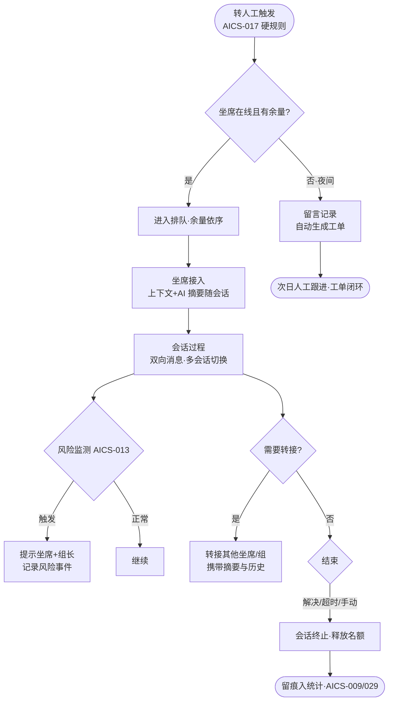

# 人工接待（AICS-010~015）

> 节点段：1/15 试点（12/30 底座就绪）｜ Owner：AI 产品负责人 ｜ 评审：客服业务对接人
> 状态：v0.3（2026-09-26，完整版立卡；六项功能同属人工接待模块，合卡管理）

## 1 概述（TL;DR）

智能体的兜底侧：会话排队与接入管理、无人在线留言、实时双向消息、风险内容监控提示、会话转接、超时释放——让"转人工"之后每一步都有秩序、有监督、有记录。人与 AI 的关系是协同：AI 先答、人兜底、AI 全程辅助。

## 2 背景与问题（Problem）

- **现状**：转人工后无队列规则（谁先接凭感觉）；夜间无坐席即断档；会话风险（不当承诺/违规表述）靠事后抽检。
- **痛点**：排队无序导致体验差与坐席负载不均；风险内容事后发现追责难、损失已造成。
- **机会**：Chatwoot 坐席体系（inbox/团队/标签）承载主体；风险监控引擎独立自研（复用 AICS-013 判例：会话内容实时监测）；AI 辅助让人工只做"真正需要人的部分"。

## 3 目标与非目标（Goals / Non-Goals）

**目标**
- G1：排队接入（AICS-010）——按余量接入，队列透明（位置/预计等待）
- G2：留言兜底（AICS-011）——无坐席时留言记录，自动转工单次日跟进
- G3：会话过程（AICS-012）——实时双向、多会话快速切换
- G4：风险监控（AICS-013）——会话内容实时监测，触发风险即提示坐席与管理者
- G5：转接（AICS-014）——跨坐席/跨组转接带上下文摘要
- G6：名额管理（AICS-015）——超时/手动终止自动释放接待名额

**非目标**
- N1：不做智能应答（AICS-016~ 域；本卡是人工侧）
- N2：不做坐席绩效考核体系（AICS-029 报表域，本卡只供数）
- N3：不做 AI 话术推荐（回复建议引擎已在 :8003 独立运行，接入形态另议——ADR-004）

## 4 用户与场景（Personas & Use Cases）

**用户角色**

| 角色 | 描述 | 核心诉求 |
|---|---|---|
| 采购人/供应商 | 被接待方 | 队列透明、夜间有兜底、转接不重复陈述 |
| 客服坐席 | 接待执行者 | 负载均衡、风险预警、切换高效 |
| 客服组长 | 监督者 | 风险提示可见、转接审计 |

**用户故事**
- US-1：作为采购人，转人工时我希望看到"前面还有 2 人，预计 3 分钟"，以便决定等或留言。
- US-2：作为采购人，深夜咨询无人时我希望留言后有人次日跟进，以便问题不石沉大海。
- US-3：作为坐席，当用户情绪激动或出现承诺类敏感表述时我希望即时收到提示，以便规范应对。
- US-4：作为坐席，转接给同事时我希望 AI 摘要自动带上，以便用户不用重讲一遍。

**触发场景**：转人工触发（AICS-017 硬规则）进入队列；坐席上线自动依序接入；会话中全程风险监测。

## 5 业务流程（Diagrams）

## 6 功能需求（Functional Requirements）

### 6.1 需求详述

**FR-1 排队接入（AICS-010）**：会话按坐席余量依序接入；用户侧可见队列位置与预计等待；坐席侧可设最大并行会话数。
**FR-2 留言（AICS-011）**：无坐席在线时段提供留言表单（问题/附件/联系方式）；留言自动生成工单并指派次日跟进；留言状态用户可查。
**FR-3 双向消息（AICS-012）**：接入后实时双向（文本/图片/附件，与底座 AICS-007 一致）；坐席多会话并行与快速切换。
**FR-4 风险监控（AICS-013）**：监测用户与坐席双向内容，命中风险（不当承诺/违规表述/纠纷升级信号）即时提示当事坐席与组长；风险事件独立记录（类型/片段/处理）。
**FR-5 转接（AICS-014）**：跨坐席/跨组转接；转接包携带会话历史与 AI 摘要；用户侧无感切换提示。
**FR-6 名额释放（AICS-015）**：会话超时（可配）或手动终止自动关闭并释放接待名额；关闭前满意度邀评（与 AICS-025 衔接）。

### 6.2 页面与原型（Wireframes）

**真实页面入口（原型档位 1）**：坐席工作台 = Chatwoot :3002（会话列表/接入/转接/标签开箱能力，实测可用）；风险提示 = 坐席侧 toast + 组长看板（UAT 段随 FR-4 交付）。
AI 功能位置：会话侧栏的 AI 摘要卡（转接时生成）、风险预警条（红签置顶）。

**完美输出样例**（实测口径，CUSTOMER_SERVICE_SCENARIOS）：conv6 投诉转人工四动作实测全中——自动打[投诉]标签、分派坐席组、AI 生成私有摘要、推荐话术；坐席接入回复时 bot 自动静默（人机协同不抢话）。webhook 适配器防自环/防重放/人工接管即静默三机制已验证。

### 6.3 字段与数据（Field Schema）

| 对象 | 字段 | 说明 |
|---|---|---|
| 排队（cs_queue） | conv_id / position / enqueued_at / wait_estimate | 队列透明数据源 |
| 留言（cs_leavemsg） | msg_id / content / attachment / contact / ticket_id FK | 自动转工单 |
| 风险事件（cs_risk_event） | conv_id / direction（user/agent）/ type / fragment / action_taken / created_at | 独立记录 |
| 转接（cs_transfer） | conv_id / from_agent / to_agent|group / summary / transferred_at | 摘要随行 |

### 6.4 异常与错误处理

| 场景 | 触发 | 系统行为 | 用户感知 |
|---|---|---|---|
| 队列超长 | 等待超阈值 | 主动建议留言+工单 | 不无限等 |
| 坐席全离线 | 排班异常 | 自动切留言模式 | 兜底文案 |
| 风险引擎超时 | 监测服务异常 | 降级为抽检模式并告警 | 无感（组长收到告警） |
| 转接目标不存在 | 坐席已下线 | 转接失败回原坐席+提示 | 无感 |

## 7 成功指标（Success Metrics）

| 指标 | 定义 | 口径来源 |
|---|---|---|
| 人工首响时长 | 接入到首条人工回复 | 00-索引 §参考层 |
| 队列放弃率 | 排队中途离开比例 ↓ | 00-索引 §参考层 |
| 留言闭环率 | 留言→工单→跟进完成 100% | 00-索引 §参考层 |
| 风险事件处置率 | 提示后规范处置比例 | 00-索引 §参考层 |

## 8 里程碑（Milestones）

| 里程碑 | 交付内容 |
|---|---|
| ★12/30（底座） | 排队/双向消息/转接基础（Chatwoot 对接） |
| 1/15 试点 | 留言工单 + 风险监控 + 名额管理全量上线 |

## 9 验收用例（Acceptance Cases）

| 用例 | Given | When | Then |
|---|---|---|---|
| AC-1 队列透明 | 3 人在队 | 新用户转人工 | 显示位置 4 与预计等待 |
| AC-2 余量接入 | 坐席并行上限 3、当前 2 | 新会话 | 自动依序接入 |
| AC-3 夜间留言 | 全员离线 | 用户发起 | 留言表单；提交生成工单并可见状态 |
| AC-4 工单闭环 | 昨夜留言 | 次日 | 人工跟进完成，状态更新 |
| AC-5 风险提示 | 坐席输入承诺类表述 | 发送/输入时 | 坐席与组长即时提示；事件记录 |
| AC-6 带摘要转接 | 会话转同事 | 转接 | 新坐席见 AI 摘要+历史；用户侧提示已转接 |
| AC-7 超时释放 | 会话静默超阈值 | 到时 | 自动终止+名额释放+邀评 |
| AC-E1 风险引擎降级 | 监测服务宕机 | 会话 | 切抽检模式；组长告警 |
| AC-P1 转接审计 | 任意转接 | 查日志 | from/to/摘要/时间完整 |

## 10 开放问题（Open Questions）

- Q1：风险词/风险类型首批清单（承诺类/违规类/纠纷升级类）——合规归口 / 12-20 前
- Q2：会话超时阈值（建议静默 10 分钟）——评审

## 11 相关文档（Appendix）

- 上游：`../00-功能点总索引.md` ｜ 关联：`AICS-001-009`（底座）、`AICS-016-025`（转人工来源）
- 参考：../../CUSTOMER_SERVICE_SCENARIOS.md（A3/conv6 实测）、../../DECISIONS.md ADR-004/008

## 变更记录

| 日期 | 版本 | 变更 | 说明 |
|---|---|---|---|
| 2026-09-26 | v0.3 | 完整版立卡（合卡：010~015 人工接待六项） | 补齐客服模块文档 |
