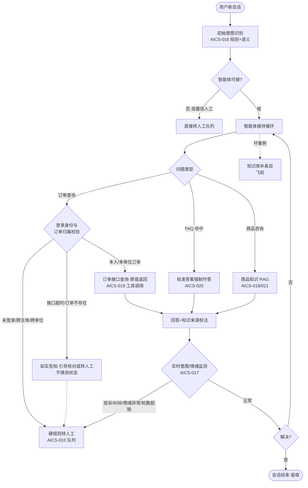
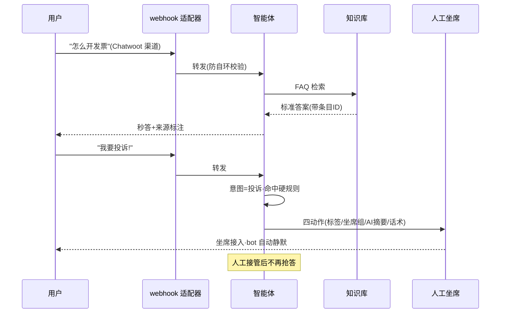

# 智能体接待（AICS-016~025）

> 节点段：★12/30 MVP（知识库首版）/ 1/15 试点（全量）｜ Owner：AI 产品负责人 ｜ 评审：客服业务对接人
> 范围：SOW 合同能力（十项合卡，COMP-18）｜ 文档状态：**Frozen v1.0**（2026-10-09 冻结；签署记录见 ../../PRD-REVIEW-CHECKLIST.md）
> 实现进度见 `docs/STATUS.md`；本文只维护需求定义与验收契约
> 术语口径：本模块是三大中台中**名副其实的智能体**（对话 + RAG + 工具调用 + 人工移交），与商品中台"智能体"（实为流水线）区分。

## 1 概述（TL;DR）

客服的 AI 主力：意图识别决定"谁接得住"，FAQ 标准答案保证"口径一致"，商品知识 RAG 与订单查询让"答得出、答得准、可溯源"，知识库分库训练专家智能体，转人工是硬规则兜底，大模型提供方可切换不被绑定——秒级首响、7×24 在线、回答标注来源。

## 2 背景与问题（Problem）

- **现状**：人工客服首响分钟级、夜间断档；同一问题不同坐席答案不一；重复问题占用大量人力。
- **痛点**：口径不一致是合规与信任风险（退换货政策各说各话）；FAQ 靠人脑记忆，新品新政策更新滞后。
- **机会**：FAQ RAG 已实测（命中 0.911，回复数字全为库内原值）；转人工硬规则已修复验证（handoff 规则语义判例）；Chatwoot webhook 适配器五件套上线——主链路全部跑通。

## 3 目标与非目标（Goals / Non-Goals）

**目标**
- G1：意图识别（016/017）——初始意图分流 + 实时意图转变转人工
- G2：业务应答（018/019）——商品推荐/商品与交付问询/订单综合问询
- G3：知识库管理（020~023）——FAQ 标准答强制一致、商城商品库强化、分库专家智能体、引用规则可控
- G4：维护（024/025）——大模型提供方可配置（本地/云端）、效果评价收集与分析
- G5：回答可溯源——每条生成回答标注知识来源

**非目标**
- N1：不代客执行操作（不代下单/代退款——建议与引导到流程）
- N2：不做开放域闲聊（域外拒答）
- N3：不承诺 100% 准确（强制口径 + 转人工兜底是设计的一部分，指标基线见表 13）

## 4 用户与场景（Personas & Use Cases）

**用户角色**

| 角色 | 描述 | 核心诉求 |
|---|---|---|
| 采购人 | 高频咨询方 | 秒答、口径一致、夜间有人 |
| 供应商 | 协同问询方 | 结算/对账类问题有入口 |
| 客服质检 | 效果监督方 | 回答可溯源、效果可分析 |
| 知识库运营 | 内容维护方 | FAQ/知识库自助管理、变更即时生效 |

**用户故事**
- US-1：作为采购人，半夜问"生鲜什么时候到"希望直接有答案，以便不用等到明早。
- US-2：作为采购人，问"怎么开发票"希望今天和上周的答案完全一致，以便按正确流程办事。
- US-3：作为运营，我在管理页改一条 FAQ 后 1 分钟内生效，以便政策更新零滞后。
- US-4：作为质检，我希望每条 AI 回答能点开看引用的知识条目，以便抽检有依据。

**触发场景**：新会话初始意图识别；每轮对话实时意图监测；FAQ/知识命中即标准作答；高风险即硬规则转人工。

## 5 业务流程（Diagrams）

### 关键时序：FAQ 命中与人机协同

## 6 功能需求（Functional Requirements）

### 6.1 需求详述

**FR-1 初始意图（AICS-016）**：新会话首条消息做意图分类（FAQ/商品咨询/订单查询/售后/投诉/供应商事务/域外）；规则高置信优先、剩余语义分类；不可接类型直接路由（投诉→人工、域外→礼貌拒答）。
**FR-2 意图转变（AICS-017）**：全程监测——投诉/纠纷/紧急关键词命中、负面情绪识别、轮数超限三类触发**硬规则**转人工（确定性，非模型决策）。
**FR-3 商品应答（AICS-018）**：商品推荐与商品信息/交付问询基于商品知识 RAG（商品库治理产出为知识源）；回答标注来源条目。
**FR-4 订单问询（AICS-019）**：订单状态/物流/退换进度通过订单接口工具调用查询实时作答（不猜、不编状态）。边界约束（P0-4 对齐 AICS-001~009 N5）：
- **可用渠道**：MVP=挂件腿（Chatwoot 渠道，会话绑定已登录采购身份）；站内直连腿一期不开放订单查询（对齐底座 N5，开放随其 Q6 裁决）。
- **前置校验**：仅可查询当前登录主体（及其单位）名下订单；跨主体/跨单位访问拒绝，且不泄露订单存在性（统一"未找到可查询的订单"话术）。
- **工具超时/失败**：明示"订单查询暂不可用"并转人工；订单号不存在时如实告知并引导核对，禁止猜测状态。
- **输出**：状态、物流、退换进度一律引用订单接口原值（数字/日期不改写）。
**FR-5 FAQ 强制标准答（AICS-020）**：FAQ 命中必须按标准答案作答（不允许模型改写口径）；未命中走 RAG 并标注"参考答案"。
**FR-6 知识库强化（AICS-021）**：导入商城与商品支持库，增强回答覆盖；知识条目增删改即时生效（6 秒内到坐席快捷回复，实测先例）。
**FR-7 专家智能体（AICS-022）**：区分资料库训练不同专家（采购专家/售后专家/供应商服务专家）；专家路由按意图分派。
**FR-8 引用规则（AICS-023）**：知识库匹配与引用规则可配——控制某场景只引用指定知识域（防止跨域误引）。
**FR-9 提供方配置（AICS-024）**：大模型提供方可配置（云端可切换/预留本地）；切换不改变知识库与规则。
**FR-10 效果评价（AICS-025）**：用户点赞点踩收集；效果分析看板（命中率/点踩归因/转人工原因分布）；坏案例进知识库补条目流程。

### 6.2 页面与原型（Wireframes）

**真实页面入口（原型档位 1，全部实测可访问）**：
- 知识库管理：portal :8000 →「客服知识库」页签（增删改查，变更 6 秒同步 canned responses）
- 用户侧对话：deploy/chatwoot/demo/index.html（:8005 起服务，真 widget 对话）
- 坐席侧：Chatwoot :3002（`/` 键唤出 AI 回复建议，FAQ 原样透传零幻觉、909ms/3 条带溯源）

**完美输出样例**（实测口径）：conv5「怎么开发票」秒答命中 0.911、回复数字全为库内原值；conv7「怎么退货」→ 追问「退款多久到账」上下文承接（审核后 1-3 工作日/对公 3-7）；投诉 conv6 四动作全中；handoff 硬规则修复后正常咨询不再误转人工。

### 6.3 字段与数据（Field Schema）

| 对象 | 字段 | 类型 | 必填 | 校验/默认 | 说明 |
|---|---|---|---|---|---|
| 意图记录（cs_intent） | conv_id / turn_id | VARCHAR | 是 | 联合唯一 | 每轮留痕 |
| 意图记录（cs_intent） | intent | ENUM | 是 | faq / product / order / after_sale / complaint / supplier / out_of_domain（全枚举，与 FR-1 一致） | 意图分类 |
| 意图记录（cs_intent） | confidence / by | NUMERIC / ENUM | 是 | confidence ∈ [0,1]；by ∈ {rule, model} | 识别来源 |
| 知识条目（kb_entry） | entry_id / domain / q / a / status / version | — | 是 | domain ∈ {faq, product, sop, supplier}；status ∈ {draft, active, retired} | 已有 faq_kb 基础；版本化 |
| 引用规则（kb_cite_rule） | scene / allowed_domains | VARCHAR / JSONB | 是 | allowed_domains 最小结构 {domains: [..]} | FR-8 |
| 专家路由（cs_expert_route） | intent_group / expert_id / kb_domains | — | 是 | intent_group→expert_id 唯一 | FR-7 |
| 效果反馈（cs_feedback） | turn_id / rating / reason | — | 是 | rating ∈ {up, down}；含用户标识导出脱敏 | 点踩归因；保留期 1 年（Q3 合规复核） |
| 提供方配置（llm_provider_conf） | channel / model / status | — | 是 | channel ∈ {cloud_a, cloud_b, local}；status ∈ {active, standby} | 可切换留痕 |

### 6.4 异常与错误处理

| 场景 | 触发 | 系统行为 | 用户感知 |
|---|---|---|---|
| 大模型超时 | 生成超时 | FAQ 命中仍标准作答；其余转人工 | "转接人工为您确认" |
| 知识未命中且 RAG 低置信 | 无可靠答案 | 如实"暂无确切答案"+转人工/留言 | 不编造 |
| 提供方切换中 | 路由切换 | 会话不中断（旧请求完成） | 无感 |
| 上下文超长 | 轮次多历史长 | 摘要压缩保留关键上下文 | 无感 |
| 订单接口异常 | 查询失败 | 明示"订单查询暂不可用"转人工 | 不给猜测的状态 |

## 7 成功指标（Success Metrics）

| 指标 | 定义 | 口径来源 |
|---|---|---|
| 有效回答正确率 | 标准问答 ≥85% / 非标准 ≥80% / 强制口径 ≥88%（表 13 基线） | 00-索引 §参考层 |
| 应转人工召回 | 一般 ≥95% / 高风险关键词 100% / 库外语义 ≥99% | 00-索引 §参考层 |
| 问题解决率 | AI 独立解决（不转人工）比例 | 00-索引 §参考层 |
| 首响时长 | 秒级 | 00-索引 §参考层 |

## 8 里程碑（Milestones）

| 里程碑 | 交付内容 |
|---|---|
| ★12/30 MVP | 意图识别 + FAQ 标准答 + 商品 RAG + 订单查询 + 知识库首版导入 + 转人工硬规则 |
| 1/15 试点 | 专家智能体分库 + 引用规则 + 提供方切换 + 效果评价看板全量 |

## 9 验收用例（Acceptance Cases）

| 用例 | 覆盖 FR | Given | When | Then |
|---|---|---|---|---|
| AC-1 FAQ 强制 | FR-5 | FAQ 命中"怎么开发票" | 提问 | 按标准答案原文作答+条目来源 |
| AC-2 订单实查 | FR-4 | 挂件腿已登录用户问本人订单进度 | 提问 | 调接口返回真实状态，非编造；数字/日期为接口原值 |
| AC-3 硬规则转人工 | FR-2 | 用户说"我要投诉" | 任一轮 | 立即四动作转人工；bot 静默 |
| AC-4 情绪转人工 | FR-2 | 用户连续负面情绪表达 | 监测命中 | 转人工并附 AI 摘要 |
| AC-5 知识即时生效 | FR-6 | 运营改一条 FAQ | 保存 | ≤6 秒新答案生效（含坐席快捷回复） |
| AC-6 专家路由 | FR-7 | 售后类问题 | 会话 | 路由售后专家（其知识域） |
| AC-7 引用规则 | FR-8 | 场景限定采购知识域 | 请求 | 不引用其他域条目 |
| AC-8 提供方切换 | FR-9 | 切换云端提供方 | 配置 | 新会话用新提供方；进行中会话不中断 |
| AC-9 反馈闭环 | FR-10 | 用户点踩 | 提交 | 归因入看板；进知识库补条目流程 |
| AC-10 商品 RAG 应答 | FR-3 | 问商品信息/交付问询 | 提问 | 基于商品知识 RAG 作答并标注来源条目 |
| AC-11 订单归属校验 | FR-4 | 用户问他人/他单位订单号 | 提问 | 拒绝查询且不泄露订单存在性（统一话术）；引导核对本人订单 |
| AC-E1 模型超时 | FR-5、FR-9 | 生成服务超时 | FAQ 命中场景 | 标准答照常；非 FAQ 转人工 |
| AC-E2 域外拒答 | FR-1 | 问天气 | 提问 | 礼貌拒答+引导回业务域 |
| AC-E3 订单工具超时 | FR-4 | 订单接口超时/失败 | 问订单进度 | 明示"订单查询暂不可用"并转人工；不返回猜测状态 |
| AC-P1 知识库权限 | FR-6 | 无运营角色改知识 | 尝试修改 | 拒绝；留痕 |
| AC-P2 未登录拒查 | FR-4 | 挂件腿未绑定登录主体的会话 | 问订单 | 引导登录/转人工，不返回任何订单数据 |

（订单问询与底座 N5 的渠道边界对拍：AICS-001~009 AC-E3 验证站内腿一期不查订单；本卡 AC-2/AC-10/AC-11/AC-E3/AC-P2 验证挂件腿按权限实查——同一端到端 UAT 场景覆盖两张卡。）

## 10 开放问题（Open Questions）

| Q ID | 未决问题 | 影响 FR/AC | 选项与推荐项 | 决策 Owner | 截止日期 | 当前状态 | 未决时默认行为 |
|---|---|---|---|---|---|---|---|
| Q1 | 知识库首批内容清单（FAQ 条数/商品支持库范围） | FR-6、AC-5 | 首批 FAQ ≥50 条 + 商品支持库 | 客服业务对接人 | 2026-12-15 | 待清单 | 沿用 faq_kb 种子扩充 |
| Q2 | 点踩低分条目的补条目 SLA（建议 48h） | FR-10、AC-9 | 推荐 48h | 客服运营 | 2026-12-31 | 待裁决 | 点踩入看板周清，不承诺 SLA |
| Q3 | cs_feedback 保留期与脱敏口径（本卡定 1 年） | FR-10 | 推荐 1 年 | 合规归口 | 2026-12-31 | 待复核 | 保留 1 年、导出脱敏 |
| Q4 | 订单问询开放站内直连腿的时点（联动底座 Q6，P0-4 裁决项） | FR-4、AC-2 | 推荐：1/15 试点灰度 | 客服业务 Owner＋AI 产品负责人 | 2026-12-30 | 待裁决 | 仅挂件腿可查（本卡 AC 口径） |

## 11 相关文档（Appendix）

- 上游：`../00-功能点总索引.md` ｜ 关联：`AICS-001-009`（底座）、`AICS-010-015`（转人工去向）
- 参考：../../CUSTOMER_SERVICE_SCENARIOS.md（A2-A4 实测）、../../DECISIONS.md ADR-004/005/008

## 变更记录

| 日期 | 版本 | 变更 | 说明 |
|---|---|---|---|
| 2026-09-26 | v0.3 | 完整版立卡（合卡：016~025 智能体接待十项） | 补齐客服模块文档；标注"名副其实的智能体"口径 |
| 2026-10-09 | v1.0 | Frozen（规范化修复） | FR-4 补渠道/登录身份/订单归属/超时/不存在全边界（P0-4，对齐底座 N5 与 Q6）；流程图加校验分支；§9 加「覆盖 FR」列并补 AC-10/AC-11/AC-E3/AC-P2；§6.3 升全字段契约；§10 表格化 |
