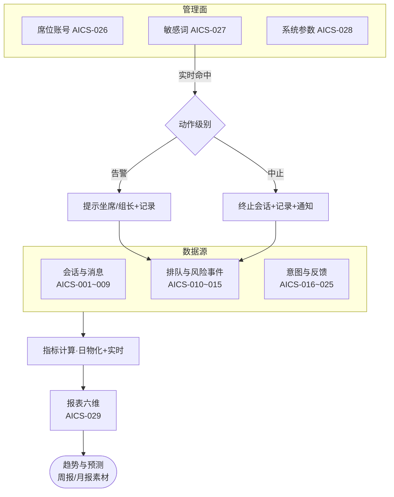

# 基础设置与报表分析（AICS-026~029）

> 节点段：★12/30 MVP（026~028）/ 1/15 试点（029）｜ Owner：AI 产品负责人 ｜ 评审：客服业务对接人
> 状态：v0.3（2026-09-26，完整版立卡；四项功能同属基础设置模块，合卡管理）

## 1 概述（TL;DR）

客服体系的"管理后台 + 仪表盘"：席位账号管理、敏感词管控（告警或中止会话）、系统参数配置、多维运营报表（呼叫量/接通率/坐席绩效/满意度/服务质量/业务趋势）——让客服从"能聊"变成"可管理、可度量、可改进"。

## 2 背景与问题（Problem）

- **现状**：会话数据散落在 Chatwoot 与 AI 服务日志中，无统一运营视图；敏感词与系统参数无管理界面。
- **痛点**：管理者看不到量与质（接通率/绩效/满意度）；风险词靠坐席自觉；参数变更要找开发。
- **机会**：平台控制面（DQ/评测/口径三注册表 + SDK + 体检 UI）提供了报表底座的成熟模式；会话/工单/反馈数据源全部就绪。

## 3 目标与非目标（Goals / Non-Goals）

**目标**
- G1：席位账号（AICS-026）——虚拟与人工席位账号统一管理（角色/权限/状态）
- G2：敏感词（AICS-027）——屏蔽词/停用词库管理；触发可配置"提示告警"或"中止会话"两级动作
- G3：系统设置（AICS-028）——关键选项与参数集中配置（会话超时/并行上限/保留期等）
- G4：报表分析（AICS-029）——六大维度：呼叫量、接通率、坐席绩效、客户满意度、服务质量、业务趋势与预测

**非目标**
- N1：不做全平台 BI（本报表限客服域；跨域分析归数据底座）
- N2：不做排班管理（AICS-002 域）
- N3：趋势预测为辅助参考（不做自动决策）

## 4 用户与场景（Personas & Use Cases）

**用户角色**

| 角色 | 描述 | 核心诉求 |
|---|---|---|
| 客服组长 | 日常管理 | 看量看质、管席位管词库 |
| 坐席 | 被度量者 | 绩效口径透明公正 |
| 运营负责人 | 汇报者 | 趋势报表直接可用于周报月报 |
| 合规 | 风控 | 敏感词命中与处置可审计 |

**用户故事**
- US-1：作为组长，我希望一屏看到今日呼叫量、接通率与待响应，以便动态调配坐席。
- US-2：作为组长，我希望新坐席入职开账号、离职停用在同一界面完成，以便账号生命周期可控。
- US-3：作为合规，我希望命中竞品词/违规词时可配置"仅告警"或"直接中止会话"，以便不同风险分级处置。
- US-4：作为运营负责人，我希望满意度与业务趋势自动出周报图，以便汇报不再手工拼表。

**触发场景**：报表每日物化+实时大屏；敏感词实时命中处置；账号/参数变更即时生效。

## 5 业务流程（Diagrams）

## 6 功能需求（Functional Requirements）

### 6.1 需求详述

**FR-1 席位账号（AICS-026）**：虚拟账号与人工坐席账号统一管理（创建/停启用/角色分配）；与 Chatwoot 坐席同步；账号操作留痕。
**FR-2 敏感词管理（AICS-027）**：屏蔽词/停用词分库管理（命中即拦截发送/替换）；每词可配动作级别——"提示告警"或"中止会话"；词库版本化、变更评审留痕。
**FR-3 系统设置（AICS-028）**：集中配置关键参数（会话超时/坐席并行上限/消息大小限制/保留期/满意度邀评开关）；参数变更即时生效并留痕。
**FR-4 报表六维（AICS-029）**：
- 呼叫量：会话量/消息量/时段分布（今日/周/月）
- 接通率：转人工接入成功率、排队放弃率、首响分布
- 坐席绩效：接入量/解决量/平均处理时长/满意度分（口径透明公示）
- 客户满意度：邀评率/评分分布/点踩归因
- 服务质量：风险事件数与处置率、敏感词命中分布、AI 回答正确率抽检
- 业务趋势：咨询热点品类/问题类型趋势、工单类型分布；预测为辅助参考线
**FR-5 下钻与导出**：所有报表支持下钻到会话明细；导出 Excel/图。
**FR-6 权限分域**：坐席只见自己绩效；组长见本组；负责人见全域；合规见风险全域。

### 6.2 页面与原型（Wireframes）

**界面形态**：运营后台 → 智能客服 → 管理与报表（四页签：席位/敏感词/系统设置/报表看板）。
AI 功能位置：报表看板的"AI 质量卡"（回答正确率抽检趋势）与"热点洞察"（咨询热点自动聚类）；模式先例=portal「平台体检」页（DQ 总览+评测趋势折线+阈值参考线，已实测）。

**完美输出样例**（数据源实测口径）：faq_kb 35 条种子中 data_grounded_faq() 从 gov_product 真实聚合（在售 167,213 / 大类分布 / 安全帽·充电宝·打印纸价位与品牌）；e2e 实测 chat 命中 0.911——报表六维的分子分母全部有真实数据源，非空表上线。

### 6.3 字段与数据（Field Schema）

| 对象 | 字段 | 说明 |
|---|---|---|
| 席位（cs_agent_account） | agent_id / type（virtual/human）/ role / status / chatwoot_ref | 同步映射 |
| 敏感词（cs_sensitive_term） | term_id / term / level（block/alert）/ library（blocklist/stopword）/ status / version | 两级动作 |
| 系统参数（cs_setting） | key / value / value_type / updated_by / updated_at | 集中配置 |
| 报表物化（cs_report_daily） | date / dimension / metric_key / value | 日物化+实时大屏双轨 |

### 6.4 异常与错误处理

| 场景 | 触发 | 系统行为 | 用户感知 |
|---|---|---|---|
| 物化失败 | 日任务异常 | 用上一日数据+标注"截至昨日"；告警 | 看板角标提示 |
| 敏感词误伤 | 正常词命中 block | 会话被中止但记录完整，可申诉恢复 | 申诉通道 |
| 参数越界 | 配置值非法 | 保存拒绝+合理范围提示 | 即时 |
| Chatwoot 同步失败 | 账号变更未同步 | 重试队列+管理员告警 | 管理页红标 |

## 7 成功指标（Success Metrics）

| 指标 | 定义 | 口径来源 |
|---|---|---|
| 报表及时率 | 日物化成功率（≥99%） | 00-索引 §参考层 |
| 敏感词处置及时率 | 命中到动作 <1s | 00-索引 §参考层 |
| 周报素材可用率 | 负责人不再手工拼表 | 定性回访 |

## 8 里程碑（Milestones）

| 里程碑 | 交付内容 |
|---|---|
| ★12/30 MVP | 席位管理 + 敏感词两级 + 系统参数 |
| 1/15 试点 | 报表六维 + 下钻导出 + 趋势周报素材 |

## 9 验收用例（Acceptance Cases）

| 用例 | Given | When | Then |
|---|---|---|---|
| AC-1 席位生命周期 | 新坐席入职 | 建号→分配→停用 | 三步完成且与 Chatwoot 同步；全程留痕 |
| AC-2 告警级 | 词配 alert 级命中 | 会话中出现 | 坐席/组长提示+事件记录，会话继续 |
| AC-3 中止级 | 词配 block 级命中 | 会话中出现 | 会话中止+记录+双方通知 |
| AC-4 参数生效 | 修改坐席并行上限 3→5 | 保存 | 即时生效；第 4、5 个会话可接入 |
| AC-5 六维报表 | 当日有真实会话 | 次日看板 | 六维指标非空且与明细一致 |
| AC-6 绩效下钻 | 某坐席满意度异常 | 下钻 | 定位到具体低分会话与归因 |
| AC-7 权限分域 | 普通坐席登录 | 看绩效页 | 仅见自己数据 |
| AC-E1 物化失败 | 日任务异常 | 次日 | 用昨日数据+角标注明；运维告警 |
| AC-P1 词库权限 | 无合规角色改 block 级词 | 拒绝 | 留痕 |

## 10 开放问题（Open Questions）

- Q1：敏感词首批清单与两级分配（block/alert）——合规归口 / 12-20 前
- Q2：坐席绩效口径公示方式（防"黑箱度量"争议）——客服业务对接人

## 11 相关文档（Appendix）

- 上游：`../00-功能点总索引.md` ｜ 关联：`AICS-001-009`（数据源）、`AICS-016-025`（AI 质量数据）
- 参考：STATUS「平台体检 UI」「平台控制面 SDK」两行（报表底座模式）、../../EVALUATION.md

## 变更记录

| 日期 | 版本 | 变更 | 说明 |
|---|---|---|---|
| 2026-09-26 | v0.3 | 完整版立卡（合卡：026~029 基础设置与报表四项） | 补齐客服模块文档 |
