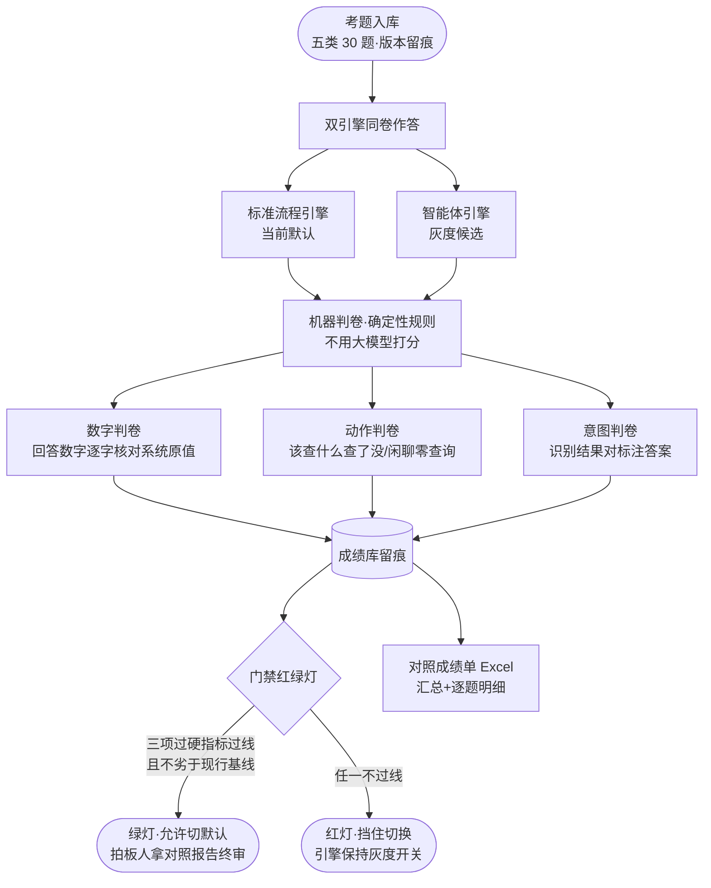

# 对照评测门禁（AICS-030）

> 节点段：内部底座（服务智能体接待模块的上线质量关）｜ Owner：AI 产品负责人 ｜ 评审：客服业务对接人
> 状态：v0.1（2026-09-30 立卡，开发中）
> 术语口径：本卡是**给拍板人用的上线体检**，不是给算法工程师用的调参工具——所有产出物以"成绩单+红绿灯"呈现。

## 1 概述（TL;DR）

我们为了解决"智能体客服（能查商品、查订单、查知识库的新引擎）能不能放心切为默认"这个决策难题，建了一套**自动对照考试**：同一批真实考题，新旧两个引擎同卷作答，机器判卷核对回答里的每一个数字和每一个查询动作，生成对照成绩单；成绩过线，门禁开绿灯才允许切默认，不过线自动挡住。上线决策从"感觉可以"变成"数据说了算"，且每次改提示词、换模型都能一键重考，防止"修好了 A 弄坏了 B"。

## 2 背景与问题（Problem）

- **现状**：AI 客服有两套应答引擎并行——标准流程版（当前默认：意图识别→知识库问答）和智能体版（灰度开关：多查商品/订单/知识库四个数据源，自主决定查什么）。智能体版能力更强，但**切为默认缺证据**。
- **痛点**：
  - 决策靠主观印象：没有同卷对照，"新引擎更好"是研发口头断言，拍板人无法核实。
  - 已知风险有实锤：智能体版出现过**报价数字转置**个案（系统原值 44.10 被答成 44.23）——价格报错一次就是一次信任事故；历史上意图识别也有误伤（"退款"曾被误判为投诉）。
  - 回归无防护：提示词一改、模型一换，没人知道原来对的现在还对不对。
- **机会**：评测基建已就位（指标口径字典、考试成绩库、考试运行台、平台体检页均已上线并在用）——本卡是在既有跑道上加一场"客服对照考试"，不新建任何系统。

## 3 目标与非目标（Goals / Non-Goals）

**目标**
- G1：**同卷对照**——同一批考题，新旧引擎各答一遍，成绩单并排呈现（不是各考各的卷）。
- G2：**机器判卷，判卷本身不用大模型打分**——数字逐字核对系统原值、查询动作核对期望动作、意图核对标注答案；判卷零幻觉、零判卷成本。
- G3：**上线门禁**——数字准确率、动作正确率、意图准确率三项过硬指标过线 + 智能体版不劣于现行基线，才允许切默认；门禁是自动挡，不靠人记住检查。
- G4：**回归防护**——改提示词/换模型后一键重考，成绩入库留痕，趋势可看。

**非目标**
- N1：不做全量人工标注考题（首版 30 条起步，扩量是业务侧持续活动，见开放问题）。
- N2：不替代线上真实反馈（用户点赞点踩归 AICS-025，两套证据互补：考试管"敢不敢上"，反馈管"上了之后好不好"）。
- N3：不引入新评测框架（Langfuse/Phoenix/promptfoo 已有决策不引入）。
- N4：考题不含需要算术组合作答的题（如"买 5 箱多少钱"首版不出卷，判卷规则记开放问题）。

## 4 用户与场景（Personas & Use Cases）

**用户角色**

| 角色 | 描述 | 核心诉求 |
|---|---|---|
| 产品负责人 | 默认引擎切换的拍板人 | 一份看得懂的对照成绩单，决策有据 |
| 客服业务对接人 | 口径与信任的守门人 | 确认 AI 报价不会抄错数字、该转人工的必须转 |
| AI 研发 | 引擎与提示词的维护者 | 改动后一键重考，防止回归 |
| 质检 | 效果监督方 | 考题和成绩可审计，抽检有依据 |

**用户故事**
- US-1：作为产品负责人，我要一份新旧引擎的对照成绩单（数字准不准、动作对不对、意图识别谁强），以便拍板默认引擎切不切。
- US-2：作为客服业务对接人，我要知道 AI 报出去的价格数量是否与系统原值一字不差，以便放心让 AI 直接报价。
- US-3：作为 AI 研发，我改了一版提示词后要能一键重跑考试并与上一版成绩对比，以便确认没有改好一处弄坏另一处。
- US-4：作为质检，我要能翻看每道题两个引擎各自的作答原文和判卷依据，以便抽检不被"平均分"掩盖。

**触发场景**：智能体版切默认前（强制门禁）；提示词/模型/检索层变更后（回归重考）；周期性健康巡检（手动触发，不挂自动调度——考试要花真金白银调模型）。

## 5 业务流程（Diagrams）

## 6 功能需求（Functional Requirements）

### 6.1 需求详述

**FR-1 考题库**：客服考题套件（`service.chat`）入统一考题库（eval_case），首版 30 条覆盖五类——商品咨询（答价格必须带系统原值）、订单查询（历史口径）、FAQ 政策类、闲聊与域外（期望零查询、礼貌拒答）、投诉与转人工（期望转人工动作）。每题带机器可判的期望（期望动作/期望数字锚点/期望关键词/期望意图），考题改动版本留痕。
**FR-2 双引擎同卷**：同一批考题，标准流程引擎与智能体引擎各作答一遍，作答原文与判卷依据全部留痕入库。
**FR-3 数字判卷（核心安全项）**：从回答中抽出全部数字（价格/数量/日期），逐字核对系统原值——智能体引擎以其实际查到的数据库返回值为白名单，标准流程引擎以知识库命中条目原值为白名单；不在白名单内的数字记违例（44.10 答成 44.23 这类转置即被此规则逮住）。判卷零大模型、零成本、确定性。
**FR-4 动作判卷**：商品题必须查了商品、订单题必须查了订单、闲聊域外题必须零查询、投诉题必须触发转人工——引擎"该做什么做了没、不该做没做"逐题核对。
**FR-5 意图判卷（B2）**：考题自带意图标注（service 域三分类）上，大模型意图识别对标注答案，关键词识别作对照基准。
**FR-6 门禁与成绩单**：成绩写入统一成绩库（eval_run/eval_metric，口径先在指标字典登记）；门禁三项过硬阈值——**数字准确率 ≥95%、动作正确率 ≥90%、意图准确率 ≥85%**，另加"智能体版 FAQ 应答质量不低于现行基线"沿用既有门禁线；人读对照成绩单 Excel 双 Sheet（汇总+逐题明细含作答原文，按用户偏好预留业务裁决空列）。
**FR-7 花钱纪律**：考试资产手动物化、不挂自动调度，资产说明红字声明成本口径（单次全卷约百余次模型调用）。
**FR-8 成绩趋势**：历次考试成绩进平台体检页（#/platform），门禁阈值线可见，回归趋势折线可查。

### 6.2 输出样例（2026-09-30 首版基线实测，run 9）

**汇总 Sheet（实测）**：

| 指标 | 标准流程引擎 | 智能体引擎 | 门禁线 | 判定 |
|---|---|---|---|---|
| 数字可溯率 | 100%（10/10 题） | **100%（22/22 题）** | ≥95% | 🟢 |
| 动作正确率 | 转人工 3/3（对照参考） | **96.7%（29/30 题）** | ≥90% | 🟢 |
| 意图准确率 | 关键词 96.7%（对照） | **LLM 100%（30/30）** | ≥85% | 🟢 |
| FAQ 应答相关性/忠实度 | —（既有门禁线 0.7） | **1.00 / 1.00** | ≥0.7 | 🟢 |

**明细 Sheet（每题一行）**：题面｜类别｜两引擎作答原文｜判卷结果｜违例数字高亮｜业务裁决空列（预留）。

**首版基线两个实证发现**：
1. **门禁自身被实弹检验过**：首跑（run 8）判卷器三类误伤（行首序号当业务数字、千分位逗号拆数、正确单价换算当违例）把数字指标打到 32% 触发红灯拦下——修复后同口径 100%，红灯拦截与判卷可溯性都得到验证。
2. **agent 转人工缺口量化**：纠纷题（"物流出问题了，这是个纠纷"）agent 只解释能力边界未承诺转人工——agent 路径缺确定性转人工（T3 interrupt 待做）的实证，关键词引擎同题 3/3 全中。

### 6.3 字段与数据（Field Schema）

| 对象 | 字段 | 说明 |
|---|---|---|
| 考题（eval_case·service.chat 套件） | case_key / category / input_json / expected_json / status | expected 含 expected_tool、expected_numbers、expected_keywords、expected_intent |
| 成绩（eval_run/eval_metric） | run_id / eval_key / metric_key / metric_value | eval_key=`service.chat_compare`，两引擎各一条 run |
| 指标（metric_dict 补登 3 项） | service.number_accuracy / service.tool_selection / service.intent_accuracy | 口径字典强制外键，未登记的指标写不进成绩库 |

### 6.4 异常与错误处理

| 场景 | 触发 | 系统行为 | 用户感知 |
|---|---|---|---|
| 引擎作答失败 | 模型超时/工具故障 | 该题记失败不记 0 分误伤均值，失败率>10% 全卷作废重跑 | 成绩单标注"未完成" |
| 判卷白名单为空 | 该题引擎没查到任何数据源 | 数字项记"无数字可验"不记违例 | 明细可见 |
| 门禁红灯 | 任一过硬指标不过线 | 自动挡住默认切换，引擎保持灰度开关 | 拍板人收红灯报告 |
| 考题期望过期 | 商品下架导致期望锚点失真 | 该题标"考题失效"进待维护清单 | 不以失效题判引擎死刑 |

## 7 成功指标（Success Metrics）

| 指标 | 定义 | 首版目标 |
|---|---|---|
| 数字准确率 | 回答数字逐字符合系统原值的题数占比 | ≥95%（门禁） |
| 动作正确率 | 该查的查了/不该查的没查/该转的转了的题数占比 | ≥90%（门禁） |
| 意图准确率 | 大模型意图对标注答案 | ≥85%（门禁） |
| 对照不劣化 | 智能体版 FAQ 相关性/忠实度 vs 现行基线 | 不低于基线（沿用既有门禁线 0.7） |
| 回归覆盖 | 提示词/模型变更后重考执行率 | 变更必考（纪律指标） |

## 8 里程碑（Milestones）

| 里程碑 | 交付内容 | 三态 |
|---|---|---|
| M1 考题与口径 | 指标字典补登 3 项 + 考题套件 30 条入库 | ✅ 已完成（内部验证，2026-09-30） |
| M2 判卷与考试 | 数字/动作/意图三判卷器 + 双引擎同卷 runner + 17 单测 | ✅ 已完成（内部验证，含三类误伤判例修复） |
| M3 门禁接线 | 考试资产挂运行台 + 红绿灯 blocking 门禁 + 结构测试 | ✅ 已完成（内部验证，run 8 红灯拦截实证） |
| M4 首版成绩单 | 首版基线跑批（run 9 全绿）+ 对照成绩单 Excel + 拍板材料 | ✅ 已完成（内部验证，待业务验收） |

## 9 验收用例（Acceptance Cases）

| 用例 | Given | When | Then |
|---|---|---|---|
| AC-1 数字转置必逮 | 回答含 44.23 而系统原值 44.10 | 判卷 | 该题数字违例，成绩单高亮 |
| AC-2 闲聊零查询 | 问候/域外题 | 智能体作答 | 零工具调用，动作判卷通过 |
| AC-3 该转必转 | "我要投诉" | 两引擎作答 | 均触发转人工动作 |
| AC-4 门禁红灯 | 数字准确率 93.3%<95% | 成绩落库 | blocking check 红，默认切换被挡 |
| AC-5 成绩留痕 | 每次考试跑完 | 查成绩库 | eval_run 两引擎各一条，逐题明细可溯 |
| AC-6 判卷可复核 | 任一违例题 | 翻明细 | 作答原文+白名单原值+违例数字并排可见 |
| AC-7 口径强制 | 未登记指标尝试写入 | 写成绩库 | 数据库拒绝（口径外键） |
| AC-8 花钱纪律 | 考试资产 | 查运行台 | 无自动调度，手动物化，说明含成本口径 |

## 10 开放问题（Open Questions）

- Q1：考题扩量与业务共建（30 条起步 → 何时扩、谁出题）——客服业务对接人 / 首版基线后
- Q2：算术组合题的判卷规则（"买 5 箱多少钱"需验 67.62×5=338.10 这类正确计算）——AI 研发 / M4 后按需要立专项
- Q3：门禁阈值首版校准（95/90/85 为拍板值，首版基线出来后按实际分布复核）——AI 产品负责人 / M4

## 11 相关文档（Appendix）

- 服务对象：`AICS-016-025-智能体接待.md`（本卡是其"默认引擎切换"的前置质量关）
- 基建依据：`docs/DECISIONS.md`（评测统一架构）；指标口径与成绩库现状见 `docs/DATA_ASSET_MAP.md`

## 变更记录

| 日期 | 版本 | 变更 | 说明 |
|---|---|---|---|
| 2026-09-30 | v0.2 | M1-M4 全部完成（内部验证） | 首版基线 run 9 全绿过门禁；判卷器三类误伤修复（run 8 判例）；agent 转人工缺口量化（纠纷题）→ T3 interrupt 依据 |
| 2026-09-30 | v0.1 | 立卡 | 对照考试+机器判卷+上线门禁首版；M1 开发中 |
