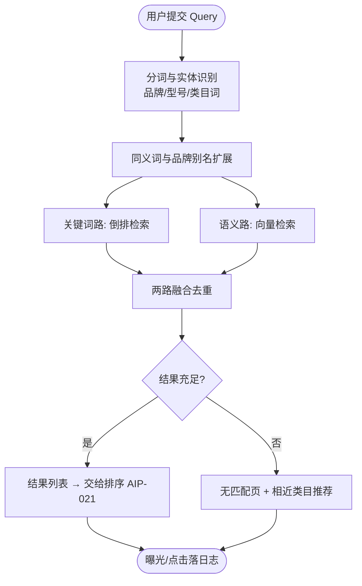
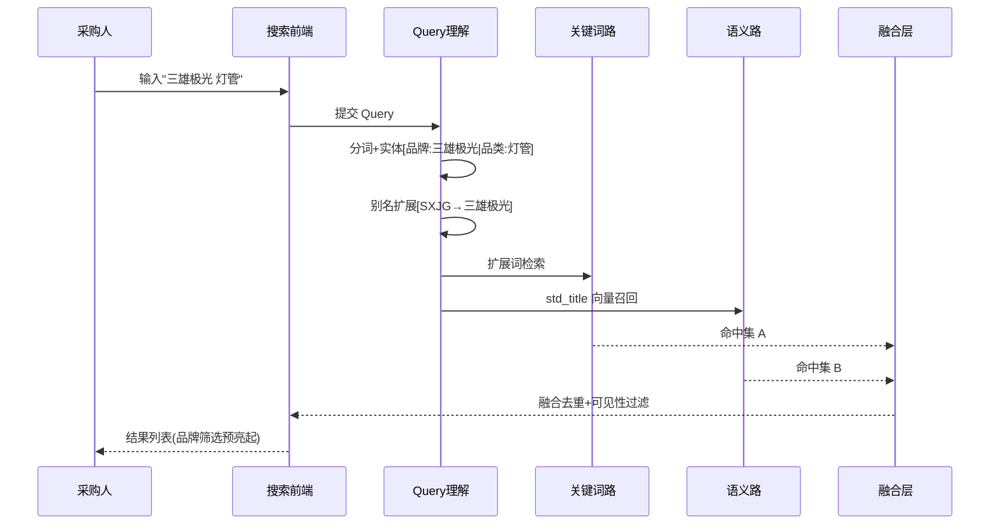

# 智能分词与语义理解（AIP-015）

> 节点段：★11/15 MVP ｜ Owner：AI 产品负责人 ｜ 评审：采购业务对接人
> 范围：SOW 合同能力（COMP-09）｜ 文档状态：**Frozen v1.0**（2026-10-09 冻结；签署记录见 ../../PRD-REVIEW-CHECKLIST.md）
> 实现进度见 `docs/STATUS.md`；本文只维护需求定义与验收契约

## 1 概述（TL;DR）

采购人输入关键词，系统自动分词并识别品牌、型号，语义与关键词双路召回——搜"清洁用品"能找到"保洁工具"，搜品牌缩写能命中全称。解决"关键词不匹配但语义相同"的根本问题，是搜索中台所有能力的理解基座。

## 2 背景与问题（Problem）

- **现状**：关键词精确匹配；工业品与办公品的标准叫法采购人未必熟悉。
- **痛点**：同义词、品牌别名、型号变体一概搜不到，零结果直接把采购人推向线下。
- **机会**：同义词库、品牌归一、语义向量三块治理资产已就绪，理解层是它们的检索侧出口。

## 3 目标与非目标（Goals / Non-Goals）

**目标**
- G1：Query 自动分词，品牌、型号实体识别准确（评测集口径，Q1 锁定后基线测量）
- G2：语义 + 关键词双路召回融合，同义/别名 Query 命中（评测集上 Top-K 命中达 SOW 表 13 线：精确前三 ≥95% / 普通前十 ≥85%）
- G3：在冻结的采购 Query 评测集（Q1）上，零结果率相对当前基线下降；具体目标值在基线测量后经业务评审冻结。线上同时监控强返率（SOW ≤5%），不能以降低零结果率为由返回低相关商品
- G4：真无货时诚实返回"无匹配"并引导（不硬凑，无匹配识别率 SOW ≥90%）

**非目标**
- N1：不做排序策略（AIP-021）
- N2：不做对话式交互（AIP-024+）
- N3：不做比价视图（不在本期搜索范围）

## 4 用户与场景（Personas & Use Cases）

**用户角色**

| 角色 | 描述 | 核心诉求 |
|---|---|---|
| 采购人员 | 搜索框日常找货 | 输入什么都能搜到 |
| 采购单位新用户 | 不熟悉标准品类叫法 | 容错、引导 |

**用户故事**
- US-1：作为采购人员，我希望搜"打印纸"也出"A4 复印纸"，以便不用猜平台标准叫法。
- US-2：作为采购人员，我希望搜品牌缩写命中品牌全称商品，以便按品牌快速找货。
- US-3：作为采购人员，我希望真没货时明确告知"无匹配"并推荐相近类目，以便立刻换方向。

**触发场景**：搜索框每次提交自动生效；对话导购（UAT 段）复用同一理解层。

## 5 业务流程（Diagrams）

### 5.1 端到端流程图



读图要点：扩展发生在检索前（词库一次扩展两路共用）；"无匹配"是显式状态而非低质结果列表；日志全量落库供回流。

### 5.2 关键时序：一次搜索的内部协作



## 6 功能需求（Functional Requirements）

### 6.1 需求详述

**FR-1 分词与实体识别**：系统应对 Query 自动分词，并识别品牌、型号、品类三类实体；识别结果用于检索加权与筛选面板预选。
- 边界：无实体命中的纯泛词按语义整句处理。
**FR-2 同义与别名扩展**：查询前按词库扩展同义词与品牌别名；扩展命中对用户透明（结果页可折叠查看"包含相关词"）。
**FR-3 双路召回融合**：关键词路（倒排）与语义路（向量）并行召回，融合去重；融合权重可配置。
**FR-4 诚实无匹配**：两路召回均不足时返回"无匹配"状态并附相近类目入口与心愿单引导；禁止以低相关结果充数（强返率受指标约束）。
**FR-5 可见性过滤**：无权商品不出现在任何召回结果与计数中（过滤先于融合返回）。
**FR-6 搜索日志**：记录 Query 原文、分词实体、扩展词、召回来源、结果列表与点击；供词库运营、排序训练、零结果分析三用。
- 边界：日志含用户与单位标识但导出时脱敏（合规）。

### 6.2 页面与原型（Wireframes）

**高保真原型**：
（本卡负责区域：顶部搜索框 → 双路召回结果列表（商品行的规格参数来自治理层 AIP-012 产出）→ 无匹配态引导区；可编辑源 [mockup-search.drawio](../../assets/prd/mockup-search.drawio)）

**完美输出样例**〔品牌同义词热扩展实测，STATUS 口径；证据=frontend-es-chain 检索链路验证〕：搜索「SXJG」→ 命中三雄极光商品（brand 同义词热更新生效，扩展条可见映射）。
〔设计示例〕语义路召回样例：Query「清洁用品」→ 扩展词{保洁工具, 清洁用具} → 关键词路命中 48 + 语义路命中 12 → 融合去重 55 → 权限过滤后 53，首条为"保洁工具套装"。整条链路 portal :8000 已可访问。

> 数据资产规模（Milvus 176,074 向量、同义词库行数等）属 Reference 层——见 `docs/DATA_ASSET_MAP.md`，不在此冒充功能输出样例。

**页面：搜索结果页（理解层部分）**（ASCII 快速版）

```
┌──────────────────────────────────────────────────────────────────┐
│ [三雄极光 灯管                                    ] 🔍           │
│ 包含相关词: SXJG · 三雄 . 极光灯管 ▾                            │
├──────────────────────────────────────────────────────────────────┤
│ 相关类目: LED灯管(48) 荧光灯管(12)          [相关品牌: 三雄极光]│
├──────────────────────────────────────────────────────────────────┤
│ ① T8 LED灯管 18W 三雄极光   ¥12.5  [clean·京东]  相关度 0.94   │
│ ② T8 LED灯管 36W 三雄极光   ¥18.0  [clean·震坤行] 相关度 0.91  │
└──────────────────────────────────────────────────────────────────┘
（无匹配态）
│ 🔍 没有找到"xx"的相关商品                                        │
│ 试试: 相近类目 [LED灯管] [灯座]  或 提交心愿单 →                 │
```

| 区域 | 元素 | 交互 |
|---|---|---|
| 扩展条 | "包含相关词" | 默认折叠一行，点开看全部扩展映射 |
| 实体预亮 | 类目/品牌 chips | 实体识别命中的筛选项预选亮起（可取消） |
| 无匹配态 | 引导区 | 相近类目点击即改写检索；心愿单入口 |

### 6.3 字段与数据（Field Schema）

| 对象 | 字段 | 类型 | 必填 | 校验/默认 | 说明 |
|---|---|---|---|---|---|
| Query 解析（query_parse） | query_id / raw_query | BIGINT / TEXT | 是 | query_id 自增；raw_query 原文不修改 | 解析主体 |
| Query 解析（query_parse） | tokens | JSONB | 是 | 最小结构 {tokens: [..]} | 分词 |
| Query 解析（query_parse） | entities | JSONB | 否 | 最小结构 [{type, value, norm_id}]；type ∈ {brand, model, category} | 实体识别 |
| Query 解析（query_parse） | expanded_terms / parse_version | JSONB / VARCHAR | 否 | 最小结构 {terms: [..]} | 扩展词与版本 |
| 搜索日志（search_log） | log_id / user_id / org_id | BIGINT | 是 | 含用户/单位标识，**导出脱敏**（合规） | 主体 |
| 搜索日志（search_log） | query_id / recall_source | BIGINT / ENUM | 是 | recall_source ∈ {kw, vec, fusion} | 召回来源 |
| 搜索日志（search_log） | result_skus / clicked_sku / clicked_rank | JSONB / VARCHAR / INT | 是 | result_skus 有序 | 结果与点击 |
| 搜索日志（search_log） | latency_ms / created_at | INT / TIMESTAMP | 是 | — | 耗时；保留期 1 年（Q3 类口径，合规复核） |
| 同义词库（正源 PG） | term / synonym_group / status / updated_by | VARCHAR / VARCHAR / ENUM / VARCHAR | 是 | status ∈ {active, disabled}；热更新到检索引擎 | 只链接不复制 |

### 6.4 异常与错误处理

| 场景 | 触发 | 系统行为 | 用户感知 |
|---|---|---|---|
| 语义路超时 | 向量服务 >阈值 | 仅关键词路返回并标记降级 | 结果照常（可能召回少），无报错 |
| 词库热更失败 | 同步异常 | 用旧版本继续，告警 | 无感 |
| Query 全停用词 | 如"的吗" | 提示重输 | 空态引导 |
| 权限过滤后为空 | 有召回但无权可见 | 按无匹配处理（不暴露有货无权） | 无匹配页 |

## 7 成功指标（Success Metrics）

| 指标 | 定义 | 口径来源 |
|---|---|---|
| Top-K 命中率 | 精确前三 / 普通前十 | 00-索引 §参考层 |
| 零结果率 | 无结果占比（下降） | 00-索引 §参考层 |
| 无匹配识别率 / 强返率 | 该返即返 / 不硬凑 | 00-索引 §参考层 |

（评测集 Query 分布按内部采购高频品类构造，口径与业务方共建。）

## 8 里程碑（Milestones）

| 里程碑 | 交付内容 |
|---|---|
| ★11/15 MVP | 分词实体识别 + 双路召回 + 扩展透明 + 无匹配引导 + 日志 |
| 12/20 UAT | Top-K 评测报告 + 词库首轮运营 + 零结果分析 |

## 9 验收用例（Acceptance Cases）

| 用例 | 覆盖 FR | Given | When | Then |
|---|---|---|---|---|
| AC-1 同义命中 | FR-2 | 词库"打印纸=A4复印纸" | 搜"打印纸" | 结果含 A4 复印纸商品；扩展条可见映射 |
| AC-2 品牌别名 | FR-1、FR-2 | 词库 SXJG→三雄极光 | 搜"SXJG 灯管" | 命中三雄极光商品；品牌筛选项预亮 |
| AC-3 诚实无匹配 | FR-4 | 库内无"光刻机" | 搜"光刻机" | 返回无匹配页 + 相近类目推荐；无低质凑数 |
| AC-4 双路融合 | FR-3 | 构造仅语义可召回的 Query（描述性长句） | 提交 | 结果来自语义路且排序正常 |
| AC-5 日志完整 | FR-6 | 任意一次搜索+点击 | 查日志 | Query/解析/结果/点击/耗时五段齐备 |
| AC-6 实体预选 | FR-1 | Query 含类目/品牌实体 | 结果页加载 | 命中筛选项预选亮起（可取消） |
| AC-E1 语义路降级 | FR-3 | 模拟向量服务超时 | 搜索 | 关键词路结果返回；日志标 degraded |
| AC-P1 可见性 | FR-5 | 用户无某供应商权限 | 搜索 | 该供应商商品不出现在结果与任何计数 |

## 10 开放问题（Open Questions）

| Q ID | 未决问题 | 影响 FR/AC | 选项与推荐项 | 决策 Owner | 截止日期 | 当前状态 | 未决时默认行为 |
|---|---|---|---|---|---|---|---|
| Q1 | 标准测试集品类分布与抽样规则（G2/G3 基线冻结前置） | §7 指标、AC-4 | 与业务方共建（内部采购高频品类构造） | 采购业务对接人＋AI 产品负责人 | 2026-11-30 | 待锁定 | 用近 30 天真实搜索日志抽样充当临时评测集，标注"临时口径" |
| Q2 | 无匹配页引导形态（相近类目 + 心愿单入口） | FR-4、AC-3 | 推荐现方案 | 采购业务对接人 | 2026-11-15 | 待确认 | 相近类目入口先行，心愿单后置 |
| Q3 | 搜索日志保留期与脱敏口径（本卡定 1 年） | FR-6、AC-5 | 推荐 1 年 | 合规归口 | 2026-12-31 | 待复核 | 保留 1 年、导出脱敏 |

## 11 相关文档（Appendix）

- 上游：`../00-功能点总索引.md` ｜ 关联：`AIP-016-017`（词库同源）、`AIP-021`（排序）
- 参考：`../../frontend-es-chain.md`、`../../EVALUATION.md`

## 变更记录

| 日期 | 版本 | 变更 | 说明 |
|---|---|---|---|
| 2026-09-26 | v0.1–v0.2 | 立卡→社区结构 | |
| 2026-09-26 | v0.3 | 完整版 | +流程图/检索时序/线框(含无匹配态)/字段表×3/错误表/用例 7 条 |
| 2026-10-09 | v1.0 | Frozen（规范化修复） | 移除跨模块证据混用样例（FAQ 0.911 属客服域，P1-5）；G3 改为评测集+基线冻结节点口径；补语义路召回设计示例；§6.3 升全字段契约（含日志脱敏与保留期）；§9 加「覆盖 FR」列并补 AC-6；§10 表格化 |
