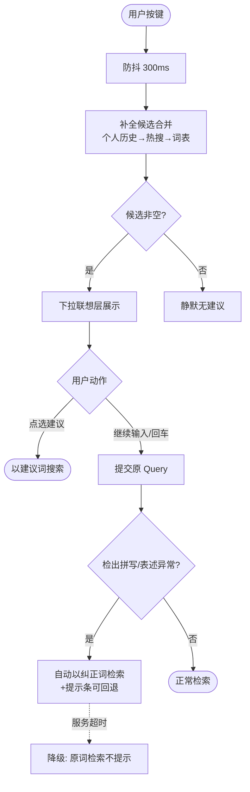
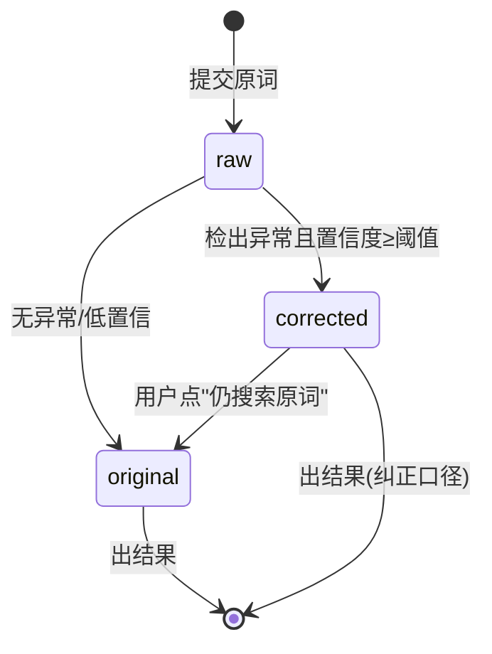

# 输入推荐补全与智能纠错（AIP-016/017）

> 节点段：★11/15 MVP ｜ Owner：AI 产品负责人 ｜ 评审：采购业务对接人
> 状态：v0.3（2026-09-26，完整版；016/017 同属输入容错域，合卡管理）

## 1 概述（TL;DR）

打字打一半就有建议、打错字也照样搜到：输入框实时推荐补全词（个人历史 → 热搜 → 词表三层来源），错别字与同义表述自动识别并返回正确结果——把专业采购词的输入门槛降到零。

## 2 背景与问题（Problem）

- **现状**：采购场景专业词（品牌型号、工业术语）输入门槛高，拼错一个字母、用错一个说法即零结果。
- **痛点**：零结果挫败直接把用户推向线下；输入时间拉长平均搜索时长。
- **机会**：品类高频词、品牌词表、同义词库构成冷启动补全源；纠错规则与词库同源维护。

## 3 目标与非目标（Goals / Non-Goals）

**目标**
- G1：输入过程实时出现补全建议（三层来源合并）
- G2：错别字与同义表述自动纠正，透明展示且可回退
- G3：零结果率下降、输入耗时缩短

**非目标**
- N1：不做对话式补全（AIP-024+）
- N2：不做个性化排序（AIP-021）

## 4 用户与场景（Personas & Use Cases）

**用户角色**

| 角色 | 描述 | 核心诉求 |
|---|---|---|
| 采购人员 | 高频输入 | 少打字、打不错 |
| 新用户 | 不确定标准叫法 | 容错与引导 |

**用户故事**
- US-1：作为采购人员，我希望输入两三个字出现完整词建议，以便快速提交。
- US-2：作为采购人员，我希望打错品牌名也能搜到正确结果并被提示，以便不必返工。
- US-3：作为采购人员，我希望最近搜过的词排在建议前列，以便复购一键再搜。

**触发场景**：输入框按键（300ms 防抖后请求）；Query 提交且检出拼写异常或召回不足时（纠错）。

## 5 业务流程（Diagrams）

### 5.1 端到端流程图



### 5.2 对象状态机：一次 Query 的纠错生命周期



## 6 功能需求（Functional Requirements）

### 6.1 需求详述

**FR-1 实时补全**：输入防抖后返回 ≤8 条建议；来源三层合并排序：个人历史（最多 3 条，置顶）→ 热搜榜 → 品类品牌词表；前缀与拼音匹配。
**FR-2 热搜榜**：按时间窗（默认 7 天）从搜索日志聚合生成 top 词；日志不足时词表兜底，冷启动期建议不为空；榜单脱敏（剔除含单位/人名的词）。
**FR-3 智能纠错**：识别错别字（编辑距离/拼音/错字表）与同义表述，置信度 ≥ 阈值才自动纠正；以纠正词检索。
**FR-4 纠错透明可回退**：结果页顶部提示"已显示「打印纸」的结果，仍搜索「打印指」"；点击回退以原词检索并记录。
**FR-5 历史隐私**：个人搜索历史仅本人可见，可清除；留存期 90 天（Q2 合规确认）；热搜榜为全局聚合脱敏数据。
**FR-6 词库同源**：补全词表与纠错映射同语义检索同义词库同源维护，一处修改两处生效。

### 6.2 页面与原型（Wireframes）

**高保真原型**：
（本卡负责区域：搜索框下拉的**联想层**（🕘个人历史 / 🔥热搜 7 天 / 品类品牌词表三层来源角标）与结果页顶部的**纠错条**（"已显示「打印纸」的结果 · 仍搜索「打印指」"可回退）；可编辑源 [mockup-search.drawio](../../assets/prd/mockup-search.drawio)）

**完美输出样例**（设计样例 + 资产现状）：纠错映射「打印指→打印纸」为设计演示；词库资产现状——poly 树重锚定后同义词库存活 2,124 条、13 域全覆盖（STATUS 口径），与语义检索同源热更新。

（ASCII 快速版）

```
┌────────────────────────────────────────────┐
│ [安全                    ] 🔍              │
│ ┌────────────────────────────────────────┐ │
│ │ 🕘 安全帽 透气款        ←个人历史       │ │
│ │ 🔥 安全警示贴 3M       ←热搜 7 天      │ │
│ │ 安全帽 V型 ABS         ←品类品牌词表   │ │
│ │ 安全绳 全身式 五点     ←词表           │ │
│ └────────────────────────────────────────┘ │
└────────────────────────────────────────────┘
（纠错提示条，结果页顶部）
│ ℹ️ 已显示「打印纸」的结果 · [仍搜索"打印指"] │
```

| 区域 | 元素 | 交互 |
|---|---|---|
| 联想层 | 建议列表 + 来源角标 | 方向键选择、回车提交；历史条目可单条删除 |
| 纠错条 | 纠正提示 + 回退链接 | 点击回退按原词重检并留日志 |

### 6.3 字段与数据（Field Schema）

**个人历史（user_search_history）**：user_id、query、searched_at；索引（user_id, searched_at desc）；TTL 90 天。

**热搜榜（hot_query）**：window（7d）、term、count、updated_at；每日物化。

**纠错映射（query_correction）**：wrong_form、corrected_form、type（typo/synonym）、confidence、source（rule/lexicon）、status。

### 6.4 异常与错误处理

| 场景 | 触发 | 系统行为 | 用户感知 |
|---|---|---|---|
| 补全服务超时 | 建议接口 >500ms | 静默降级 | 下拉不出现，手输不受影响 |
| 纠错低置信 | 置信度 <阈值 | 不自动纠正 | 按原词检索 |
| 历史清空 | 用户点清除 | 即时删除不可恢复 | 二次确认 |
| 榜单为空 | 冷启动无日志 | 词表兜底 | 建议照常出现 |

## 7 成功指标（Success Metrics）

| 指标 | 定义 | 口径来源 |
|---|---|---|
| 零结果率 | 纠错直接受益（下降） | 00-索引 §参考层 |
| Query 改写准确率 | 改写符合标注比例 | 00-索引 §参考层 |
| 补全采纳率 | 点选建议占总搜索比 | 00-索引 §参考层 |
| 平均搜索时长 | 输入到点击耗时（缩短） | 00-索引 §参考层 |

## 8 里程碑（Milestones）

| 里程碑 | 交付内容 |
|---|---|
| ★11/15 MVP | 三层补全 + 纠错透明回退 + 历史管理 |
| 12/20 UAT | 改写准确率评测 + 热榜冷启动校准 |

## 9 验收用例（Acceptance Cases）

| 用例 | Given | When | Then |
|---|---|---|---|
| AC-1 三层补全 | 用户历史含"安全帽"，热搜含"安全警示贴" | 输入"安全" | 历史置顶；建议 ≤8 条带来源角标 |
| AC-2 拼音匹配 | 词表含"安全绳" | 输入"anquans" | 拼音命中出建议 |
| AC-3 纠错自动 | 错字表含"打印指→打印纸" | 提交"打印指" | 以"打印纸"检索；提示条可见 |
| AC-4 纠错回退 | 纠错结果页 | 点"仍搜索打印指" | 按原词重检；日志记录回退 |
| AC-5 历史隔离 | 用户 A 的历史 | 用户 B 输入同前缀 | 不出现 A 的历史 |
| AC-E1 补全降级 | 建议服务宕机 | 输入 | 无下拉、无报错、提交正常 |
| AC-P1 脱敏 | 某单位名被频繁搜索 | 看热搜榜 | 该词不出榜 |

## 10 开放问题（Open Questions）

- Q1：冷启动兜底词表范围（ZKH+京东 top 品类词 × 品牌归一）——评审
- Q2：个人历史留存期与脱敏口径（建议 90 天）——合规过目

## 11 相关文档（Appendix）

- 上游：`../00-功能点总索引.md` ｜ 关联：`AIP-015-语义检索与Query理解.md`（词库同源）
- 参考：`../../frontend-es-chain.md`

## 变更记录

| 日期 | 版本 | 变更 | 说明 |
|---|---|---|---|
| 2026-09-26 | v0.1–v0.2 | 立卡→社区结构 | |
| 2026-09-26 | v0.3 | 完整版 | +流程图/纠错状态机/线框(联想层+纠错条)/字段表×3/错误表/用例 7 条 |
