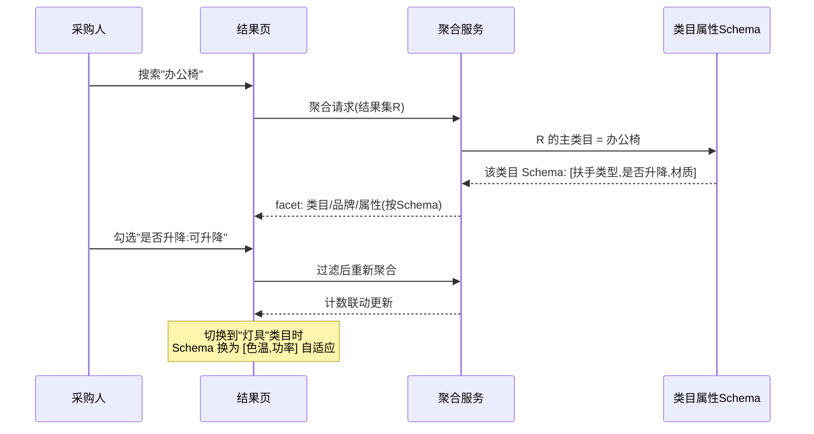

# 类目品牌筛选与属性聚合面板（AIP-018/019/020）

> 节点段：★11/15 MVP ｜ Owner：AI 产品负责人 ｜ 评审：采购业务对接人
> 状态：v0.3（2026-09-26，完整版；三面筛选同属结果收敛域，合卡管理）

## 1 概述（TL;DR）

搜索结果页的三个收敛面：类目面板缩小范围、品牌多选比选、属性自动聚合（价格区间、规格参数随结果动态生成）——从"一堆结果"到"三步锁定目标商品"。属性治理的检索侧变现：治理越结构化，面板越有用。

## 2 背景与问题（Problem）

- **现状**：结果列表无结构化收敛手段，采购人靠翻页和肉眼比对。
- **痛点**：采购比消费更看重参数对齐（同规格比价、同品牌集采）；筛选面的空缺本质是属性数据不结构化。
- **机会**：类目树、品牌归一、类目属性 Schema 三块治理资产已就绪，聚合面板是它们的产品化出口。

## 3 目标与非目标（Goals / Non-Goals）

**目标**
- G1：类目面板按树路径 + 计数收敛
- G2：品牌多选，别名归一后展示
- G3：属性面板按当前结果自动聚合，随类目自适应
- G4：条件可叠加、可逐个移除，与排序互不干扰

**非目标**
- N1：不做筛选字段自定义配置（随属性治理配置项后续开放）
- N2：不做排序（AIP-021）

## 4 用户与场景（Personas & Use Cases）

**用户角色**

| 角色 | 描述 | 核心诉求 |
|---|---|---|
| 采购人员 | 结果页比选 | 三步锁定目标 |
| 集采经办 | 品牌集中圈选 | 按品牌/规格批量圈品 |

**用户故事**
- US-1：作为采购人员，我希望结果页直接显示类目路径和数量，以便一键收窄。
- US-2：作为集采经办，我希望多选两三个品牌看交集，以便按集采协议圈选。
- US-3：作为采购人员，我希望办公椅类目下自动出现"扶手类型/是否升降"，以便按参数对齐比选。

**触发场景**：结果页加载时聚合生成；勾选即二次过滤；与排序叠加。

## 5 业务流程（Diagrams）

### 5.1 端到端流程图

```mermaid
flowchart TD
    A([搜索结果集 R]) --> B[权限过滤 先于聚合]
    B --> C1[类目 facet: 树路径+计数]
    B --> C2[品牌 facet: 归一+计数]
    B --> C3[属性 facet: Schema 驱动<br/>数值分桶/枚举计数]
    C1 & C2 & C3 --> D[面板渲染]
    D --> E{用户勾选}
    E --> F[结果与计数联动刷新]
    F --> G[已选条件标签]
    G --> H{移除条件?}
    H -->|逐个/清空| F
    E -.叠加排序.-> I[排序状态保持 AIP-021]
    C3 -.属性缺失商品.-> J[不出现在 facet<br/>但保留在结果并标"参数不全"]
```

### 5.2 关键时序：属性面板的类目自适应



## 6 功能需求（Functional Requirements）

### 6.1 需求详述

**FR-1 类目面板**：展示类目路径与结果计数（树形可展开，默认二级）；点击即收窄并保持其他条件。
**FR-2 品牌多选**：品牌经别名归一后展示（计数为归并值）；支持多选，多品牌取并集（同 facet 内 OR）。
**FR-3 属性聚合**：按当前结果自动聚合——数值型生成区间桶（分桶规则可配，建议等频 5 桶），枚举型生成选项计数；仅展示该类目 Schema 定义且当前非空的属性。
**FR-4 类目自适应**：切换/收窄类目后，属性面板按新类目 Schema 重载（见 5.2 时序）。
**FR-5 条件标签**：已选条件以标签展示于顶部，支持逐个移除与一键清空；移除后结果恢复。
**FR-6 筛选与排序叠加**：先过滤后排序，切换互不丢失对方状态。
**FR-7 防侧漏**：全部面板计数只统计有权可见商品（权限过滤先于聚合）；参数缺失商品不出现在对应 facet 但保留在结果中并标记"参数不全"。
**FR-8 多 facet 交互语义**：不同 facet 间取交集（AND），同 facet 内多选取并集（OR）。

### 6.2 页面与原型（Wireframes）

**高保真原型**：
（本卡负责区域：左栏**筛选面板**（类目树+计数 / 品牌多选 / 属性 facet 含"是否升降·扶手类型·价格区间"）与顶部**已选条件标签条**（chips 可逐个移除/清空）；可编辑源 [mockup-search.drawio](../../assets/prd/mockup-search.drawio)）

**完美输出样例**（资产现状，STATUS 口径）：类目树 = poly 治理树 6,495 叶 / 13 域；属性 Schema 自举机制曾产出 694 叶类目 / 1,182 行属性定义（poly 树重载后按新树重新自举，机制幂等可复跑）。

（ASCII 快速版）

```
┌───────────────────────────────────────────────────────────────────────┐
│ 搜索"办公椅"  已选: [办公椅✕] [品牌:得力∨震坤行✕] [可升降✕] [清空全部]│
├───────────────┬───────────────────────────────────────────────────────┤
│ 类目           │ ① 得力 4808 升降椅  [可升降·网布] ¥399  相关度0.92  │
│ 办公家具 1,204 │ ② 震坤行 E-21 升降椅 [可升降·皮质] ¥459  相关度0.90 │
│ ├ 办公椅 896   │ ③ XX 基础椅 [参数不全⚠]      ¥199  相关度0.71      │
│ └ 会议椅 308   │                                                       │
│ 品牌(可多选)   │                                                       │
│ ☑得力 320      │                                                       │
│ ☑震坤行 210    │                                                       │
│ ☐XX 120        │                                                       │
│ 属性(办公椅)   │                                                       │
│ 是否升降: ☑可升降 540 □固定 356                        │              │
│ 扶手类型: □固定 480 □可调 416                          │              │
└───────────────┴───────────────────────────────────────────────────────┘
```

| 区域 | 元素 | 交互 |
|---|---|---|
| 条件标签条 | 已选 chips | ✕ 逐个移除；清空全部；∨ 展开多选值 |
| 类目树 | 路径+计数 | 展开收起；计数随筛选联动 |
| 品牌/属性 facet | 复选项 | 同 facet 多选并集；计数实时联动 |
| 结果"参数不全" | ⚠ 标记 | 悬停提示该商品属性未治理 |

### 6.3 字段与数据（Field Schema）

| 对象 | 字段 | 说明 |
|---|---|---|
| 类目 facet | path_id、path_label、count | 源自治理类目树聚合 |
| 品牌 facet | brand_norm_id、brand_label、count | 归一后合并计数 |
| 属性 facet | attr_key、attr_type（range/enum）、buckets jsonb（[{label, from, to, count}] 或 [{value, count}]） | 按 Schema 驱动 |
| 已选条件 | facet_type、值列表 | URL 参数化（可分享、可回退） |

### 6.4 异常与错误处理

| 场景 | 触发 | 系统行为 | 用户感知 |
|---|---|---|---|
| Schema 未定义 | 新类目无属性模板 | 属性区显示"该类目参数建设中" | 仅类目/品牌 facet 可用 |
| 全部属性缺失 | 批量未治理 | 属性区隐藏 | 无空面板 |
| facet 聚合超时 | 结果集过大 | 面板降级只出类目/品牌 | 属性区加载提示 |
| 桶计数为 0 | 组合筛选无结果 | 勾选项禁用置灰 | 防死路 |

## 7 成功指标（Success Metrics）

| 指标 | 定义 | 口径来源 |
|---|---|---|
| 筛选使用率 | 使用筛选的会话占比 | 00-索引 §参考层 |
| 平均搜索时长 | 收敛效率（缩短） | 00-索引 §参考层 |
| 属性聚合覆盖率 | 结果可出 facet 的商品占比 | 00-索引 §参考层 |

## 8 里程碑（Milestones）

| 里程碑 | 交付内容 |
|---|---|
| ★11/15 MVP | 三面筛选 + 条件标签 + 类目自适应 |
| 12/20 UAT | 分桶调优 + 使用率首轮复盘 |

## 9 验收用例（Acceptance Cases）

| 用例 | Given | When | Then |
|---|---|---|---|
| AC-1 类目收窄 | 结果跨 3 类目 | 点"办公椅" | 结果收窄；类目计数联动刷新 |
| AC-2 品牌并集 | 勾选得力+震坤行 | 查看 | 两品牌商品均出现（facet 内 OR） |
| AC-3 类目自适应 | 当前"办公椅"类目 | 切到"灯具" | 属性区换为灯具 Schema（色温/功率） |
| AC-4 数值分桶 | 价格属性 | 打开价格 facet | 生成区间桶且计数正确 |
| AC-5 条件移除 | 已选 3 个条件 | 点一个 ✕ | 仅该条件移除，其余保持 |
| AC-6 筛选排序叠加 | 已筛选 + 价格排序 | 再改筛选 | 排序选择不丢失 |
| AC-E1 无 Schema | 新类目未配模板 | 查看属性区 | "参数建设中"占位不报错 |
| AC-P1 防侧漏 | 无权商品在原始结果集中 | 看任一 facet 计数 | 计数不含无权商品 |

## 10 开放问题（Open Questions）

- Q1：数值分桶规则（等频/等宽，建议等频 5 桶）——评审
- Q2：类目面板默认展开层级（建议二级）——UAT 反馈后调

## 11 相关文档（Appendix）

- 上游：`../00-功能点总索引.md` ｜ 关联：`AIP-015`（召回）、`AIP-021`（叠加）
- 参考：`../../DATA_ASSET_MAP.md`（类目树/品牌归一/属性 Schema 资产）

## 变更记录

| 日期 | 版本 | 变更 | 说明 |
|---|---|---|---|
| 2026-09-26 | v0.1–v0.2 | 立卡→社区结构 | |
| 2026-09-26 | v0.3 | 完整版 | +流程图/自适应时序/线框/字段表/错误表/用例 8 条 |
