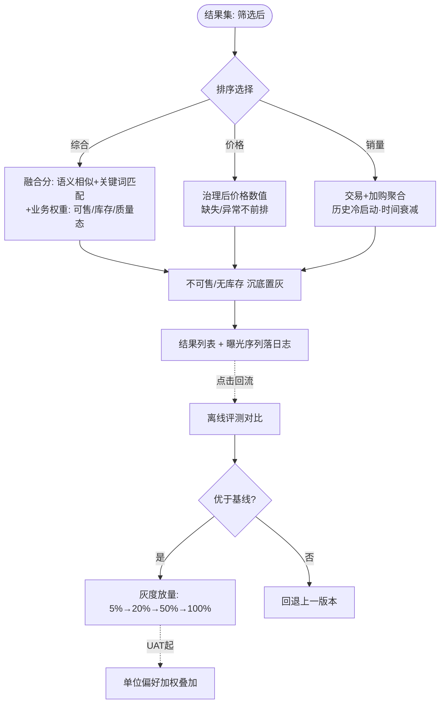
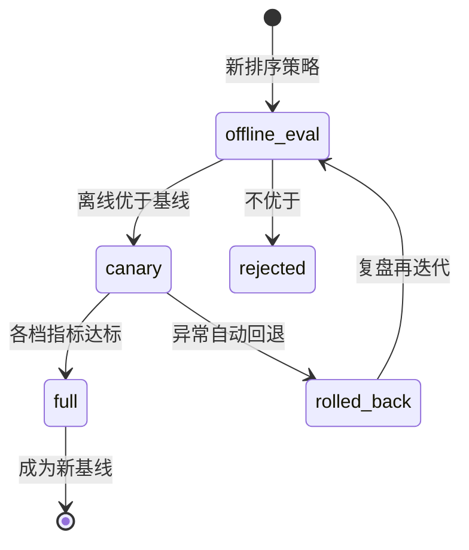

# 多维度排序（AIP-021）

> 节点段：★11/15 MVP ｜ Owner：AI 产品负责人 ｜ 评审：采购业务对接人
> 范围：SOW 合同能力（COMP-12）｜ 文档状态：**Frozen v1.0**（2026-10-09 冻结；签署记录见 ../../PRD-REVIEW-CHECKLIST.md）
> 实现进度见 `docs/STATUS.md`；本文只维护需求定义与验收契约

## 1 概述（TL;DR）

搜索结果按综合相关度 / 销量 / 价格自由切换：MVP 交付三档基础排序，UAT 段叠加采购单位偏好加权，点击反馈持续优化。排序公正为设计红线——无任何推广位与人工干预。

## 2 背景与问题（Problem）

- **现状**：单一排序把不同采购诉求压成一个顺序。
- **痛点**：找最便宜（预算约束）看价格、找稳妥（复购）看销量、找最匹配看相关度——三种诉求互相踩踏，选品效率低。
- **机会**：历史交易数据可作销量冷启动权重；点击回流随使用积累。

## 3 目标与非目标（Goals / Non-Goals）

**目标**
- G1：综合 / 价格（升降）/ 销量三档切换，默认综合
- G2：与筛选叠加互不干扰
- G3：UAT 段叠加单位偏好加权；点击反馈持续优化
- G4：排序可解释、可回溯（记录排序版本与曝光序列）

**非目标**
- N1：无竞价、无推广位、无人工置顶——采购合规场景排序公正红线
- N2：个人维度深度个性化留二期（内部行为稀疏）

## 4 用户与场景（Personas & Use Cases）

**用户角色**

| 角色 | 描述 | 核心诉求 |
|---|---|---|
| 采购人员 | 日常找货 | 最相关在前 |
| 集采经办 | 预算约束圈选 | 价格升序快速圈最低价 |

**用户故事**
- US-1：作为采购人员，我希望默认最相关在前且不可售沉底，以便第一屏决策。
- US-2：作为集采经办，我希望切价格升序并保持已选筛选，以便圈出同规格最低价组合。
- US-3：作为采购人员，我希望常点的商品渐渐排前，以便越用越顺手。

**触发场景**：结果页加载（默认综合）与排序切换；与筛选叠加。

## 5 业务流程（Diagrams）

### 5.1 端到端流程图



读图要点：排序迭代走"离线评测 → 灰度 → 回退"铁律（FR-7）；曝光序列落日志是可回溯与效果对比的基础。

### 5.2 对象状态机：排序版本发布



## 6 功能需求（Functional Requirements）

### 6.1 需求详述

**FR-1 排序切换**：结果页提供 综合相关度 / 价格（升、降）/ 销量 四个切换项，默认综合。
**FR-2 综合排序**：融合语义相似与关键词匹配信号，叠加业务基础权重（可售性、库存、质量状态）；不可售或无库存商品沉底并置灰。**硬约束分层（定则）**：可售性/权限/合规等硬约束先于一切偏好加权判定——偏好分不得覆盖或绕过硬约束（硬过滤在前、排序在后，与 AIP-029 推荐链同口径）。
**FR-3 价格排序**：基于治理后价格字段数值；价格缺失或明显异常的商品**沉底弱化展示**（结果内可见、不进前排）——是弱化展示而非硬过滤，与 AIP-029"不可采购不进推荐"是两条不同规则，不得混用。
**FR-4 销量排序**：基于交易与加购聚合信号；历史数据作冷启动权重并带时间衰减（窗口 Q1）；无销量新品按中性分处理不惩罚。
**FR-5 状态保持**：切换排序保持筛选；调整筛选保持排序（URL 参数化）。
**FR-6 可回溯**：记录排序版本号与每次曝光序列（结果 SKU 有序列表）；支持按版本对比效果。
**FR-7 迭代铁律**：排序算法迭代必须先离线评测对比基线，再灰度（5→20→50→100%）放量，每档核心指标达标才进下一档，异常自动回退。
**FR-8 单位偏好加权（UAT 起）**：支持按采购单位配置偏好加权（如供应商地域、品牌档次）；规则可配置、可审计、可关闭。
**FR-9 公正性约束**：任何排序档位不得包含竞价、推广位、人工置顶逻辑；此约束为产品红线，变更需评审委员会级别决策。

### 6.2 页面与原型（Wireframes）

**高保真原型**：
（本卡负责区域：结果区顶部**排序条**（综合▾默认高亮 / 价格↑↓ / 销量，含"已选筛选保持·URL 同步"提示）与结果列表的**沉底置灰行**（无库存商品弱化保留）；可编辑源 [mockup-search.drawio](../../assets/prd/mockup-search.drawio)）

**完美输出样例**（销量冷启动资产，STATUS 口径）：历史订单 gold 星型库 1,922,626 行 / dim_product 401,891（2022–2025 四年），作为销量档冷启动权重源；曝光序列日志 schema 见 6.3。

（ASCII 快速版）

```
┌─────────────────────────────────────────────────────────────────────┐
│ 排序: [综合▾默认] [价格 ↑] [价格 ↓] [销量]        已选筛选保持 ▸     │
├─────────────────────────────────────────────────────────────────────┤
│ ① 打印纸 A4 70g 得力    ¥18.5/包  [clean] 销量2,304  综合0.94      │
│ ② 打印纸 A4 80g 晨光    ¥21.0/包  [clean] 销量1,876  综合0.91      │
│ ⬚ XX 打印纸 (无库存)    ¥19.0      [已置灰·沉底]                  │
└─────────────────────────────────────────────────────────────────────┘
```

| 区域 | 元素 | 交互 |
|---|---|---|
| 排序条 | 四切换项 | 当前项高亮；URL 同步可分享 |
| 商品行 | 综合分/销量角标 | 悬停看"为什么在前"简释（相关度+权重因素） |
| 沉底行 | 置灰 | 保留可点开详情但弱化 |

### 6.3 字段与数据（Field Schema）

| 对象 | 字段 | 类型 | 必填 | 校验/默认 | 说明 |
|---|---|---|---|---|---|
| 排序版本（rank_version） | version / strategy | VARCHAR / ENUM | 是 | version 唯一；strategy ∈ {fusion, price, sales} | 状态机一致 |
| 排序版本（rank_version） | params / status | JSONB / ENUM | 是 | params 最小结构 {weights: {..}}；status ∈ {eval, canary, full, rolled_back} | 参数快照 |
| 曝光日志（rank_exposure） | log_id / version / query_id | BIGINT / VARCHAR / BIGINT | 是 | query_id FK→search_log | 可回溯 |
| 曝光日志（rank_exposure） | sku_sequence | JSONB | 是 | 最小结构 {skus: [..]}（有序） | 最终结果序列 |
| 曝光日志（rank_exposure） | filter_version / feature_snapshot_id / released_at | VARCHAR / VARCHAR / TIMESTAMP | 是 | 过滤规则版本 + 输入特征快照标识 | 复现判定依据；保留期 1 年 |
| 单位偏好（org_rank_pref） | org_id / pref_type / weight / enabled / updated_by | VARCHAR / ENUM / NUMERIC / BOOL / VARCHAR | 是 | pref_type ∈ {region, brand_tier, ..}；weight 归一化 | UAT 起，审计留痕；**不得作用于硬约束** |

### 6.4 异常与错误处理

| 场景 | 触发 | 系统行为 | 用户感知 |
|---|---|---|---|
| 排序服务异常 | 打分超时 | 降级相关度默认序 + 告警 | 结果照常 |
| 价格大面积缺失 | 治理滞后 | 价格档提示"部分商品无价格已沉底" | 提示条 |
| 灰度异常 | 核心指标跌落 | 自动回退上一版本 | 无感 |
| 偏好权重冲突 | 单位配多条同类偏好 | 权重归一化 + 提示配置重叠 | 管理端提示 |

## 7 成功指标（Success Metrics）

| 指标 | 定义 | 口径来源 |
|---|---|---|
| Top-K 命中率 | 召回/相关性口径（精确前三 ≥95% / 普通前十 ≥85%，SOW 表 13）——**不单独证明排序顺序有效** | 00-索引 §参考层 |
| 排序质量（NDCG@K / MRR） | 冻结评测集（相关性等级人工标注或以点击序列代理）上的位置质量指标——排序档专属 | 待基线测量（Q3 定评测集与相关性标签口径） |
| 搜索转化率 | 搜索后加购/下单比例 | 00-索引 §参考层 |
| 平均搜索时长 | 收敛效率 | 00-索引 §参考层 |

## 8 里程碑（Milestones）

| 里程碑 | 交付内容 |
|---|---|
| ★11/15 MVP | 三档排序 + 叠加规则 + 曝光日志 + 沉底策略 |
| 12/20 UAT | 单位偏好加权 + 离线评测对比报告 + 灰度机制演练 |

## 9 验收用例（Acceptance Cases）

| 用例 | 覆盖 FR | Given | When | Then |
|---|---|---|---|---|
| AC-1 默认综合 | FR-2 | 含不可售商品的结果集 | 打开结果页 | 相关优先；不可售沉底置灰；硬约束先于权重判定 |
| AC-2 价格排序 | FR-1、FR-3、FR-5 | 同规格多价格商品（部分缺价） | 切价格升序 | 低价在前；无价沉底弱化保留；筛选保持 |
| AC-3 销量冷启动 | FR-4 | 新品无销量 | 销量档查看 | 新品不被惩罚（中性分，非末位强制） |
| AC-4 状态保持 | FR-5 | 已选筛选 + 排序 | 任改其一 | 另一状态不丢失；URL 可还原 |
| AC-5 曝光可回溯 | FR-6 | 任一次搜索 | 查日志 | 版本号 + 过滤规则版本 + 特征快照标识 + SKU 序列完整落库 |
| AC-6 灰度回退 | FR-7 | canary 版本指标跌落 | 触发 | 自动回退；日志记录回退事件 |
| AC-7 偏好加权 | FR-8 | 单位配置品牌档次偏好（可关） | UAT 档开启 | 排序体现偏好、审计可查、关闭即恢复；偏好不得覆盖硬约束 |
| AC-E1 排序降级 | FR-2 | 打分服务超时 | 搜索 | 返回默认相关度序；无报错 |
| AC-P1 公正性 | FR-9 | 任意配置入口 | 尝试添加置顶/推广 | 无此功能入口（红线验证） |

## 10 开放问题（Open Questions）

| Q ID | 未决问题 | 影响 FR/AC | 选项与推荐项 | 决策 Owner | 截止日期 | 当前状态 | 未决时默认行为 |
|---|---|---|---|---|---|---|---|
| Q1 | 销量冷启动窗口与衰减系数 | FR-4、AC-3 | 建议：近 2 年 + 时间衰减 | 评审（采购业务对接人） | 2026-11-30 | 待裁决 | 近 2 年窗口、半衰期 180 天 |
| Q2 | 无库存商品形态 | FR-2、AC-1 | 建议：沉底置灰保留 | 评审 | 2026-11-30 | 待裁决 | 沉底置灰保留可点详情 |
| Q3 | 排序质量评测集与相关性标签口径（NDCG@K/MRR 前置） | §7 排序质量指标 | 人工标注抽样 or 点击序列代理 | AI 产品负责人＋采购业务对接人 | 2026-12-20（UAT 前） | 待定 | 先用点击序列代理口径并标注"临时口径" |

## 11 相关文档（Appendix）

- 上游：`../00-功能点总索引.md` ｜ 关联：`AIP-015`（召回）、`AIP-018-020`（叠加）
- 参考：`../../EVALUATION.md`

## 变更记录

| 日期 | 版本 | 变更 | 说明 |
|---|---|---|---|
| 2026-09-26 | v0.1–v0.2 | 立卡→社区结构 | |
| 2026-09-26 | v0.3 | 完整版 | +流程图(含灰度铁律)/版本状态机/线框/字段表×3/错误表/用例 8 条 |
| 2026-10-09 | v1.0 | Frozen（规范化修复） | FR-2 硬约束分层定则（偏好不得覆盖硬约束）；FR-3 澄清沉底=弱化展示非硬过滤（与 AIP-029 区分）；§7 补 NDCG@K/MRR 排序质量指标（Top-K 不单独证明排序有效）；§6.3 曝光日志补 filter_version/feature_snapshot_id；§9 加「覆盖 FR」列并补 AC-7（FR-8 原无验收覆盖）；§10 表格化+Q3 |
