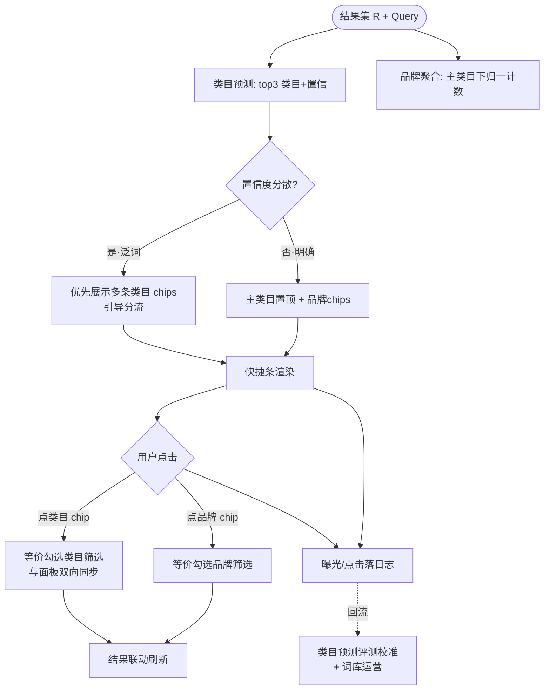

# 类目与品牌自动推荐（AIP-022/023）

> 节点段：★11/15 MVP ｜ Owner：AI 产品负责人 ｜ 评审：采购业务对接人
> 范围：SOW 合同能力（两项合卡，COMP-13）｜ 文档状态：**Frozen v1.0**（2026-10-09 冻结；签署记录见 ../../PRD-REVIEW-CHECKLIST.md）
> 实现进度见 `docs/STATUS.md`；本文只维护需求定义与验收契约；022/023 同属搜索引导域，合卡管理

## 1 概述（TL;DR）

搜索时自动推荐相关类目与相关品牌，帮采购人在结果泥潭里快速定位——类目预测能力的检索侧出口：治理树越准推荐越有用，推荐点击又回流验证挂载质量，形成闭环。

## 2 背景与问题（Problem）

- **现状**：采购人常"知道要买什么类型，不知道归在哪个类目、哪些品牌可选"。
- **痛点**：泛词搜索结果跨多类目混杂，人工翻找定位慢；品类新手无从下手。
- **机会**：类目预测（Query → top 类目）与品牌分布（类目内归一计数）能力已具备，推荐是它们的产品化包装。

## 3 目标与非目标（Goals / Non-Goals）

**目标**
- G1：搜索时展示 top 相关类目（路径 + 预估计数），点击即收窄
- G2：展示 top 相关品牌（归一后），可多选叠加
- G3：推荐点击信号回流，校准类目预测与词库

**非目标**
- N1：不做 Query 改写展示（AIP-015/017 域）
- N2：无推荐位运营配置——chips 顺序纯算法产出（与排序同守"无人工干预"红线）

## 4 用户与场景（Personas & Use Cases）

**用户角色**

| 角色 | 描述 | 核心诉求 |
|---|---|---|
| 采购人员 | 泛词搜索后定位 | 快速收窄 |
| 品类新手 | 不熟悉类目体系 | 被引导 |

**用户故事**
- US-1：作为采购人员，我搜"手套"后希望直接看到"劳防用品 > 手部防护"推荐，以便一键进入正确类目。
- US-2：作为采购人员，我希望看到类目下主流品牌，以便缩小选择范围。
- US-3：作为品类新手，我希望泛词搜索时系统替我猜类目，以便不必先学会类目体系。

**触发场景**：结果页加载自动生成；Query 意图偏泛（预测置信度分散）时优先展示。

## 5 业务流程（Diagrams）

### 5.1 端到端流程图



## 6 功能需求（Functional Requirements）

### 6.1 需求详述

**FR-1 类目推荐**：基于 Query 预测并展示 top 3 相关类目（树路径 + 结果预估计数）；点击等价勾选对应类目筛选。
**FR-2 品牌推荐**：展示主类目下 top 3–5 品牌（别名归一后）；支持多选，点击等价勾选品牌筛选。
**FR-3 泛词优先策略**：类目预测置信度分散时（top1 置信 < 阈值），优先展示多条类目 chips 分流；置信集中时主类目置顶展示。
**FR-4 权限一致**：推荐项仅含有权可见的类目与品牌（过滤先于推荐）。
**FR-5 回流闭环**：记录 chips 曝光与点击；点击信号回流类目预测评测集与词库运营（持续校准）。
**FR-6 双向同步**：推荐条与筛选面板状态双向同步——点推荐 = 勾筛选；取消筛选 = 推荐复原。
**FR-7 无干预**：chips 内容与顺序纯算法产出，无人工配置入口。

### 6.2 页面与原型（Wireframes）

**高保真原型**：
（本卡负责区域：纠错条下方的**相关类目/品牌 chips 快捷条**（"LED灯管 48 / 荧光灯管 12 / 3M / 东亚 +2"，点击等价勾选筛选）；可编辑源 [mockup-search.drawio](../../assets/prd/mockup-search.drawio)）

**完美输出样例**（类目预测端点实测，STATUS 口径）：`POST /api/v1/products/listing/predict-category` 终版精度 @1=62.7% / @3=81.6% / auto 精度 80.4%（自然序编排 + LLM 闸门）——本卡的 chips 就是该端点在检索侧的出口，一次建模两处使用。

（ASCII 快速版）

```
┌──────────────────────────────────────────────────────────────────────┐
│ 搜索"手套"                                                            │
│ 相关类目: [劳防>手部防护 482] [医用检查手套 96] [运动手套 41]         │
│ 相关品牌: [3M] [霍尼韦尔] [东亚] [Selectable +2]                     │
├──────────────────────────────────────────────────────────────────────┤
│ （点击"劳防>手部防护"后）                                             │
│ 已选: [劳防>手部防护 ✕]   ← 左栏筛选面板同步勾选                     │
│ 相关品牌: [3M 210] [霍尼韦尔 156] [安思尔 88]   ← 计数随收窄更新     │
└──────────────────────────────────────────────────────────────────────┘
```

| 区域 | 元素 | 交互 |
|---|---|---|
| 类目 chips | 路径缩写+计数 | 点击收窄；与左栏面板同步高亮 |
| 品牌 chips | 品牌+计数 | 多选叠加；`+n` 展开全部 |
| 同步验证 | 已选条 | 取消筛选后 chips 复原可再点 |

### 6.3 字段与数据（Field Schema）

| 对象 | 字段 | 类型 | 必填 | 校验/默认 | 说明 |
|---|---|---|---|---|---|
| 类目预测输出 | query / top_categories | TEXT / JSONB | 是 | top_categories 最小结构 [{path_id, label, confidence}]，按 confidence 降序 | 复用商品侧类目预测服务 |
| 推荐曝光（chip_exposure） | log_id / query_id / chip_type / items / released_at | BIGINT / BIGINT / ENUM / JSONB / TIMESTAMP | 是 | chip_type ∈ {category, brand}；items 最小结构 [{id, label, count}] | 曝光留痕 |
| 推荐点击（chip_click） | log_id / exposure_id / clicked_item / result_action | BIGINT / BIGINT / VARCHAR / ENUM | 是 | exposure_id FK→chip_exposure；result_action ∈ {narrowed_click, narrowed_exit, none} | 转化度量；保留期 1 年（同搜索日志口径） |

### 6.4 异常与错误处理

| 场景 | 触发 | 系统行为 | 用户感知 |
|---|---|---|---|
| 预测服务超时 | chips 接口 >阈值 | 快捷条隐藏 | 主流程不受影响 |
| 预测无结果 | 新词/冷门词 | 不展示类目 chips | 仅品牌或无快捷条 |
| 品牌计数全 0 | 收窄后空集 | chips 计数禁用置灰 | 防死路 |
| 双向同步冲突 | 面板手改与 chips 状态竞争 | 面板为唯一状态源，chips 派生 | 永不出现两套勾选 |

## 7 成功指标（Success Metrics）

| 指标 | 定义 | 口径来源 |
|---|---|---|
| 推荐点击率 | chips 曝光→点击转化 | 00-索引 §参考层 |
| 点击后转化 | 经推荐收窄后的加购/下单 | 00-索引 §参考层 |
| 类目预测精度 | 推荐间接外显（@1/@3） | 00-索引 §参考层 |

## 8 里程碑（Milestones）

| 里程碑 | 交付内容 |
|---|---|
| ★11/15 MVP | 双 chips + 筛选联动 + 曝光点击日志 |
| 12/20 UAT | 点击回流校准首轮 + 展示规则调优 |

## 9 验收用例（Acceptance Cases）

| 用例 | 覆盖 FR | Given | When | Then |
|---|---|---|---|---|
| AC-1 类目推荐 | FR-1 | 搜"手套"（跨 3 类目） | 结果页加载 | 3 条类目 chips 带路径与计数 |
| AC-2 点击收窄同步 | FR-6、FR-1 | 点"劳防>手部防护" chip | 查看 | 结果收窄；左栏面板同项勾选 |
| AC-3 品牌多选 | FR-2 | 品牌区点两个品牌 | 查看 | 交集结果；计数联动 |
| AC-4 泛词优先 | FR-3 | 泛词"办公用品"（低置信） | 结果页加载 | 多条类目 chips 优先展示分流 |
| AC-5 取消复原 | FR-6 | 已点 chip 收窄后 | 面板取消勾选 | chips 复原可再次点击 |
| AC-6 回流落库 | FR-5 | 一次曝光+点击 | 查日志 | exposure 与 click 关联记录完整 |
| AC-7 无干预验证 | FR-7 | 检查管理端 | 尝试配置 chips 顺序/内容 | 无人工配置入口（与排序同红线） |
| AC-E1 预测超时 | FR-1 | 预测服务异常 | 结果页加载 | 快捷条隐藏；搜索正常 |
| AC-P1 权限一致 | FR-4 | 无权品牌在聚合源中 | 看品牌 chips | 不出现（过滤先于推荐） |

## 10 开放问题（Open Questions）

| Q ID | 未决问题 | 影响 FR/AC | 选项与推荐项 | 决策 Owner | 截止日期 | 当前状态 | 未决时默认行为 |
|---|---|---|---|---|---|---|---|
| Q1 | 类目 chips 展示层级（一级 or 二级路径缩写） | FR-1、AC-1 | 推荐：二级缩写 | 评审（采购业务对接人） | 2026-11-30 | 待裁决 | 二级路径缩写 |
| Q2 | 品牌 chips 数量与同名品牌去重规则 | FR-2、AC-3 | 推荐：top3-5 + 归一去重 | 评审 | 2026-11-30 | 待裁决 | top5，归一后去重 |

## 11 相关文档（Appendix）

- 上游：`../00-功能点总索引.md` ｜ 关联：`AIP-018-020`（联动）、`AIP-015`（理解层）
- 参考：`../../EVALUATION.md`

## 变更记录

| 日期 | 版本 | 变更 | 说明 |
|---|---|---|---|
| 2026-09-26 | v0.1–v0.2 | 立卡→社区结构 | |
| 2026-09-26 | v0.3 | 完整版 | +流程图(含回流闭环)/线框/字段表×3/错误表/用例 8 条 |
| 2026-10-09 | v1.0 | Frozen（规范化修复） | §6.3 升全字段契约；§9 加「覆盖 FR」列并补 AC-7（FR-7 无干预原无验收覆盖）；§10 表格化 |
