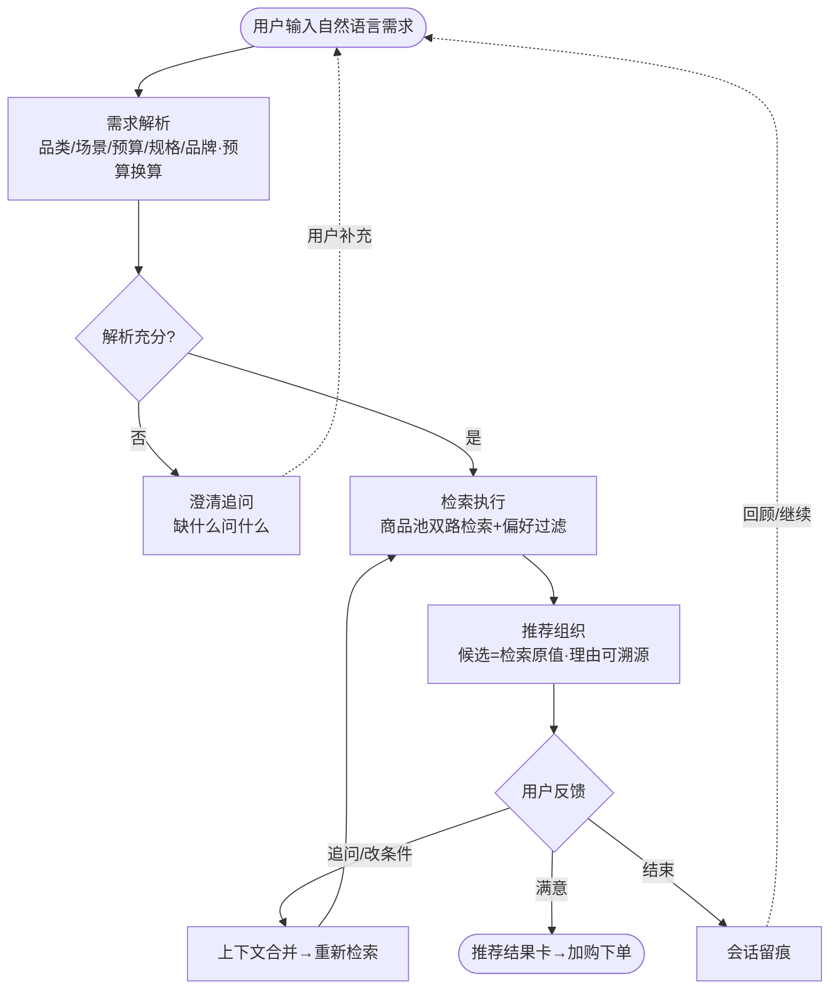
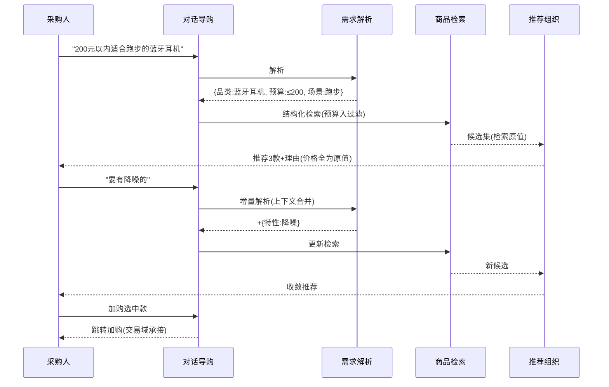

# AI 对话导购（AIP-024~028）

> 节点段：12/20 UAT ｜ Owner：AI 产品负责人 ｜ 评审：采购业务对接人
> 范围：SOW 合同能力（五项合卡，COMP-14）｜ 文档状态：**Frozen v1.0**（2026-10-09 冻结；签署记录见 ../../PRD-REVIEW-CHECKLIST.md）
> 实现进度见 `docs/STATUS.md`；本文只维护需求定义与验收契约；五项功能同属对话导购域，合卡管理

## 1 概述（TL;DR）

搜索页一键切换到"说人话"模式：采购人直接说"200 元以内适合跑步的蓝牙耳机"，AI 理解需求、多轮追问补条件、按单位偏好精准推荐，历史会话可回顾续聊——覆盖关键词表达不了的长尾与复杂采购需求。

## 2 背景与问题（Problem）

- **现状**：搜索只能关键词表达；预算+场景+品类混合的需求（"工地 200 顶透气安全帽单价 30 以内"）拆不成关键词。
- **痛点**：不会拆词的采购人直接零结果或线下求助；长尾需求（无明确品类词）关键词检索天然覆盖不了。
- **机会**：采购需求解析 MVP-1（结构化解析+预算换算，实测 1.1s）与推荐出口 MVP-2（检索原值+防幻觉，实测 2.4s）已验证核心链路；对话导购是这两个内核的会话化包装。行业同期对标：Amazon Rufus、淘宝问问、京东京言。

## 3 目标与非目标（Goals / Non-Goals）

**目标**
- G1：入口一键切换——搜索页常驻"AI 对话"入口，关键词/对话双模式并存
- G2：自然语言直搜——一句话含预算/场景/规格/品牌即搜即得推荐结果
- G3：多轮对话——追问、补充条件、切换方向，上下文全程连贯
- G4：个性化规则遵循——品类/品牌/价格区间偏好参数可配，推荐严格遵循
- G5：历史会话——对话留痕，可回顾并继续之前的对话

**非目标**
- N1：不代客下单（推荐到加购为止，下单回交易域——克制的受限助手定位）
- N2：不做闲聊/通用问答（领域限定商品导购，域外问题礼貌拒答）
- N3：不替代关键词搜索（双模式并存，各自最优场景）

## 4 用户与场景（Personas & Use Cases）

**用户角色**

| 角色 | 描述 | 核心诉求 |
|---|---|---|
| 采购人（新手） | 不熟悉品类术语 | 说需求不用拆词 |
| 采购人（复杂需求） | 多条件组合采购 | 多轮补充逐步收敛 |
| 采购管理 | 偏好策略制定者 | 单位级推荐偏好可配 |

**用户故事**
- US-1：作为采购人，我希望说"200 元以内适合跑步的蓝牙耳机"直接得到推荐，以便不用研究该搜什么词。
- US-2：作为采购人，我希望追问"要有降噪的"后结果自动收敛，以便像跟导购员聊天一样买货。
- US-3：作为采购管理，我希望配置"本单位优先本地供应商/低端类目限价"，以便 AI 推荐自动遵循。
- US-4：作为采购人，我希望昨天的对话今天能接着聊，以便比选周期长的采购不断线。

**触发场景**：搜索页点击"AI 对话"入口；关键词搜索零结果时引导切换；商品详情页"问问 AI"。

## 5 业务流程（Diagrams）

### 关键时序：一次对话导购往返

## 6 功能需求（Functional Requirements）

### 6.1 需求详述

**FR-1 对话入口（AIP-024）**：搜索页常驻"AI 对话"入口一键切换；关键词模式零结果时主动引导切换；模式互切不丢上下文。
**FR-2 自然语言理解（AIP-025）**：一句话解析出品类/场景/预算/规格/品牌五要素；数量×单价与总价自动换算（"200 顶单价 30 以内"→ 总预算 6000）；解析失败时明确说"没听懂"并给示例，禁止瞎猜。
**FR-3 多轮对话（AIP-026）**：支持追问、补充条件、切换方向三类轮次；上下文全程保持（换方向时保留历史但按新方向检索）；单会话轮次上限可配。
**FR-4 个性化规则（AIP-027）**：单位级偏好参数可配（品类范围/品牌偏好/价格区间/供应商地域），对话推荐严格遵循并在理由中体现（"按贵单位偏好优先本地供应商"）。
**FR-5 历史会话（AIP-028）**：会话列表可回顾；一键继续历史对话（上下文恢复）；会话可删除（用户侧）。
**FR-6 防幻觉铁律**：推荐商品与价格/库存数字全部来自检索原值，代码层校验回填——模型只组织语言不产生数字；候选不符时如实说"没找到完全匹配的，最接近的是…"。

### 6.2 页面与原型（Wireframes）

**高保真原型**：
（AI 功能位置：左侧会话流（用户消息/AI 推荐卡/澄清追问三类气泡）、推荐卡内"推荐理由+来源"、顶部单位偏好角标、右侧历史会话列表；可编辑源 [mockup-chat.drawio](../../assets/prd/mockup-chat.drawio)）

**完美输出样例**（MVP-1/2 实测口径）：输入"工地需要 200 顶安全帽，透气款，单价 30 以内"——解析 1.1s 输出结构化需求（品类安全帽/数量 200/特性透气/单价上限 30）；推荐 2.4s 返回候选，推荐理由只引原值（25.65 / 22.58 元 < 30 上限），picks 代码校验回填防幻觉。对话导购 = 该链路的会话化。

### 6.3 字段与数据（Field Schema）

| 对象 | 字段 | 类型 | 必填 | 校验/默认 | 说明 |
|---|---|---|---|---|---|
| 会话（chat_session） | session_id / user_id / org_id | BIGINT / VARCHAR / VARCHAR | 是 | session_id 自增 | 会话主体 |
| 会话（chat_session） | status / created_at | ENUM / TIMESTAMP | 是 | status ∈ {active, closed} | 生命周期；用户可删（级联轮次） |
| 轮次（chat_turn） | turn_id / session_id / role | BIGINT / BIGINT / ENUM | 是 | role ∈ {user, assistant} | 消息 |
| 轮次（chat_turn） | content / parse / retrieve_ref | TEXT / JSONB / VARCHAR | 是 | parse 最小结构 {品类, 场景, 预算, 规格, 品牌}（可为空） | 解析留痕与检索引用 |
| 偏好规则（chat_pref） | org_id / dimension / value / enabled | VARCHAR / ENUM / JSONB / BOOL | 是 | dimension ∈ {category, brand, price, region} | 单位级配置，变更留痕 |
| 推荐卡（chat_rec_card） | turn_id / sku / reason / source_values | BIGINT / VARCHAR / TEXT / JSONB | 是 | source_values 最小结构 {price, stock, ..}（检索原值） | 原值溯源；保留期 1 年（同搜索日志口径） |

### 6.4 异常与错误处理

| 场景 | 触发 | 系统行为 | 用户感知 |
|---|---|---|---|
| 解析失败 | 需求不可理解 | 明确说没听懂+示例引导 | 不瞎猜推荐 |
| 检索零结果 | 无满足条件商品 | 如实"没找到"+放宽建议（"去掉降噪有 5 款"） | 不硬凑 |
| 模型服务超时 | 组织推荐超时 | 降级无理由纯列表（MVP-2 已验证降级路径） | 结果仍可看 |
| 域外问题 | 问天气/闲聊 | 礼貌拒答+引导回商品域 | 定位清晰 |
| 轮次超限 | 达上限 | 提示开新会话（历史可回顾） | 防上下文过载 |

## 7 成功指标（Success Metrics）

| 指标 | 定义 | 口径来源 |
|---|---|---|
| 对话导购转化率 | 对话产生加购/下单比例 | 00-索引 §参考层 |
| 解析准确率 | 五要素解析符合标注（评测集 500+ 对话） | 00-索引 §参考层 |
| 多轮完成率 | 多轮会话达成加购比例 | 00-索引 §参考层 |
| 首响时长 | 首轮响应（对标 ≤3s） | 00-索引 §参考层 |

## 8 里程碑（Milestones）

| 里程碑 | 交付内容 |
|---|---|
| 11/25 | 五要素解析会话化 + 推荐卡 + 双模式切换 |
| 12/20 UAT | 多轮上下文 + 偏好规则 + 历史会话 + 解析评测报告 |

## 9 验收用例（Acceptance Cases）

| 用例 | 覆盖 FR | Given | When | Then |
|---|---|---|---|---|
| AC-1 一句话直搜 | FR-1、FR-2 | 输入"200元以内适合跑步的蓝牙耳机" | 提交 | 推荐卡≤200 元跑步款；理由含预算命中说明 |
| AC-2 预算换算 | FR-2 | "200 顶安全帽 单价 30 以内" | 提交 | 解析出总价 6000 上限并用于检索 |
| AC-3 多轮收敛 | FR-3 | 首轮结果后追问"要有降噪的" | 提交 | 结果收敛且保留预算上下文 |
| AC-4 换方向 | FR-3 | "那看看有线耳机" | 提交 | 按新品类检索，历史保留 |
| AC-5 偏好遵循 | FR-4 | 单位配"优先本地供应商" | 推荐 | 候选排序体现偏好且理由注明 |
| AC-6 历史续聊 | FR-5 | 昨日会话 | 继续对话 | 上下文恢复可续问 |
| AC-7 双模式互切 | FR-1 | 对话模式进行中 | 切回关键词搜索再切回 | 模式互切不丢上下文 |
| AC-8 防幻觉校验 | FR-6 | 推荐候选含价格/库存数字 | 查推荐卡 | 数字全部来自检索原值（代码校验回填），模型不产生数字 |
| AC-E1 解析失败 | FR-2 | 输入不可理解需求 | 提交 | 明确没听懂+示例，不瞎猜 |
| AC-E2 零结果 | FR-6 | 无满足条件 | 检索 | 如实告知+放宽建议，不硬凑 |
| AC-E3 轮次超限 | FR-3 | 达轮次上限 | 继续提问 | 提示开新会话（历史可回顾） |
| AC-P1 偏好配置权限 | FR-4 | 无管理角色改单位偏好 | 尝试修改 | 拒绝；留痕 |

## 10 开放问题（Open Questions）

| Q ID | 未决问题 | 影响 FR/AC | 选项与推荐项 | 决策 Owner | 截止日期 | 当前状态 | 未决时默认行为 |
|---|---|---|---|---|---|---|---|
| Q1 | 单会话轮次上限与上下文压缩策略 | FR-3、AC-E3 | 建议 20 轮 + 摘要压缩 | 评审（采购业务对接人） | 2026-11-30 | 待裁决 | 20 轮上限，超出提示开新会话 |
| Q2 | 对话数据留存期与脱敏口径（同搜索日志合规） | §6.3、AC-8 | 推荐 1 年 | 合规过目 | 2026-11-30 | 待复核 | 保留 1 年、导出脱敏 |

## 11 相关文档（Appendix）

- 上游：`../00-功能点总索引.md` ｜ 关联：`AIP-015`（同理解层）、`AIP-029-031`（推荐联动）
- 参考：STATUS 采购解析 MVP-1 / 推荐出口 MVP-2 两行、../../frontend-es-chain.md

## 变更记录

| 日期 | 版本 | 变更 | 说明 |
|---|---|---|---|
| 2026-09-26 | v0.3 | 完整版立卡（合卡：024~028 五项同域） | 补齐搜索 UAT 段；锚定 MVP-1/2 实测 |
| 2026-10-09 | v1.0 | Frozen（规范化修复） | §6.3 升全字段契约；§9 加「覆盖 FR」列并补 AC-7/AC-8/AC-E3（FR-1 互切、FR-6 校验、FR-3 超限原无验收覆盖）；§10 表格化 |
