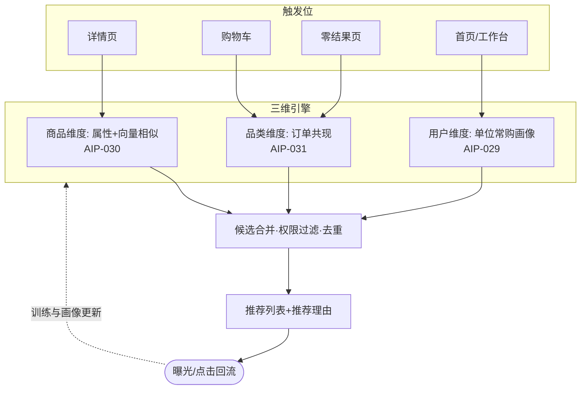

# AI 猜你喜欢（AIP-029~031）

> 节点段：12/20 UAT ｜ Owner：AI 产品负责人 ｜ 评审：采购业务对接人
> 范围：SOW 合同能力（三维合卡，COMP-15）｜ 文档状态：**Frozen v1.0**（2026-10-09 冻结；签署记录见 ../../PRD-REVIEW-CHECKLIST.md）
> 实现进度见 `docs/STATUS.md`；本文只维护需求定义与验收契约；三维推荐同域，合卡管理

## 1 概述（TL;DR）

三个维度的关联推荐：**用户维度**（越用越懂这个单位）、**商品维度**（看了又看/相似商品）、**品类维度**（买了又买）——覆盖找货全路径的"被动发现"。内部采购优先策略下，一期以采购单位维度与品类关联为主力，个人维度随外部开放放量。

## 2 背景与问题（Problem）

- **现状**：搜索是"主动找"，浏览详情页与零结果场景缺"被动推"；复购（内部采购高频刚需）靠人记忆。
- **痛点**：采购人不知道自己单位常买什么新品；详情页无关联推荐，比选要反复搜索；零结果后无兜底路径。
- **机会**：历史订单 gold 星型（192 万行 / dim_product 40 万）可冷启动品类关联与单位常购画像；治理后的属性相似度支撑"看了又看"。

## 3 目标与非目标（Goals / Non-Goals）

**目标**
- G1：用户维度（AIP-029）——基于单位常购画像 + 个人行为（量足后启用）推荐
- G2：商品维度（AIP-030）——详情页"看了又看/相似商品"（属性+向量相似）
- G3：品类维度（AIP-031）——"买了又买"品类关联（订单共现冷启动）
- G4：**四个推荐触发位**——①首页/工作台（单位常购）②详情页（看了又看）③购物车（关联搭配）④零结果兜底页；每个触发位启用维度、展示数量与候选不足行为各自可配置（FR-4/`rec_slot_conf`）

**非目标**
- N1：不做竞价/推广推荐位（与排序同守公正红线，纯算法无人工干预）
- N2：个人深度画像一期不做（内部行为稀疏，二期外部开放后增强——分期策略是设计决策）
- N3：不做跨单位推荐（单位间数据隔离）

## 4 用户与场景（Personas & Use Cases）

**用户角色**

| 角色 | 描述 | 核心诉求 |
|---|---|---|
| 采购人（复购型） | 周期性补货 | 常购品一键再买 |
| 采购人（比选型） | 详情页逛 | 相似款横向对比 |
| 采购人（长尾型） | 零结果受阻 | 有推荐兜底不空手 |

**用户故事**
- US-1：作为采购人，我希望打开推荐位看到"贵单位上月常购"，以便补货不用重新搜。
- US-2：作为采购人，我看一款安全帽时希望看到"相似商品"，以便同规格比价。
- US-3：作为采购人，我买完劳保手套后看到"买了又买：护目镜"，以便相关配套一次买齐。
- US-4：作为采购人，我搜索零结果时希望有推荐兜底，以便页面不空转。

**触发场景**：详情页加载（相似推荐）；购物车页（关联推荐）；零结果页（兜底推荐）；首页/工作台（常购推荐）。

## 5 业务流程（Diagrams）



读图要点：触发位决定引擎选择（不是三个引擎全量混跑）；回流是画像与共现持续变准的来源——推荐本身是飞轮的一环。

## 6 功能需求（Functional Requirements）

### 6.1 需求详述

**FR-1 商品维度（AIP-030）**：详情页"看了又看/相似商品"——候选来自同款簇兄弟、同类目属性近邻、标题向量近邻；排除当前商品与无权商品。
**FR-2 品类维度（AIP-031）**："买了又买"基于历史订单品类共现（冷启动）+ 实时订单累计；共现强度带时间衰减。**组织隔离口径（默认安全）**：`cat_cooccur` 按 `org_id` 单位内统计（见 6.3）；单位内样本不足时不把其他单位的订单共现作为个性化依据，降级到明确标注的公共类目热门（"热门推荐"），是否允许匿名全平台聚合另由 Q3 裁决。
**FR-3 用户维度（AIP-029）**：一期=单位常购画像（高频品类/常购 SKU/复购周期提示）；个人行为信号量足后启用加权（灰度控制）。
**FR-4 触发位配置**：四个触发位（首页/工作台、详情页、购物车、零结果页）各自启用维度、展示数量可配置；同一请求命中多维度时按 `rec_slot_conf` 配置的优先级合并去重，冲突时高优先级维度占位；候选不足阈值内不展示该维度（不硬凑，见 AC-E3）。
**FR-5 推荐理由**：每条推荐标注理由（"贵单位常购"/"与本商品同规格"/"购买 X 的单位也买了 Y"）——**理由必须与真实数据证据一致**：无对应历史/共现/相似证据时不得显示该理由，使用其他真实理由或不显示（AC-11）；可解释是信任基础。
**FR-6 权限与隔离**：推荐候选先过权限过滤（不可见商品不出现，硬约束先于排序）；单位画像与共现统计严格单位内隔离；**推荐位的价格/库存为推荐时点快照，详情/加购/下单时按交易规则二次校验**——推荐不构成"点开即买"承诺（AC-10）。
**FR-7 回流**：曝光与点击全量落日志（与搜索日志同体系），供画像更新与效果度量。
**FR-8 公正红线**：无竞价推广位、无人工置顶；算法迭代走离线评测+灰度（与 AIP-021 同铁律）。

### 6.2 页面与原型（Wireframes）

**高保真原型**：（本卡负责区域：底部两横条——"💬 AI 对话导购"条下方"猜你喜欢：看了又看 · 买了又买 · 单位常购"区与零结果页的兜底推荐位；可编辑源 [mockup-search.drawio](../../assets/prd/mockup-search.drawio)）
推荐卡形态：商品图 + 标题 + 价格 + **推荐理由角标**（橙色小签）。

**完美输出样例**〔合成示例——展示用户实际拿到的推荐卡，非数据资产规模〕：

```
首页/工作台 · 猜你喜欢（采购人 zhang@ORG-031）
┌────────────────────────────────────────────────────────────┐
│ 🛒 贵单位常购                                    查看全部 › │
│ ① 洁柔卷纸 12卷/提   ¥28.5   [贵单位常购 · 上月 42 提]      │
│ ② 得力 A4打印纸 70g  ¥18.5/包 [贵单位常购 · 复购周期约30天] │
├────────────────────────────────────────────────────────────┤
│ 🔥 热门推荐（该单位暂无品类共现数据）                        │
│ ③ 3M 防尘口罩 9502+ ¥3.2/只 [热门推荐 · 本域采购高频]       │
└────────────────────────────────────────────────────────────┘
```

理由码与证据一一对应（org_freq=单位常购频次 / cooccur=单位内品类共现 / hot=公共热门兜底，如实标注）；冷启动单位如上降级热门并明确标注，不伪造"常购"理由。零结果兜底页与详情页"看了又看"同构（理由码换 similar）。

> 数据资产规模（历史订单 gold 192 万行 / dim_product 40 万 / 未归类 12.1% 等）属 Reference 层，见 `docs/DATA_MODEL.md` 与 `DATA_ASSET_MAP.md`——资产就绪是能力前提，不等于用户输出。

### 6.3 字段与数据（Field Schema）

| 对象 | 字段 | 类型 | 必填 | 校验/默认 | 主键/唯一 | 数据来源/更新策略 | 权限/保留期 | 说明 |
|---|---|---|---|---|---|---|---|---|
| 单位画像（org_purchase_profile） | org_id | VARCHAR | 是 | 引用组织主数据 | PK | 订单聚合，周期物化（日增量+周全量） | 单位内可见 | 画像主体 |
| 单位画像（org_purchase_profile） | freq_categories | JSONB | 否 | 最小结构 [{cat_id, count, last_at}] | — | 同上 | 同上 | 高频品类 |
| 单位画像（org_purchase_profile） | frequent_skus | JSONB | 否 | 最小结构 [{sku, count, repurchase_days}] | — | 同上 | 同上 | 常购 SKU 与复购周期 |
| 单位画像（org_purchase_profile） | repurchase_hint | TEXT | 否 | — | — | 同上 | 同上 | 周期提示文案 |
| 品类共现（cat_cooccur） | org_id / cat_a / cat_b | VARCHAR / VARCHAR / VARCHAR | 是 | 引用治理类目树 | 联合唯一 (org_id, cat_a, cat_b) | **单位内**订单共现统计，时间衰减重算 | 单位内隔离（FR-2 默认口径，N3） | **org_id 必填——单位隔离键** |
| 品类共现（cat_cooccur） | strength | NUMERIC | 是 | ∈ [0,1]，时间衰减 | — | 同上 | 同上 | 共现强度 |
| 品类共现（cat_cooccur） | window | VARCHAR | 是 | 如 180d | — | 同上 | 同上 | 统计窗口 |
| 推荐日志（rec_log） | trigger / dimension | ENUM | 是 | trigger ∈ {home, detail, cart, zero_result}；dimension ∈ {user, item, category, hot} | — | 曝光/点击实时写入 | 含 org_id/user_id，导出脱敏；保留 1 年 | 与搜索日志同体系 |
| 推荐日志（rec_log） | shown_skus / clicked_sku / reason | JSONB / VARCHAR / ENUM | 是 | shown_skus 有序；reason ∈ {org_freq, cooccur, similar, hot, none} | — | 同上 | 同上 | 理由码与证据一致（FR-5） |
| 触发位配置（rec_slot_conf） | slot / dimensions / topn / enabled | ENUM / JSONB / INT / BOOL | 是 | slot ∈ {home, detail, cart, zero_result}；dimensions 白名单；topn ∈ [1,12]；min_confidence（候选不足阈值） | PK=slot | 运营配置，变更留痕 | 运营角色可改 | 优先级=slot 声明序 |

### 6.4 异常与错误处理

| 场景 | 触发 | 系统行为 | 用户感知 |
|---|---|---|---|
| 冷启动无画像 | 新单位无历史 | 降级品类热门（标注"热门推荐"） | 理由如实标注 |
| 相似候选不足 | 长尾商品孤立 | 该维度不展示（不硬凑） | 区块隐藏 |
| 画像服务超时 | 首页推荐超时 | 静默隐藏该区块 | 页面其余正常 |
| 共现数据稀疏 | 小品类对 | 强度阈值过滤不上线 | 无低质关联 |

## 7 成功指标（Success Metrics）

| 指标 | 定义 | 口径来源 |
|---|---|---|
| 推荐点击率 | 曝光→点击（分触发位/维度） | 00-索引 §参考层 |
| 推荐转化率 | 点击→加购 | 00-索引 §参考层 |
| 零结果页挽回率 | 零结果页经推荐产生点击比例 | 00-索引 §参考层 |

## 8 里程碑（Milestones）

| 里程碑 | 交付内容 |
|---|---|
| 11/25 | 商品维度（看了又看）+ 品类共现冷启动 |
| 12/20 UAT | 单位画像 + 四触发位 + 曝光点击日志 + 效果首轮评测 |

## 9 验收用例（Acceptance Cases）

| 用例 | 覆盖 FR | Given | When | Then |
|---|---|---|---|---|
| AC-1 看了又看 | FR-1、FR-5 | 打开安全帽详情页 | 加载 | 相似商品区≥3 条且同规格带理由角标 |
| AC-2 买了又买 | FR-2、FR-5 | 单位买过劳保手套 | 首页/购物车 | 出现共现品类推荐（如护目镜）理由"购买X也买Y" |
| AC-3 单位常购 | FR-3 | 单位有高频 SKU | 首页 | "贵单位常购"区按频次排序 |
| AC-4 零结果兜底 | FR-4 | 搜索零结果 | 零结果页 | 推荐兜底区展示（热门或关联） |
| AC-5 权限过滤 | FR-6 | 候选含无权商品 | 任一触发位 | 不出现（先过滤后展示） |
| AC-6 单位隔离 | FR-6 | A 单位画像与共现数据 | B 单位用户请求推荐 | 结果和理由不包含 A 单位可识别订单/画像信号 |
| AC-7 回流落库 | FR-7 | 一次曝光+点击 | 查日志 | trigger/dimension/shown/clicked/reason 完整落库（与搜索日志同体系） |
| AC-8 触点路由 | FR-4 | 首页、详情、购物车、零结果四种上下文 | 分别请求推荐 | 每个触点仅启用配置允许的维度，展示数量与理由符合 rec_slot_conf |
| AC-9 动态可采购性 | FR-6 | 推荐时商品有库存，下单前库存耗尽 | 提交采购 | 交易接口二次校验并按交易规则处理；推荐不绕开校验 |
| AC-10 推荐理由真实性 | FR-5 | 候选无历史采购/共现匹配证据 | 展示结果 | 不得显示"贵单位常购"等不真实理由；用其他真实理由（hot 如实标注）或不显示 |
| AC-E1 冷启动 | FR-3 | 新单位无画像 | 首页 | 降级热门且理由如实标"热门" |
| AC-E3 候选不足 | FR-4 | 相似度/共现强度未达阈值 | 请求推荐 | 隐藏对应推荐区或按配置给出有标记的安全兜底，不硬凑商品 |
| AC-P1 无推广位 | FR-8 | 检查配置接口 | 尝试加置顶 | 无此入口（红线验证） |

## 10 开放问题（Open Questions）

| Q ID | 未决问题 | 影响 FR/AC | 选项与推荐项 | 决策 Owner | 截止日期 | 当前状态 | 未决时默认行为 |
|---|---|---|---|---|---|---|---|
| Q1 | 个人维度启用的灰度阈值（行为量多少算"量足"） | FR-3、AC-3 | 待定（二期外部开放后） | 评审（采购业务对接人） | 2027-01-15 | 待定 | 一期仅单位维度，个人信号只入日志不入模型 |
| Q2 | 复购周期提示的展示形态（角标 or 消息推送） | FR-3 | 推荐：角标 | 采购业务对接人 | 2026-12-20 | 待裁决 | 角标展示 |
| Q3 | 品类共现是否允许匿名全平台聚合（当前按 org_id 单位内统计） | FR-2、AC-6、AC-8 | **默认安全口径=单位内隔离**；如允匿名聚合须另定匿名化标准/可重识别风险评估/权限审批 | 客服→采购业务 Owner＋合规归口 | 2026-11-30 | 待裁决 | 单位内统计；样本不足降级公共热门并如实标注 |

## 11 相关文档（Appendix）

- 上游：`../00-功能点总索引.md` ｜ 关联：`AIP-021`（公正红线同源）、`AIP-024-028`（对话内推荐联动）
- 参考：../../DATA_MODEL.md（历史订单 gold）、DATA_ASSET_MAP.md

## 变更记录

| 日期 | 版本 | 变更 | 说明 |
|---|---|---|---|
| 2026-09-26 | v0.3 | 完整版立卡（合卡：029~031 三维同域） | 补齐搜索 UAT 段；内部优先分期策略入 G/N |
| 2026-10-09 | v1.0 | Frozen（规范化修复） | G4/FR-4 修正为**四个触发位**（原文三处口径不一，P1-6）；FR-2 明确 cat_cooccur 按 org_id 单位内统计（默认安全口径+Q3 裁决项）；FR-5 理由须与证据一致；FR-6 补交易二次校验语义；§6.2 样例改为用户实际所见推荐卡（资产规模移 Reference）；§6.3 升 9 列全字段契约（含 org_id 隔离键/更新策略/保留期）；§9 加「覆盖 FR」列并补 AC-7/AC-8/AC-9/AC-10/AC-E3；§10 表格化+Q3 |
