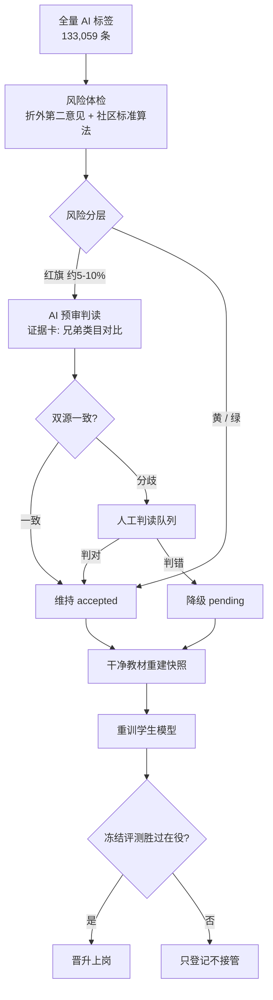
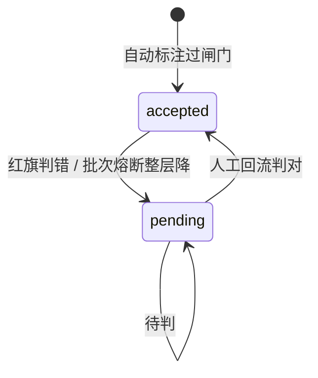

# 标签质量风控与训练编排（AIF-001~004）

> 节点段：内部底座能力（不挂对外交付节点）｜ Owner：AI 工程负责人 ｜ 评审：AI 产品负责人
> 范围：**内部工程能力**（非 SOW 功能编号范围，COMP-23，不计入合同 60 项）｜ 文档状态：**Frozen v1.0**（2026-10-09 冻结；签署记录见 ../../PRD-REVIEW-CHECKLIST.md）
> 实施状态见 `docs/STATUS.md`；实测证据（2026-09-28 E1 全量体检与对拍）见 §11 链接——本文只维护需求定义、验收线与接口契约；**"设计闸门"（本卡）与"当前实际闸门结果"（证据报告）严格分层，不混为一条产品定义**

## 1 概述（TL;DR）

17 万商品靠 AI 自动标注恢复了类目挂载，但这批标签同时是搜索、推荐和小模型训练的
「教材」——教材脏，全线遭殃。本能力用一套**全量风险体检 + 分层判读 + 干净教材
训练**的流水线，把「13 万条 AI 标签有多脏、脏在哪、怎么在进教材前拦下」变成
一条自动化产线：机器给每条标签打可疑分，只有最可疑的一小撮需要人看，且人看到的
每条都带证据卡；训练只吃过滤后的干净教材，新模型必须考试赢过旧模型才能上岗。

> 实施与实测进展（体检已全量落地、浓度线刹车、18 条改挂闭环等）以 `docs/STATUS.md` 为准；
> 完整实测数据见 §11 证据报告（2026-09-28），本文正文不复制实测报告，只保留设计闸门与验收线。

## 2 背景与问题（Problem）

- **现状**：2026-09-24 放量自动标注完成，170,880 条唯一标题 100% 分类，
  179,509 件商品（94.9%）恢复 poly 类目挂载；133,059 条标签经台账 accepted。
- **痛点（已实测）**：抽检 180 条（AI 逐条判卷，2026-09-26）发现最差切片
  错率 10%（18 错），两批触发熔断整层降级 29,245 条。错型集中在三类：
  近义类目混淆（漏电保护器→微型断路器）、跨域硬挂（广场舞音响→电脑音箱）、
  配件当成品（笔芯→笔）。**最高置信档（0.95 双通道共识直采）抽中 20 条仍错 6**。
- **为什么现有手段不够**：生产线内的算法（双通道共识、置信分档、批次熔断）
  共享同一套类目知识，对这类**系统性错误**结构性失明——共识检索在近义类目上
  会「共识地」一起错。
- **量的不可行**：13 万条全量人工判读约 8~17 人月；不判直接训模型，等于把
  已知 10% 的错误喂进教材。

## 3 目标与非目标（Goals / Non-Goals）

**目标**
- G1 全量覆盖：133,059 条标签 100% 获得风险分（机器跑，无人工）。
- G2 聚焦人工：红旗层错误浓度 ≥ 全体 3 倍，人工只看红旗（量级 ≤1 万条）。
- G3 教材干净：进入训练的标签先过体检与判读闸门，错标不进教材。
- G4 模型只升不降：新模型必须在冻结评测上严格胜出在役模型才接管，全程可回滚。

**非目标**
- N1 不做实时线上质检（本能力面向离线批量训练数据，线上监控属 F4.3 另案）。
- N2 不替代人工终审（算法只预筛排序，判读结论可被人工翻案）。
- N3 不自研检测算法（用社区标准件 cleanlab；自研仅限编排层）。

## 4 用户与场景（Personas & Use Cases）

**用户角色**

| 角色 | 描述 | 核心诉求 |
|---|---|---|
| 数据运营 | 管理商品标注质量 | 知道标签整体多脏、脏在哪些类目，不逐条看 |
| 审核员 | 执行判读 | 只看最可疑的，且每条带证据（同类目兄弟项对比） |
| AI 工程师 | 训练与发布分类模型 | 教材自动去污，模型版本可回滚、只升不降 |
| 业务负责人 | 决策数据可用性 | 一个数回答「这批标签敢不敢用」 |

**用户故事**
- US-1：作为数据运营，我希望系统给全部标签逐条打出可疑分并分层，以便我不看
  13 万条也能知道风险分布。
- US-2：作为审核员，我希望系统只把红旗条目推给我且自带证据卡（标题+被挂类目+
  同类目下的兄弟项），以便我每条 10 秒内可判。
- US-3：作为 AI 工程师，我希望判读结果自动回流台账、训练快照自动剔除降级条目，
  以便重训无需手工清洗。
- US-4：作为业务负责人，我希望每批标签有「体检报告」（浓度、分层、闸门结论），
  以便拍板数据能否用于训练和挂载。

**触发场景**：批量自动标注完成后自动触发体检；新一批标注到达 / 类目树变更重挂载
后重跑。

## 5 业务流程（Diagrams）

### 5.1 端到端流程图



读图要点：机器承担全量体检与预审，人只出现在「红旗分歧」一处；「判错必降级、
降级必出教材」是数据不脏教材的保证；晋升门（K）保证模型只升不降。

### 5.2 对象状态机（标签）



状态命名与台账 label_verdict.status 一致；降级可整批发生（抽检闸门既有语义），
回流仅人工路径。

## 6 功能需求（Functional Requirements）

### 6.1 需求详述

- **FR-1〈全量标签风险体检〉（AIF-001）**
  - 规则：系统应对指定快照的全部 accepted 标签计算风险分 ∈[0,1] 并落
    `label_risk` 表；风险分必须基于**折外**预测（预测该条的模型不得见过该条
    数据），由社区标准算法（Confident Learning）产出。
  - 字段：snapshot_id / text_hash / risk / source（算法+版本）/ created_at。
  - 边界：体检中断可幂等续跑；算法依赖缺失 fail-loud 报可操作安装指引；
    in-sample 概率一律拒绝（自证防护）。
- **FR-2〈风险分层〉（AIF-002）**
  - 规则：按风险分切红/黄/绿三档，红旗占比缺省 ≤10%、阈值可配；体检报告
    （总量/分层分布/红旗浓度、浓度提升倍数）落 outputs 供取数。
  - 边界：浓度提升 <3 倍时分层不得投产（验收线即刹车线）。
- **FR-3〈抽检闸门风险加权〉（AIF-003）**
  - 规则：抽检抽样顺序由「低置信优先」升级为「风险分加权优先」；层闸门与
    熔断语义不变（20 条错 >2 整层降、错率 ≥20% 熔断）。
  - 边界：无风险分时自动回退现行低置信顺序（老批次兼容）。
- **FR-4〈红旗判读队列与第二源回流〉（AIF-004）**
  - 规则：红旗条目生成判读任务，证据卡=标题+被挂类目+同父兄弟类目+风险分；
    AI 预审结论以独立标注源写入台账；双源一致维持 accepted，分歧转人工队列，
    人工结论为终审（可翻案，审计留痕 reviewer 署名）。
  - 边界：AI 判读词汇表与既有抽检一致（correct/wrong），两可项按无罪推定
    判 correct 并标记待人工复核。

### 6.2 接口契约（纯后端功能，命令 + 表 + 实测样例）

体检/判读/训练均以命令行 runner 提供（数据库优先，无文件通路）：

```
uv run python -m community_stack.orchestrate detect   --snapshot mass01_accepted_v1
uv run python -m community_stack.orchestrate triage   --red 0.10
uv run python -m community_stack.orchestrate review   --queue red
uv run python -m community_stack.orchestrate retrain
```

完美输出样例〔实测 2026-09-28 E1 全量口径；数据集=判卷前快照 mass01_accepted_v1（159,407 条）/ 回测真值 175 条 18 错；明细证据见 §11 对拍报告〕：
- 体检主流程：`detect --folds 5` 五折折外打分，风险分 100% 写入 `label_risk`；
- 回测三线〔测试基线〕：查全 ≥60% / 旗量 ≤30% / 浓度 ≥3x（验收线）；当前实测值见 §7 证据行；
- 口径对拍：normalized_margin 相对生产现状 self_confidence 排序更优、温度不敏感——切换为 Q5 拍板项；
- 训练登记样例：`{'n_train': 70657, 'promoted': False, ...}`（无人工真值时只登记不晋升，设计语义）。

### 6.3 字段与数据（Field Schema）

| 对象 | 字段 | 类型 | 必填 | 校验/默认 | 说明 |
|---|---|---|---|---|---|
| label_risk | snapshot_id | VARCHAR | 是 | 引用 train_snapshot | 体检批次 |
| label_risk | text_hash | VARCHAR | 是 | 引用 text_pool | 标签主体 |
| label_risk | risk | DOUBLE | 是 | [0,1] | 1=最可疑 |
| label_risk | source | VARCHAR | 是 | 如 cleanlab/2.9.0 | 算法与版本 |
| ReviewTask | text_hash/text/label/risk/siblings | — | 是 | — | 判读证据卡（siblings=同父兄弟类目） |
| ReviewVerdict | text_hash/verdict/reviewer | — | 是 | verdict∈{correct,wrong} | 与抽检词汇表一致 |

### 6.4 异常与错误处理

| 场景 | 触发条件 | 系统行为 | 用户感知 |
|---|---|---|---|
| 算法依赖缺失 | cleanlab 未安装 | 构造即 fail-loud（无静默回退） | 明确安装指引 |
| 体检中断 | 进程退出/机器重启 | 幂等续跑，已完成分片不重算 | 重跑同一命令 |
| 分层不过线 | 浓度提升 <3x | 停在当前步骤不投产 | 报告标注刹车原因 |
| 无人工真值重训 | 冻结评测为空 | 只登记不晋升 | 明示「未晋升属设计内」 |

## 7 成功指标（Success Metrics）

| 指标 | 定义 | 口径来源 | 验收线〔设计闸门〕 |
|---|---|---|---|
| 体检查全 | 判卷真值集上，已知错标被旗比例 | 回测脚本 | ≥60% |
| 体检旗量 | 被旗条目占全体比例 | 回测脚本 | ≤30% |
| 浓度提升 | 旗标池错率 ÷ 全体错率 | 回测脚本 | ≥3x（即刹车线） |
| 排序能力 | 真值上风险分 AUROC | 对拍脚本（14 口径） | 切换口径须严格优于生产现状 |
| 判读一致率 | 人工抽检 50 条 vs AI 预审结论 | E4 回测 | ≥90% |
| 教材干净度（上线后） | E4 后按 180 口径复测 accepted 错率 | 待上线度量，不预支 | 较体检前下降 |

> 〔实测 2026-09-28，175/18 口径，证据见 §11 对拍报告〕查全 72.2% ✓ / 旗量 30% ✓ / 浓度 2.43x ✗（FR-2 刹车生效，Q4 裁决中）/ AUROC 0.8447（生产现状口径 0.7976）。实测值属证据记录，不改动上表验收线。

## 8 里程碑（Milestones）

| 里程碑 | 交付内容（计划与出口标准） |
|---|---|
| M0 契约与架构 | 契约层/适配器/架构文档/门禁；出口=契约评审通过 |
| M1 体检落地 | FR-1+FR-2（E1/E2）；出口=回测三线过线（浓度不过线即刹车，Q4 裁决） |
| M2 闸门接入 | FR-3（E3）；出口=抽样顺序切换且熔断语义回归通过 |
| M3 判读闭环 | FR-4（E4）；出口=判读一致率 ≥90% |
| M4 训练常态化 | SetFit 档接入 + 晋升解锁；出口=晋升门在真实快照上演练一次 |

> 各里程碑**实施状态以 `docs/STATUS.md` 为准**（本卡不维护进度快照）；M1 实测证据见 §11。

## 9 验收用例（Acceptance Cases）

| 用例 | 覆盖 FR | Given | When | Then |
|---|---|---|---|---|
| AC-1 回测三线 | FR-1、FR-2 | 判卷真值集（当前 175 条/18 错口径） | 体检出分并按分旗标 | 查全 ≥60%、旗量 ≤30%、浓度 ≥3x（验收线；浓度不过线即 FR-2 刹车——实测值见 §7 证据行） |
| AC-2 依赖 fail-loud | FR-1 | 未安装 cleanlab | 构造体检编排 | fail-loud 且报安装指引 |
| AC-3 重训快照 | FR-4 | 红旗判错回流后重训 | 训练登记 | 快照剔除降级条目；无冻结真值则只登记 |
| AC-4 判读一致率 | FR-4 | 人工抽检 50 条 AI 判读 | 对比结论 | 一致率 ≥90% |
| AC-5 老批次兼容 | FR-3 | 风险分缺失的老批次 | 触发抽检 | 自动回退低置信抽样顺序 |
| AC-E1 幂等续跑 | FR-1 | 体检进程中断 | 重跑同一命令 | 已完成分片不重算 |

## 10 开放问题（Open Questions）

| Q ID | 未决问题 | 影响 FR/AC | 选项与推荐项 | 决策 Owner | 截止日期 | 当前状态 | 未决时默认行为 |
|---|---|---|---|---|---|---|---|
| Q1 | 两批熔断降级文本的 kg_product 挂载是否同步撤销（业务可售性 vs 数据一致性） | FR-4 | 推荐：撤销挂载保持一致 | 业务负责人 | 2026-10-31 | 待裁决 | 维持现状（挂载保留），台账标记降级 |
| Q2 | 判读协作台（Argilla）引入的量级触发线（建议红旗 >1 万条或审核员 >2 人） | FR-4 | 建议值 | AI 工程负责人 | 2026-11-30 | 待触发 | 不引入，用现有队列界面 |
| Q3 | 红旗阈值是否按一级域差异化 | FR-2 | 推荐：先全局后按域 | 数据运营 | 2026-11-30 | 待裁决 | 全局阈值（red=10%） |
| Q4 | 浓度 3x 验收线是否重定（真值仅 18 错，±1 条即 ±0.4x 抖动） | FR-2、AC-1 | 选项=扩真值集重测 或 按 2.4x 放宽 | AI 工程负责人出数据、AI 产品负责人拍板 | 2026-10-31 | 待裁决 | **分层不投产（刹车生效）**，M2/M3 不启动 |
| Q5 | 打分口径是否切换 normalized_margin（+4.7pp，margin 缓存秒级重算） | FR-1 | 推荐：切换 | AI 工程负责人 | 2026-10-31 | 待裁决 | 维持生产现状口径 self_confidence |

## 11 相关文档（Appendix）

- 技术架构：`layers/data/community_stack/ARCHITECTURE.md`（模块 A~G）
- 实施手册：`layers/data/community_stack/IMPLEMENTATION.md`
- **E1 全量实测与对拍（2026-09-28）**：`项目知识库/架构/community_stack-v2-detect回测覆盖与对拍实测-2026-09-28.md`（175/18 覆盖核对、14 口径对拍、SGD/限特征全量对拍与判例）
- **18 条错标改挂明细（2026-09-28）**：`项目知识库/架构/community_stack-判卷18条错标改挂明细-2026-09-28.md`（证据链与翻案通道范本）
- 检验方法论：`layers/data/label_ledger_kit/2026-09-27-伪标签检验补强方案.md`
- 零件选型：`layers/data/label_ledger_kit/2026-09-27-HF社区训练与检验工具地图.md`

## 变更记录

| 日期 | 版本 | 变更 | 说明 |
|---|---|---|---|
| 2026-09-28 | v0.1 | 首版 | 按 PRD 卡模板建卡；数字对齐 STATUS 实测口径 |
| 2026-09-28 | v0.2 | 预期→实测 | E1 全量体检+回测落地：§1 加实测结论；§6.2 样例换实测三线与口径对拍；§7 指标加实测列；§8 M1 标完成与刹车；§9 AC-1 标实测；§10 新增 Q4 浓度线/Q5 口径切换两个拍板项 |
| 2026-10-09 | v1.0 | Frozen（SSoT 规范化，P0-3） | 实施状态剥离至 STATUS、实测数据归位 §7 证据行/§11 报告（正文只留设计闸门）；§8 里程碑去状态列改出口标准；§9 加「覆盖 FR」列；§10 表格化（Owner/截止/默认行为）；标注内部工程能力范围 |
